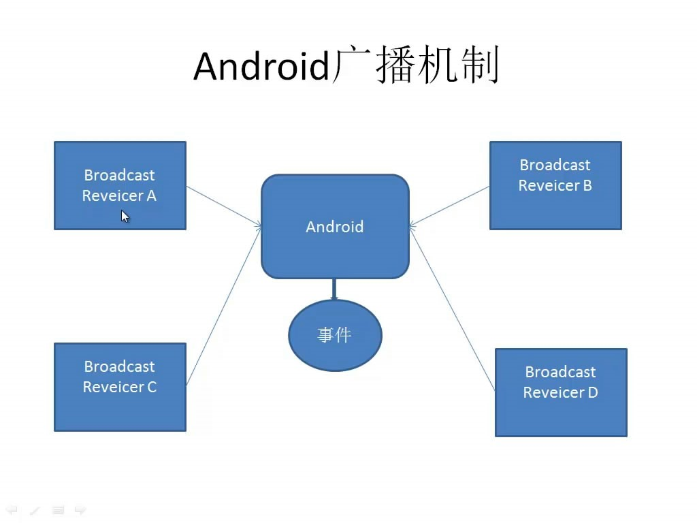
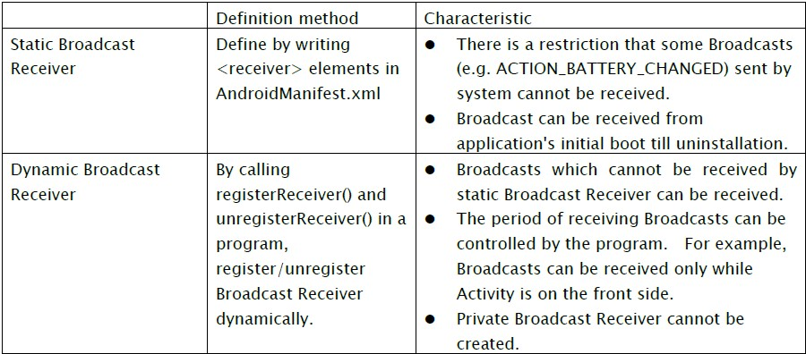
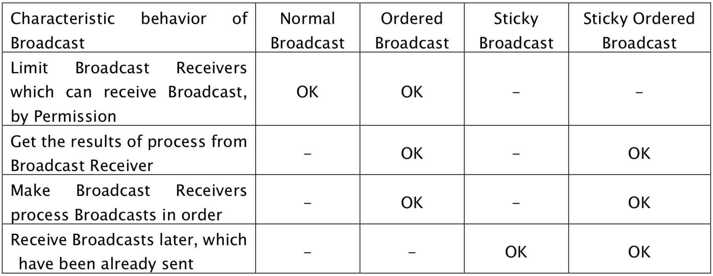
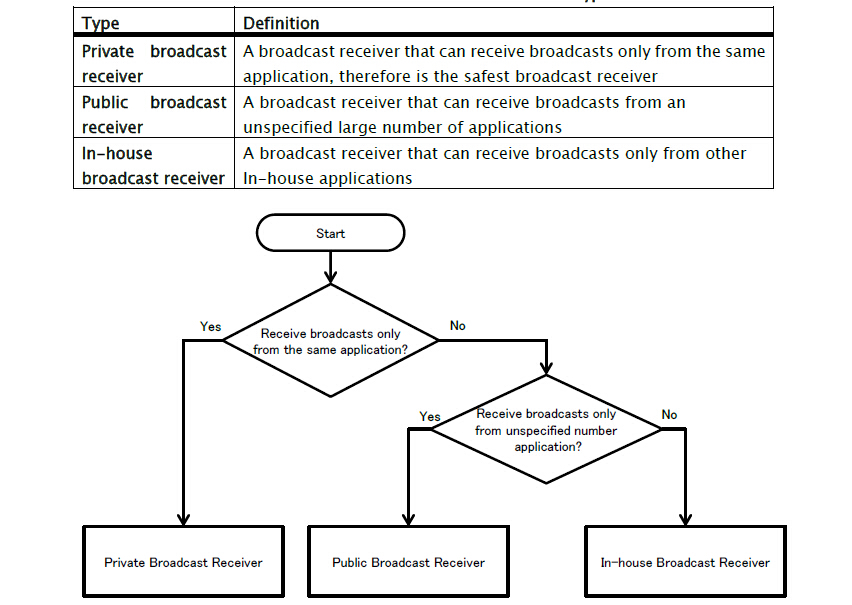
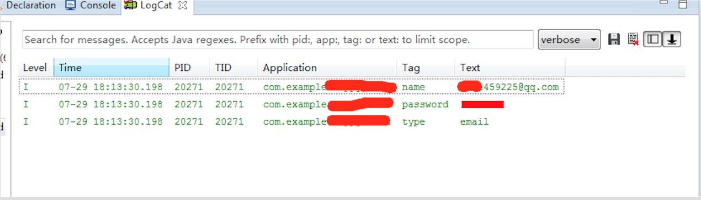

# Android Broadcast Security 

**Author:瘦蛟舞**

**Create:20141207**

## 0x00 科普 

----------

Broadcast Recevier
广播接收器是一个专注于接收广播通知信息，并做出对应处理的组件。很多广播是源自于系统代码的──比如，通知时区改变、电池电量低、拍摄了一张照片或者用户改变了语言选项。应用程序也可以进行广播──比如说，通知其它应用程序一些数据下载完成并处于可用状态。
应用程序可以拥有任意数量的广播接收器以对所有它感兴趣的通知信息予以响应。所有的接收器均继承自BroadcastReceiver基类。
广播接收器没有用户界面。然而，它们可以启动一个activity来响应它们收到的信息，或者用NotificationManager来通知用户。通知可以用很多种方式来吸引用户的注意力──闪动背灯、震动、播放声音等等。一般来说是在状态栏上放一个持久的图标，用户可以打开它并获取消息。

<!--more-->


 
## 0x01 知识要点

----------

**注册形式：动态or静态**

<activity>元素的name属性指定了实现了这个activity的 Activity的子类。icon和label属性指向了包含展示给用户的此activity的图标和标签的资源文件。其它组件也以类似的方法声明──<service> 元素用于声明服务， <receiver> 元素用于声明广播接收器，而 <provider> 元素用于声明内容提供器。 manifest文件中未进行声明的activity、服务以及内容提供器将不为系统所见，从而也就不会被运行。然而，广播接收器既可以在manifest文件中声明，也可以在代码中进行动态的创建，并以调用Context.registerReceiver()的方式注册至系统。



（静态与动态注册广播接收器区别,动态广播接收器不能设为私有是关键.）
 
**回调方法**

广播接收器只有一个回调方法：

```java
void onReceive(Context curContext, Intent broadcastMsg)
```	
当广播消息抵达接收器时，Android调用它的onReceive() 方法并将包含消息的Intent对象传递给它。广播接收器仅在它执行这个方法时处于活跃状态。当onReceive()返回后，它即为失活状态。
拥有一个活跃状态的广播接收器的进程被保护起来而不会被杀死。但仅拥有失活状态组件的进程则会在其它进程需要它所占有的内存的时候随时被杀掉。
这种方式引出了一个问题：如果响应一个广播信息需要很长的一段时间，我们一般会将其纳入一个衍生的线程中去完成，而不是在主线程内完成它，从而保证用户交互过程的流畅。如果onReceive()衍生了一个线程并且返回，则包涵新线程在内的整个进程都被会判为失活状态（除非进程内的其它应用程序组件仍处于活跃状态），于是它就有可能被杀掉。这个问题的解决方法是令onReceive()启动一个新服务，并用其完成任务，于是系统就会知道进程中仍然在处理着工作。

**权限**


设置接收app

```java
Intent 	setPackage(String packageName)
(Usually optional) Set an explicit application package name that limits the components this Intent will resolve to.
```

设置接收权限

```java
abstract void 	sendBroadcast(Intent intent, String receiverPermission)
Broadcast the given intent to all interested BroadcastReceivers, allowing an optional required permission to be enforced.
```
protectionLevel

等级|说明
------------ | -------------
normal|默认值,调用者无需操作.
dangerous|调用者需在配置清单中申明此权限.
signature|调用者需有相同签名.
signatureOrSystem|调用者需system uid或者具有相同签名.

**广播类型**

系统广播：像开机启动、接收到短信、电池电量低这类事件发生的时候系统都会发出特定的广播去通知应用，应用接收到广播后会以某种形式再转告用户。

自定义广播：不同于系统广播事件，应用可以为自己的广播接收器自定义出一条广播事件。

**Ordered Broadcast**

OrderedBroadcast-有序广播，Broadcast-普通广播，他们的区别是有序广播发出后能够适配的广播接收者按照一定的权限顺序接收这个广播，并且前面的接收者可以对广播的内容进行修改，修改的结果被后面接收者接收，优先级高的接收者还可以结束这个广播，那么后面优先级低的接收者就接收不到这个广播了。而普通广播发出后，能够是适配的接收者没有一定顺序接收广播，也不能终止广播。

**sticky broadcast**

有这么一种broadcast，在发送并经过AMS(ActivityManagerService)分发给对应的receiver后，这个broadcast并不会被丢弃，而是保存在AMS中，当有新的需要动态注册的receiver请求AMS注册时，如果这个receiver能够接收这个broadcast，那么AMS会将在receiver注册成功之后，马上向receiver发送这个broadcast。这种broadcast我们称之为stickybroadcast。

sendStickyBroadcast()字面意思是发送粘性的广播，使用这个api需要权限android.Manifest.permission.BROADCAST_STICKY,粘性广播的特点是Intent会一直保留到广播事件结束，而这种广播也没有所谓的10秒限制，10秒限制是指普通的广播如果onReceive方法执行时间太长，超过10秒的时候系统会将这个广播置为可以干掉的candidate，一旦系统资源不够的时候，就会干掉这个广播而让它不执行。



(几种广播的特性)

**变动**

android3.1以及之后版本广播接收器不能在启动应用前注册。可以通过设置intent的flag为Intent.FLAG_INCLUDE_STOPPED_PACKAGES将广播发送给未启动应用的广播接收器。

**关键方法**

- sendBroadcast(intent)
- sendOrderedBroadcast(intent, null, mResultReceiver, null, 0, null, null)
- onReceive(Context context, Intent intent)
- getResultData()
- abortBroadcast()
- registerReceiver()
- unregisterReceiver()
- LocalBroadcastManager.getInstance(this).sendBroadcast(intent)
- sendStickyBroadcast(intent)

## 0x02 分类

---




1. 私有广播接收器：只接收app自身发出的广播
2. 公共广播接收器：能接收所有app发出的广播
3. 内部广播接收器：只接收内部app发出的广播

**安全建议**

intent-filter节点与exported属性设置组合建议


1. 私有广播接收器设置exported='false'，并且不配置intent-filter。(私有广播接收器依然能接收到同UID的广播)

		<receiver android:name=".PrivateReceiver" android:exported="false" />
		
2. 对接收来的广播进行验证
3. 内部app之间的广播使用protectionLevel='signature'验证其是否真是内部app
4. 返回结果时需注意接收app是否会泄露信息
5. 发送的广播包含敏感信息时需指定广播接收器，使用显示意图或者

		setPackage(String packageName)
		
6. sticky broadcast粘性广播中不应包含敏感信息
7. Ordered Broadcast建议设置接收权限receiverPermission，避免恶意应用设置高优先级抢收此广播后并执行abortBroadcast()方法。


## 0x03 测试方法

----------

1、查找动态广播接收器：反编译后检索registerReceiver(),

```
dz> run app.broadcast.info -a android -i
```

2、查找静态广播接收器：反编译后查看配置文件查找广播接收器组件<receiver>，注意exported属性

3、查找发送广播内的信息检索sendBroadcast与sendOrderedBroadcast，注意setPackage方法于receiverPermission变量。

发送测试广播

```bash
adb shell：
am broadcast -a MyBroadcast -n com.isi.vul_broadcastreceiver/.MyBroadCastReceiver
am broadcast -a MyBroadcast -n com.isi.vul_broadcastreceiver/.MyBroadCastReceiver –es number 5556.

drozer：
dz> run app.broadcast.send --component com.package.name --action android.intent.action.XXX

code：
Intent i = new Intent();
ComponentName componetName = new ComponentName(packagename,  componet);         
i.setComponent(componetName);       
sendBroadcast(i);
```

接收指定广播

```java
public class Receiver extends BroadcastReceiver {
	private final String ACCOUNT_NAME = "account_name";
	private final String ACCOUNT_PWD = "account_password";
	private final String ACCOUNT_TYPE = "account_type";
  	private void doLog(Context paramContext, Intent paramIntent)
  	{
		String name;
		String password;
		String type;
		do
		{
			name = paramIntent.getExtras().getString(ACCOUNT_NAME);
			password = paramIntent.getExtras().getString(ACCOUNT_PWD);
			type = paramIntent.getExtras().getString(ACCOUNT_TYPE);
		}
   		while ((TextUtils.isEmpty(name)) || (TextUtils.isEmpty(password)) || (TextUtils.isEmpty(type)) || ((!type.equals("email")) && (!type.equals("cellphone"))));
		Log.i("name", name);
		Log.i("password", password);
		Log.i("type", type);
 	 }

  	public void onReceive(Context paramContext, Intent paramIntent)
  	{
  	  if (TextUtils.equals(paramIntent.getAction(), "account"))
      doLog(paramContext, paramIntent);
 	 }

}
```

## 0x04 案例

----------

**案例1：伪造消息代码执行**

http://www.wooyun.org/bugs/wooyun-2010-039801

**案例2：拒绝服务**

尝试向广播接收器发送不完整的intent比如空action或者空extra。

* http://www.wooyun.org/bugs/wooyun-2010-0511
* http://www.wooyun.org/bugs/wooyun-2013-042755 
* http://www.wooyun.org/bugs/wooyun-2010-034181
* http://www.wooyun.org/bugs/wooyun-2010-053878
* http://www.wooyun.org/bugs/wooyun-2010-047716
* http://www.wooyun.org/bugs/wooyun-2010-039968
* http://www.wooyun.org/bugs/wooyun-2013-019422 （上面都是伪造，这个是劫持）

 
 
**案例3：敏感信息泄漏**

某应用利用广播传输用户账号密码
 


隐式意图发送敏感信息

```java
public class ServerService extends Service {
  // ...
  private void d() {
    // ...
    Intent v1 = new Intent();
    v1.setAction("com.sample.action.server_running");
    v1.putExtra("local_ip", v0.h);
    v1.putExtra("port", v0.i);
    v1.putExtra("code", v0.g);
    v1.putExtra("connected", v0.s);
    v1.putExtra("pwd_predefined", v0.r);
    if (!TextUtils.isEmpty(v0.t)) {
      v1.putExtra("connected_usr", v0.t);
    }
  }
  this.sendBroadcast(v1);
}
```

接收POC


```java
public class BcReceiv extends BroadcastReceiver {
  @Override
  public void onReceive(Context context, Intent intent){
    String s = null;
    if (intent.getAction().equals("com.sample.action.server_running")){
      String pwd = intent.getStringExtra("connected");
      s = "Airdroid  => [" + pwd + "]/" + intent.getExtras();
    }
    Toast.makeText(context, String.format("%s Received", s),
                   Toast.LENGTH_SHORT).show();
  }
}
```
	
修复后代码，使用 LocalBroadcastManager.sendBroadcast() 发出的广播只能被app自身广播接收器接收。


```java
Intent intent = new Intent("my-sensitive-event");
intent.putExtra("event", "this is a test event");
LocalBroadcastManager.getInstance(this).sendBroadcast(intent);
```

**案例4：权限绕过**

* http://www.wooyun.org/bugs/wooyun-2010-09175	
* http://www.wooyun.org/bugs/wooyun-2010-019579
* http://www.wooyun.org/bugs/wooyun-2014-068478
* http://www.wooyun.org/bugs/wooyun-2014-084520
* http://www.wooyun.org/bugs/wooyun-2014-084516

[任意短信重发漏洞](http://zone.wooyun.org/content/16841)

## 0x05 参考

---

[http://www.jssec.org/dl/android_securecoding_en.pdf](http://www.jssec.org/dl/android_securecoding_en.pdf)

[https://www.securecoding.cert.org/confluence/display/java/DRD03-J.+Do+not+broadcast+sensitive+information+using+an+implicit+intent](https://www.securecoding.cert.org/confluence/display/java/DRD03-J.+Do+not+broadcast+sensitive+information+using+an+implicit+intent)