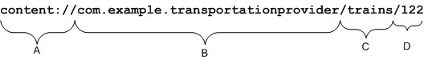
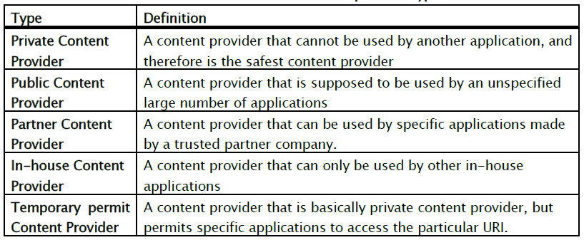
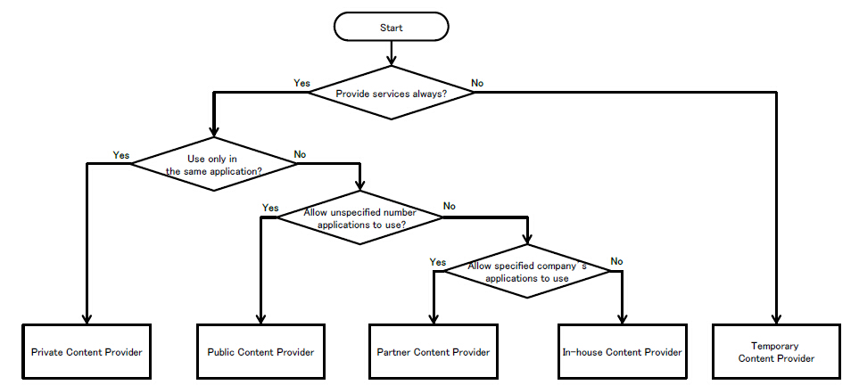

# Android Content Provider Security

**Author:瘦蛟舞**

**Create:20141201**

## 0x00  科普

----------

ContentProvider用来存放和获取数据并使这些数据可以被所有的应用程序访问。它们是应用程序之间共享数据的唯一方法；不包括所有Android软件包都能访问的公共储存区域。Android为常见数据类型（音频，视频，图像，个人联系人信息，等等）装载了很多ContentProvider。你可以看到在android.provider包里列举了一些。你还能查询这些提供器包含了什么数据。当然，对某些敏感ContentProvider，必须获取对应的权限来读取这些数据。

如果你想公开你自己的数据，你有两个选择：你可以创建你自己的ContentProvider（一个ContentProvider子类）或者你可以给已有的提供器添加数据，前提是存在一个控制同样类型数据的ContentProvider且你拥有读写权限。
 


## 0x01  知识要点

----------

参考：[http://developer.android.com/guide/topics/providers/content-providers.html](http://developer.android.com/guide/topics/providers/content-providers.html ) 

**Content URIs**

content URI 是一个标志provider中的数据的URI．Content URI中包含了整个provider的以符号表示的名字(它的authority) 和指向一个表的名字(一个路径)．当你调用一个客户端的方法来操作一个provider中的一个表，指向表的content URI是参数之一． 


 
A. 标准前缀表明这个数据被一个ContentProvider所控制。它不会被修改。

B. URI的权限部分；它标识这个ContentProvider。对于第三方应用程序，这应该是一个全称类名（小写）以确保唯一性。权限在<provider>元素的权限属性中进行声明：

```
<provider name=".TransportationProvider"
  authorities="com.example.transportationprovider"
  . . .  >
```

C. 用来判断请求数据类型的路径。这可以是0或多个段长。如果ContentProvider只暴露了一种数据类型（比如，只有火车），这个分段可以没有。如果提供器暴露若干类型，包括子类型，那它可以是多个分段长-例如，提供"land/bus", "land/train", "sea/ship", 和"sea/submarine"这4个可能的值。

D. 被请求的特定记录的ID，如果有的话。这是被请求记录的_ID数值。如果这个请求不局限于单个记录， 这个分段和尾部的斜线会被忽略：

```
content://com.example.transportationprovider/trains
```

**ContentResolver**

ContentResolver的方法们提供了对存储数据的基本的"CRUD" (增删改查)功能

```java
getIContentProvider() 
      Returns the Binder object for this provider.

delete(Uri uri, String selection, String[] selectionArgs) -----abstract
      A request to delete one or more rows.

insert(Uri uri, ContentValues values) 
      Implement this to insert a new row.

query(Uri uri, String[] projection, String selection, String[] selectionArgs, String sortOrder) 
      Receives a query request from a client in a local process, and returns a Cursor.

update(Uri uri, ContentValues values, String selection, String[] selectionArgs) 
      Update a content URI.

openFile(Uri uri, String mode) 
      Open a file blob associated with a content URI.
```

**Sql注入**

sql语句拼接

```
// 通过连接用户输入到列名来构造一个选择条款
String mSelectionClause =  "var = " + mUserInput;
```

参数化查询

```
// 构造一个带有占位符的选择条款
String mSelectionClause =  "var = ?";
```

**权限**

```
< provider android:authorities="list" 
    android:enabled=["true" | "false"] 
    android:exported=["true" | "false"] 
    android:grantUriPermissions=["true" | "false"] 
    android:multiprocess=["true" | "false"] 
    android:name="string" 
    android:permission="string" 
    android:process="string" 
    android:readPermission="string" 
    android:writePermission="string" > 
    . . . 
< /provider > 
```

下面的<uses-permission> 元素请求对用户词典的读权限：

```
<uses-permission android:name="android.permission.READ_USER_DICTIONARY">
```

申请某些protectionLevel="dangerous"的权限

```
<uses-permission android:name="com.huawei.dbank.v7.provider.DBank.READ_DATABASE"/>

<permission android:name="com.huawei.dbank.v7.provider.DBank.READ_DATABASE" android:protectionLevel="dangerous"></permission>
```

android:protectionLevel

等级|说明
------------ | -------------
normal|默认值,调用者无需操作.
dangerous|调用者需在配置清单中申明此权限.
signature|调用者需有相同签名.
signatureOrSystem|调用者需system uid或者具有相同签名.

android:grantUriPermissions

是否能临时超越 readPermission、 writePermission和 permission 属性的限制， 给平常无权对 Content Provider 数据的访问进行授权 — “true”可以授权，“false”不可以。 如果设为“true”，则可对 Content Provider 的所有数据进行授权访问。 如果设为“false”，那就只能对 < grant-uri-permission > 子元素中列出的数据子集（假如存在的话）进行授权。 默认值是“false”。

授权机制使得程序组件能对那些受权限保护的数据进行一次性的访问。 比如，假定某条 e-mail 包含了附件，邮件程序可能会调用合适的查看器来打开附件，即使该查看器平常无权查看 Content Provider 的全部数据也没关系。

这时候，可以通过设置启动组件的 Intent 对象的 FLAG_GRANT_READ_URI_PERMISSION和 FLAG_GRANT_WRITE_URI_PERMISSION 标志位进行授权。 比如，邮件程序可以在传入 Context.startActivity() 的 Intent 中设置 FLAG_GRANT_READ_URI_PERMISSION。 权限即指定授予该 Intent 中的 URI。 (此时若是隐式启动将存在越权风险?)

如果启用了这种临时授权的特性，不论是将本属性设为“true”还是定义了 < grant-uri-permission > 子元素，那么当所涉及的 URI 要从 Content Provider 中删除时，必须调用一下 Context.revokeUriPermission()。
请参阅 < grant-uri-permission > 元素。

```
< grant-uri-permission android:path="string" 
    android:pathPattern="string" 
    android:pathPrefix="string" / >
```


**API**

Contentprovider组件在API-17（android4.2）及以上版本由以前的exported属性默认ture改为默认false。

Contentprovider无法在android2.2（API-8）申明为私有。

```
	<!-- *** POINT 1 *** Do not (Cannot) implement Private Content Provider in Android 2.2 (API Level 8) or earlier. -->
	<uses-sdk android:minSdkVersion="9" android:targetSdkVersion="17" />
```

**关键方法**

- public void addURI (String authority, String path, int code)
- public static String decode (String s)
- public ContentResolver getContentResolver()
- public static Uri parse(String uriString)
- public ParcelFileDescriptor openFile (Uri uri, String mode)
- public final Cursor query(Uri uri, String[] projection,String selection, String[] selectionArgs, String sortOrder)
- public final int update(Uri uri, ContentValues values, String where,String[] selectionArgs)
- public final int delete(Uri url, String where, String[] selectionArgs)
- public final Uri insert(Uri url, ContentValues values)
- public abstract void grantUriPermission (String toPackage, Uri uri, int modeFlags) //Grant permission to access a specific Uri to another package, regardless of whether that package has general permission to access the Uri's content provider. 临时授权
- public abstract void revokeUriPermission (Uri uri, int modeFlags) //Remove all permissions to access a particular content provider Uri that were previously added with grantUriPermission(String, Uri, int). 移动授权

## 0x02 content provider 分类





这个老外分的特别细，个人认为就分private、public、in-house差不多够用。

## 0x03 安全建议

----------

1.	minSdkVersion不低于9
2.	不向外部app提供的数据的私有content provider设置exported=“false”避免组件暴露(编译api小于17时更应注意此点)
3.	使用参数化查询避免注入
4.	内部app通过content provid交换数据设置protectionLevel=“signature”验证签名
5.	公开的content provider确保不存储敏感数据
6.	Uri.decode() before use ContentProvider.openFile()
7.	提供asset文件时注意权限保护 

## 0x04  测试方法

----------

1、反编译查看AndroidManifest.xml（drozer扫描）文件定位content provider是否导出，是否配置权限，确定authority
	
	drozer:
	run app.provider.info -a cn.etouch.ecalendar

2、反编译查找path，关键字```addURI```、hook api 动态监测推荐使用zjdroid

3、确定authority和path后根据业务编写POC、使用drozer、使用小工具Content Provider Helper、adb shell // 没有对应权限会提示错误
	
```	
adb shell：
adb shell content query --uri <URI> [--user <USER_ID>] [--projection <PROJECTION>] [--where <WHERE>] [--sort <SORT_ORDER>]
content query --uri content://settings/secure --projection name:value --where "name='new_setting'" --sort "name ASC"
adb shell content insert --uri content://settings/secure --bind name:s:new_setting --bind value:s:new_value
adb shell content update --uri content://settings/secure --bind value:s:newer_value --where "name='new_setting'"
adb shell content delete --uri content://settings/secure --where "name='new_setting'"

<!--content query -–uri content://com.yulong.android.ntfcationmanager.provider/ntfpkgperm -->

drozer：
run app.provider.query content://telephony/carriers/preferapn --vertical
```

## 0x05 案例

----------

**案例1：直接暴露**

- http://www.wooyun.org/bugs/wooyun-2010-041595 
- http://www.wooyun.org/bugs/wooyun-2013-016854 
- http://www.wooyun.org/bugs/wooyun-2013-021089
- http://www.wooyun.org/bugs/wooyun-2010-039290
- http://www.wooyun.org/bugs/wooyun-2013-042609
- http://www.wooyun.org/bugs/wooyun-2014-085432
- http://www.wooyun.org/bugs/wooyun-2014-084500 


**案例2：需权限访问**

- http://www.wooyun.org/bugs/wooyun-2013-041521
- http://www.wooyun.org/bugs/wooyun-2010-057590
- http://www.wooyun.org/bugs/wooyun-2010-039697


 
**案例3：openFile文件遍历**


- http://www.wooyun.org/bugs/wooyun-2013-044407 
- http://www.wooyun.org/bugs/wooyun-2010-047098
- http://www.wooyun.org/bugs/wooyun-2010-044411

Override openFile method

错误写法1：

```java
private static String IMAGE_DIRECTORY = localFile.getAbsolutePath();
public ParcelFileDescriptor openFile(Uri paramUri, String paramString)
    throws FileNotFoundException {
  File file = new File(IMAGE_DIRECTORY, paramUri.getLastPathSegment());
  return ParcelFileDescriptor.open(file, ParcelFileDescriptor.MODE_READ_ONLY);
}
```

错误写法2：URI.parse()

```java
private static String IMAGE_DIRECTORY = localFile.getAbsolutePath();
  public ParcelFileDescriptor openFile(Uri paramUri, String paramString)
      throws FileNotFoundException {
    File file = new File(IMAGE_DIRECTORY, Uri.parse(paramUri.getLastPathSegment()).getLastPathSegment());
    return ParcelFileDescriptor.open(file, ParcelFileDescriptor.MODE_READ_ONLY);
  }
```

POC1：

```java
String target = "content://com.example.android.sdk.imageprovider/data/" + "..%2F..%2F..%2Fdata%2Fdata%2Fcom.example.android.app%2Fshared_prefs%2FExample.xml";

ContentResolver cr = this.getContentResolver();
FileInputStream fis = (FileInputStream)cr.openInputStream(Uri.parse(target));

byte[] buff = new byte[fis.available()];
in.read(buff);
```

POC2：double encode

```java
String target = "content://com.example.android.sdk.imageprovider/data/" + "%252E%252E%252F%252E%252E%252F%252E%252E%252Fdata%252Fdata%252Fcom.example.android.app%252Fshared_prefs%252FExample.xml";

ContentResolver cr = this.getContentResolver();
FileInputStream fis = (FileInputStream)cr.openInputStream(Uri.parse(target));

byte[] buff = new byte[fis.available()];
in.read(buff);
```

解决方法Uri.decode()

```java
private static String IMAGE_DIRECTORY = localFile.getAbsolutePath();
  public ParcelFileDescriptor openFile(Uri paramUri, String paramString)
      throws FileNotFoundException {
    String decodedUriString = Uri.decode(paramUri.toString());
    File file = new File(IMAGE_DIRECTORY, Uri.parse(decodedUriString).getLastPathSegment());
    if (file.getCanonicalPath().indexOf(localFile.getCanonicalPath()) != 0) {
      throw new IllegalArgumentException();
    }
    return ParcelFileDescriptor.open(file, ParcelFileDescriptor.MODE_READ_ONLY);
  }
```
## 0x06 参考

----------

[https://www.securecoding.cert.org/confluence/pages/viewpage.action?pageId=111509535](https://www.securecoding.cert.org/confluence/pages/viewpage.action?pageId=111509535)

[http://www.jssec.org/dl/android_securecoding_en.pdf](http://www.jssec.org/dl/android_securecoding_en.pdf)

[http://developer.android.com/intl/zh-cn/reference/android/content/ContentProvider.html](http://developer.android.com/intl/zh-cn/reference/android/content/ContentProvider.html)

## 0x07 相关阅读

[http://zone.wooyun.org/content/15097](http://zone.wooyun.org/content/15097)

[http://drops.wooyun.org/tips/2997](http://drops.wooyun.org/tips/2997)