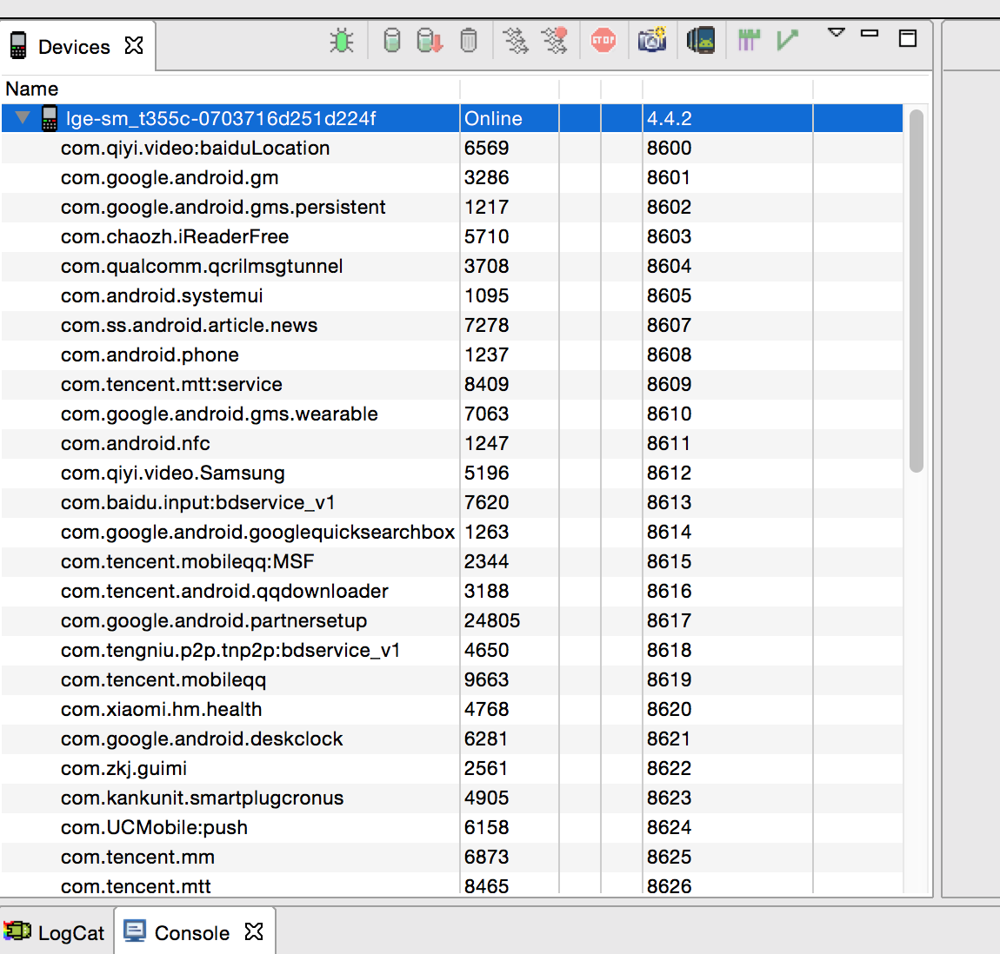
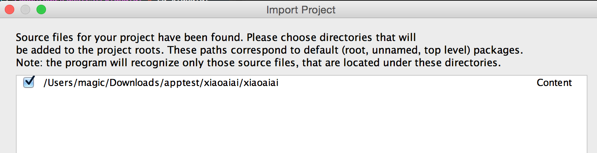
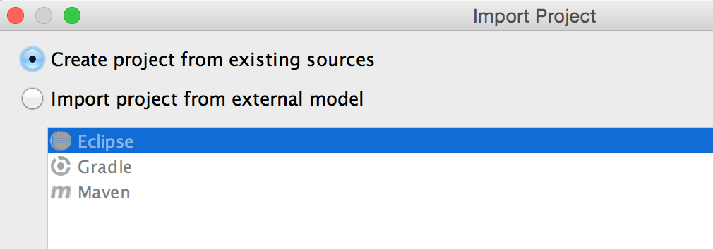
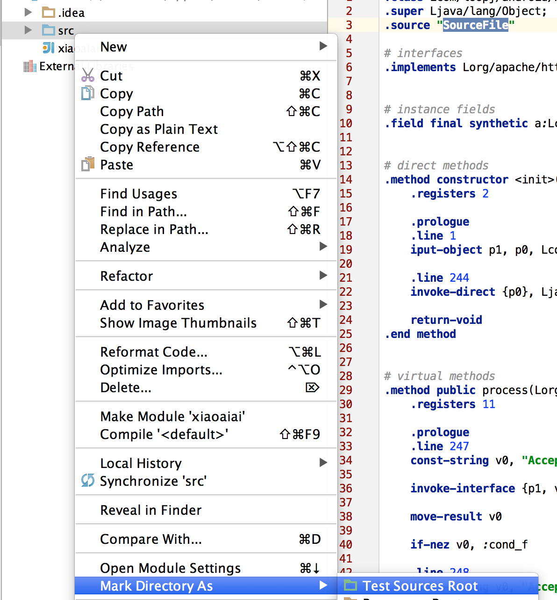
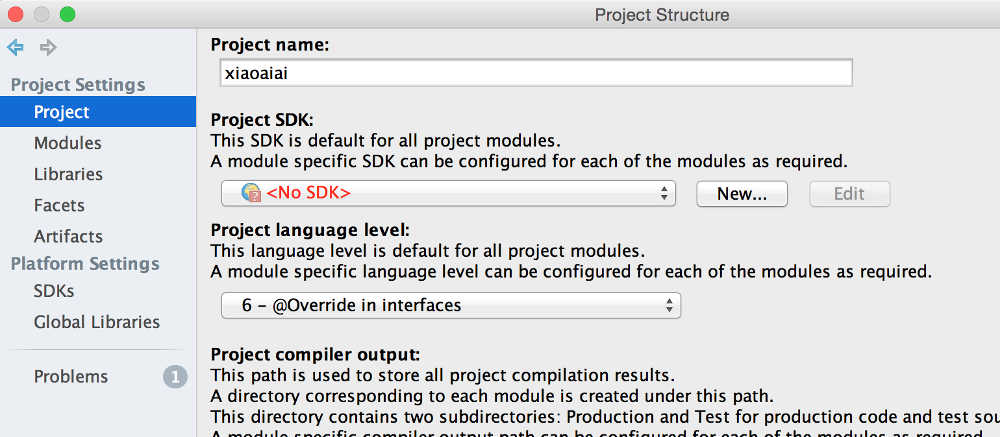
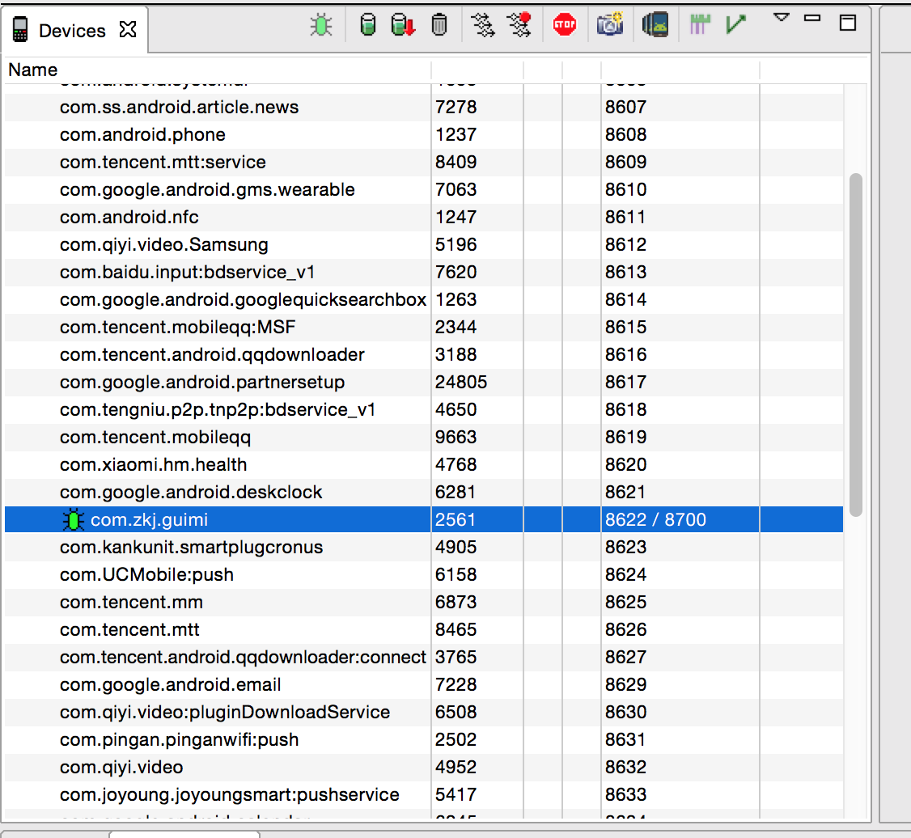
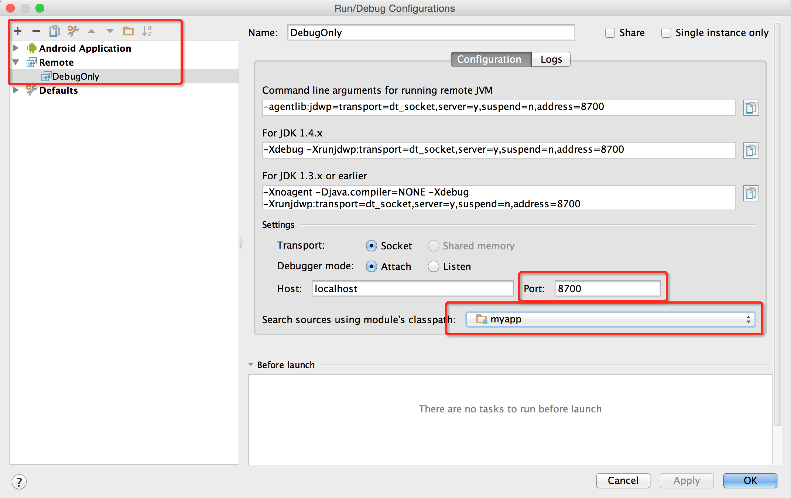
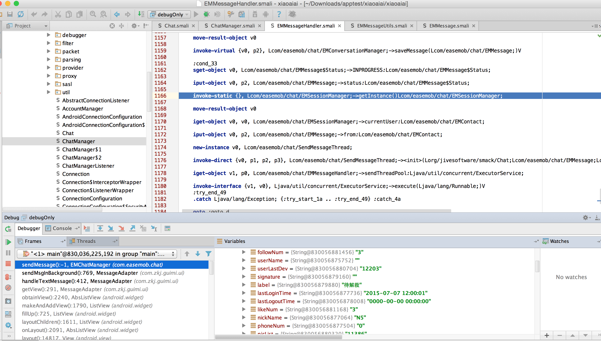

## Smalidea无源码调试android应用

<!-- create time: 2015-05-17 15:52:52  -->

<!-- This file is created from $MARBOO_HOME/.media/starts/default.md
本文件由 $MARBOO_HOME/.media/starts/default.md 复制而来 -->


**Author:瘦蛟舞**

**Create:20150517**

smalidea是一款 IntelliJ IDEA/Android Studio的 smali 插件

### 已有功能

---

- 语法高亮/错误提示
- 字节码级别调试
	* 断点
	* 单步调试
	* 寄存器查看
	* 本地窗口 java 语法支持,debug 模式下同样支持
- 支持跳转,方便追踪变量/函数/类.(Xref也支持)
- 查找用法
- 重命名
- 从 java 代码引用 smali 类 Referencing smali classes from java code (except it can't actually be compiled, yet)
- 错误反馈...

### 安装

---

- 下载插件[smalidea](https://bitbucket.org/JesusFreke/smali/downloads)
- 进入IntelliJ IDEA/Android Studio开始安装插件,进入Settings->Plugins点击```Install plugin from disk```选中下载好的压缩包.
- 点击 ```apply```

### 开启应用调试

---

要调试一个apk里面的dex代码，必须满足以下两个条件中的任何一个:

- apk中的AndroidManifest.xml文件中的Application标签包含属性android:debuggable=”true”
- /default.prop中ro.debuggable的值为1 

可选方案:

- apktool 反编译app 后在AndroidManifest.xml文件中插入android:debuggable=”true”
- hook system debug (Xinstaller)
- 修改boot.img

个人觉得改 boot.img和二次打包比较麻烦,所以这里采用 hook 方式达到开启所有应用调试的目的,xposed 插件代码如下

	public class Debug implements IXposedHookLoadPackage {

	    public boolean debugApps = true ;
	    public static final int DEBUG_ENABLE_DEBUGGER = 0x1;
	    public String tag = "IDG";

	    @Override
	    public void handleLoadPackage(XC_LoadPackage.LoadPackageParam lpparam) throws Throwable {

	        if(lpparam.appInfo == null ||
	                (lpparam.appInfo.flags & (ApplicationInfo.FLAG_SYSTEM | ApplicationInfo.FLAG_UPDATED_SYSTEM_APP)) !=0){
	            return;
	        }

	        tag = tag + lpparam.packageName;

	        XposedBridge.hookAllMethods(Process.class, "start", new XC_MethodHook() {
	            @Override
	            protected void beforeHookedMethod(MethodHookParam param) throws Throwable {

	                int id = 5;
	                int flags = (Integer) param.args[id];

	                Log.d(tag,"flags is : "+flags);

	                if (debugApps) {
	                    if ((flags & DEBUG_ENABLE_DEBUGGER) == 0) {
	                        flags |= DEBUG_ENABLE_DEBUGGER;
	                    }
	                }

	                param.args[id] = flags;
	                Log.d(tag,"flags changed : "+flags);

	            }
	        });
	    }

	}

效果如下图



如果遇到如下错误

	Adb rejected connection to client

可以使用重启 adb server 来解决

	adb kill-server

	adb start-server
	

### 调试应用

---

注意:IDEA 14.1及以上版本才支持单步调试

- 使用 baksmali 反编译应用

		baksmali myapp.apk -o ~/projects/myapp/src

- 转到 IDEA 中,导入新工程,选中之前的目录

	 	~/projects/myapp
		
	
	
- 导入时选择```Create project from existing sources```

	

- 成功导入工程后右键点击 src 目录,设定```Mark Directory As->Sources Root```

	

- 打开```Module setting```设置对应的 JDK

	

- 安装debug应用

		adb install com.zkj.guimi.apk

- 找到debug应用进程,启动应用

	

	如果不用 ddms 可以使用如下步骤:
	
		» adb shell am start -D -W -n com.zkj.guimi/.ui.SplashScreen
		» adb shell ps |grep guimi                                                                                                         1 ↵
		u0_a157   9879  242   883420 36360 ffffffff 00000000 S com.zkj.guimi
		» adb forward tcp:8700 jdwp:9879

- 在 IDEA 配置远程调试(Run->Edit Configurations),更改debug端口为8700

	
	

- Run->Debug

	Connected to the target VM, address: 'localhost:8700', transport: 'socket'

- 断点触发后就可以单步调试和查看寄存器了

	


### referrence

---

[http://www.kanxue.com/bbs/showthread.php?p=1338639](http://www.kanxue.com/bbs/showthread.php?p=1338639)

[https://github.com/JesusFreke/smali/wiki/smalidea](https://github.com/JesusFreke/smali/wiki/smalidea)

[https://github.com/pylerSM/XInstaller](https://github.com/pylerSM/XInstaller)