## 进击的短信拦截马

**Author:瘦蛟舞**

**Create:20150918**

---

木马利用短信感觉受害者通信录中好友.利用"看你做的好事","看你做的龌龊事"等语句诱导用户安装.

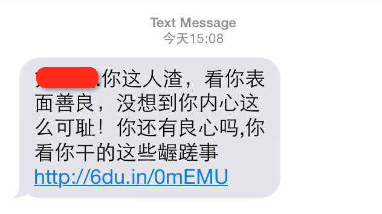

开始分析木马,首先查看其Manifest文件.从其申请短信/联系/联网的权限来看已经可以基本确认这是一款短信拦截马,貌似没啥新意不过可以从中发现一些以前没有的细节.感觉这个木马还是挺用心的

首先是installLocation属性的设置.

	android:installLocation="internalOnly" 

设置这个属性的目的是不让木马 app 被安装到 sdcard 中.因为如果 app 被安装 sdcard 中而非手机内置存储的话会失去以下特性导致木马的功能不健全

- 系统会在加载外部存储介质之前发送ACTION_BOOT_COMPLETED广播,所以程序将不能接受开机广播 (无法开机启动)
- DeviceAdminReceiver失效 (无法激活设备管理器防止卸载)
- Service无法正常工作,会被 kill 且无法 restart (无法在后台持续运行)
- Alarm Service 闹钟服务将被取消 (减少一个入口点)

第二个有意思的点 excludeFromRecents 是在 activity 标签中设置的.

	android:excludeFromRecents="false"

这样设置的目的是不让木马 app 现在在最近程序列表中减少被普通用户发现的概率.类似处理还有将此 Activity 在代码中 disable

第三个特点是随机字符串包名

	package="tjkxyfmjhvdg.oprbrvvgeevv.uxqjjuqxympd"

要抓取几个样本后发现,包名是随机的字符串,但是代码特助以及签名都是一样的.应该是通过程序自动生成的,猜测目的是躲避一些杀软.

---

继续观察程序入口点: 1.主Activity,用户点一次后将会被禁用

        <activity android:excludeFromRecents="false" android:label="@string/app_name" android:name="com.phone.stop.activity.MainActivity">
            <intent-filter>
                <action android:name="android.intent.action.MAIN" />
                <category android:name="android.intent.category.LAUNCHER" />
            </intent-filter>
        </activity>

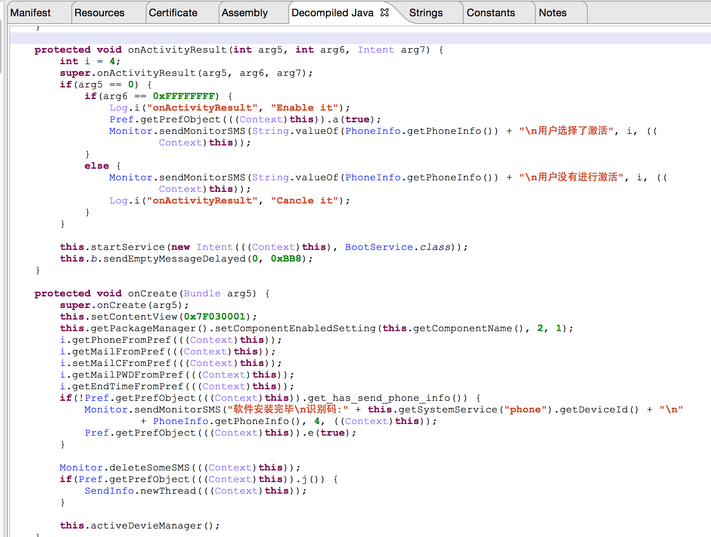

功能老几样: 

- 禁用Main Activity组件隐藏图标
- 激活设备管理器,防止卸载
- 短信通信木马使用者肉鸡已经上线.
- 异步邮件发送受害者通信录以及短信记录
- 启动后台服务实时监控短信

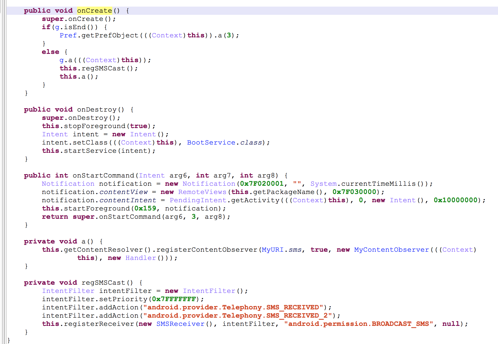

sevice 的主要功能是

- 动态注册短信广播接收器和观察这
- 被destory后自动启动
- 判断木马是否过期.(这点显然可以看出,使用木马的人是从它处购买的木马,还有有效期的)

其他入口点: 2.开机广播  3.网络切换广播  4.短信相关广播 ,总计4处可以触发拦截马行为.

        <receiver android:name="com.phone.stop.receiver.BootReceiver">
            <intent-filter android:priority="2147483647">
                <action android:name="android.intent.action.BOOT_COMPLETED" />
                <action android:name="android.net.conn.CONNECTIVITY_CHANGE" />
                <action android:name="android.provider.Telephony.SMS_RECEIVED" />
                <action android:name="android.provider.Telephony.GSM_SMS_RECEIVED" />
                <action android:name="android.provider.Telephony.SMS_RECEIVED_2" />
                <action android:name="android.provider.Telephony.SMS_DELIVER" />
            </intent-filter>
        </receiver>

短信广播接收器和观察者的代码就不贴了,发出的邮件是这样的:

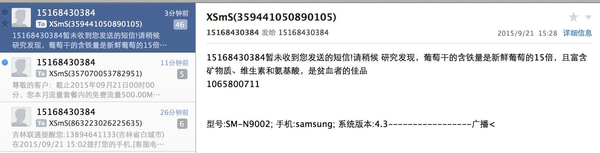

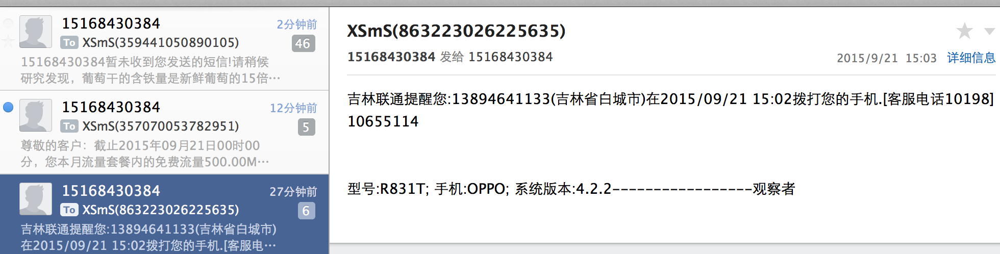

那么这个木马是肿么存储邮箱帐号木马的了,发现这些个短信马都喜欢用163.

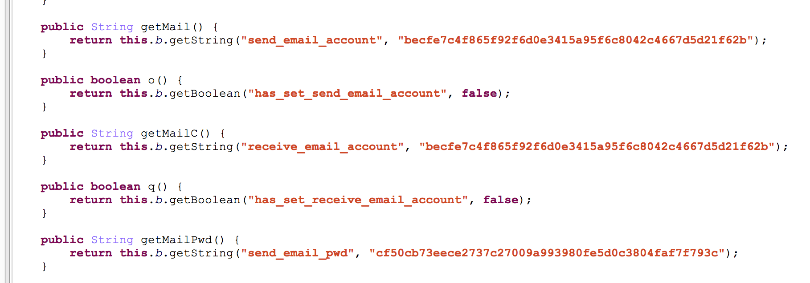

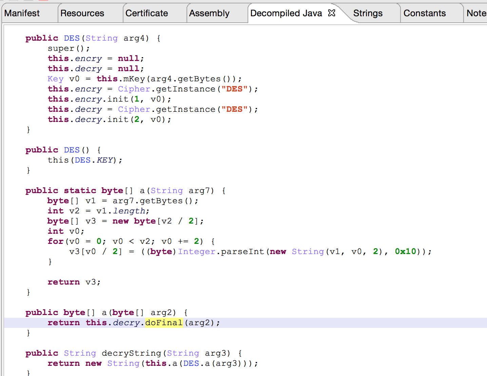

这款木马选择对邮箱帐号密码使用 des 加密.破解这个也很简单现在有三个途径: 

- 根据密钥使用 DES脚本解密
- hook API 方法 javax.mail.Service#connect(java.lang.String host, int port, java.lang.String user, java.lang.String password)
- 查看程序私有目录下配置文件

大概两天不到的时间已经有上千受害者中招,部分数据如下:

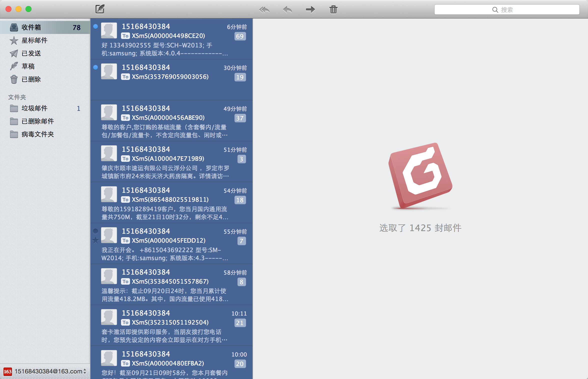

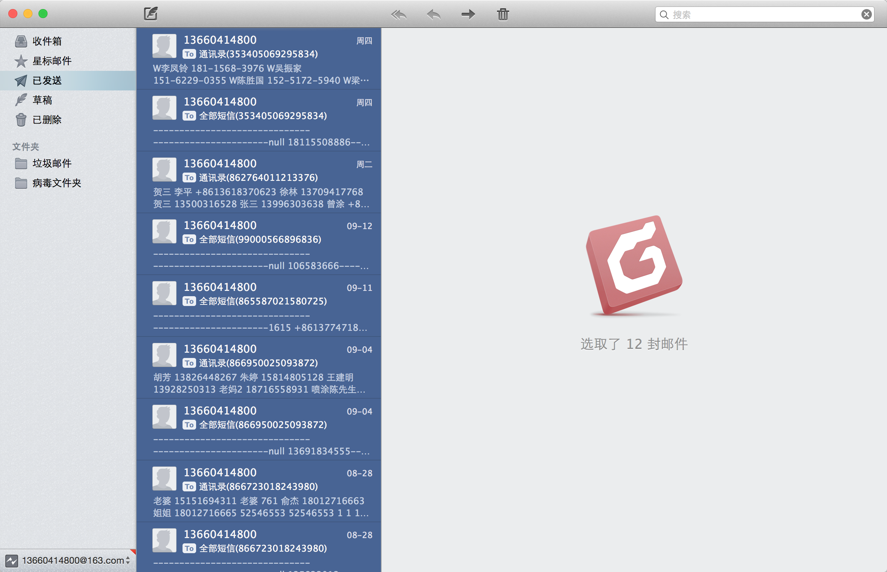

通信录

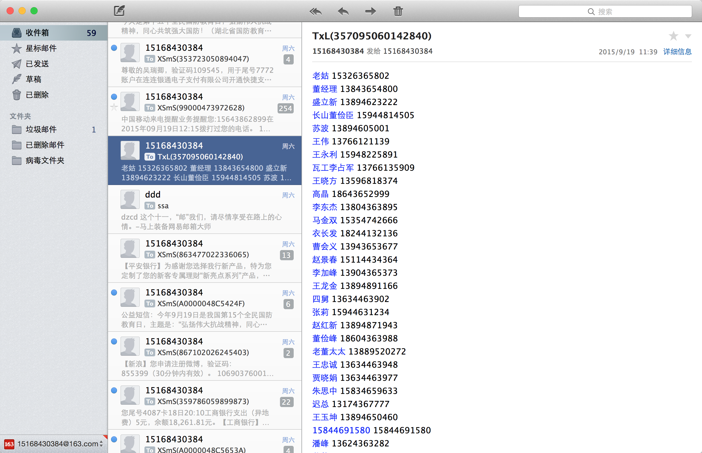

短信记录

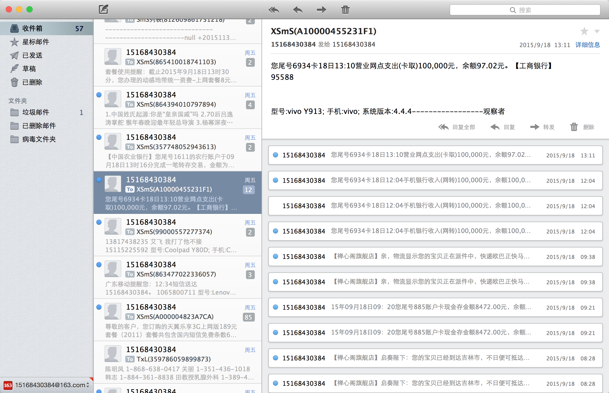

**总结木马功能:**

- 短信指令控制
- 通过 SMTP 协议邮件发送受害者通信录以及短信记录
- 通过"短信广播接收器"和"观察者"实时监控短信

---

在这些用 SMTP 上传受害者信息的短信木马中,有些木马作者比较 low 就直接硬编码在 java 代码中,有些会选择像上述的加密,也有往底层迁移

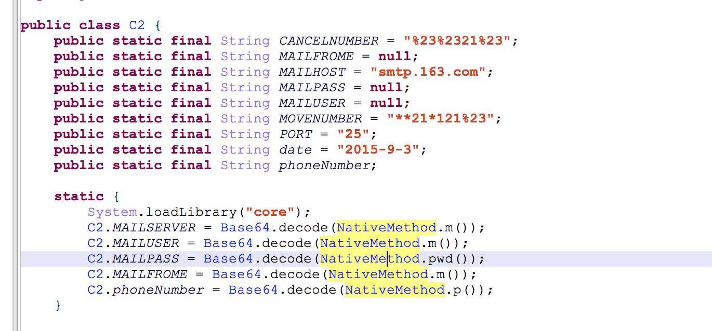

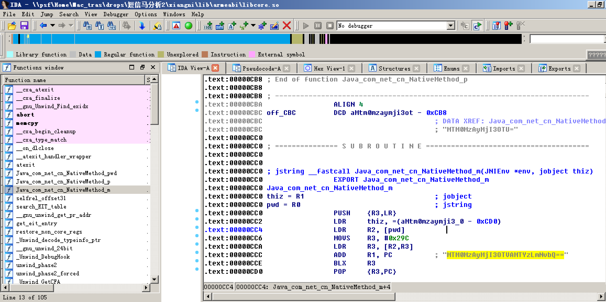

---

**木马传播途径:**

1.伪基站\钓鱼\定向群发

2.受害者感染通信录好友

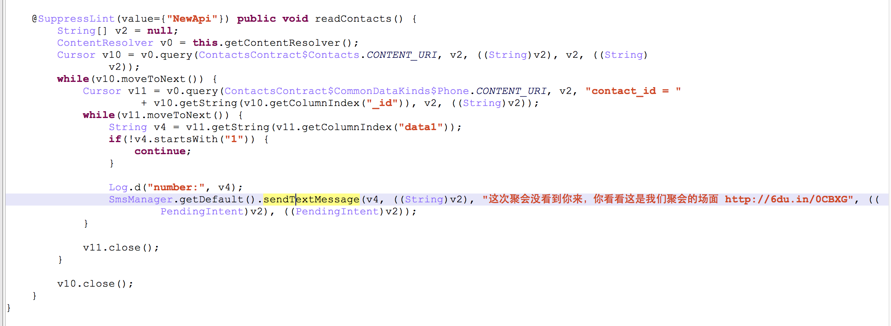

---

**木马使用者手机号码:**

15168430384

13894651855

13660414800

13430222795

已验证为黑卡,未实名认证.

**传播站点:**

118.193.170.149:2100

118.193.157.132:1123

http://www.shunlilao.com/hyl/xiangni.apk

http://wusha66.net/erw2fs.apk

主要来自香港的 VPS.