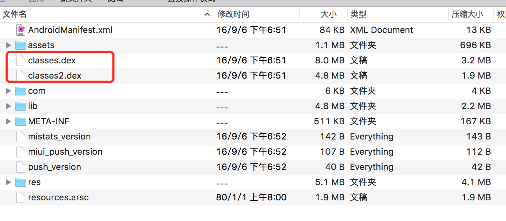
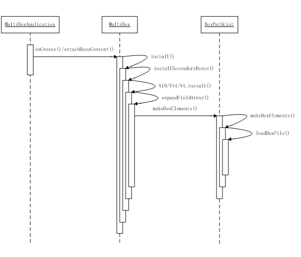
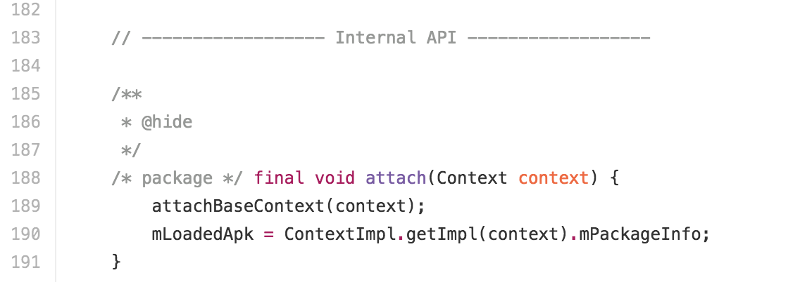
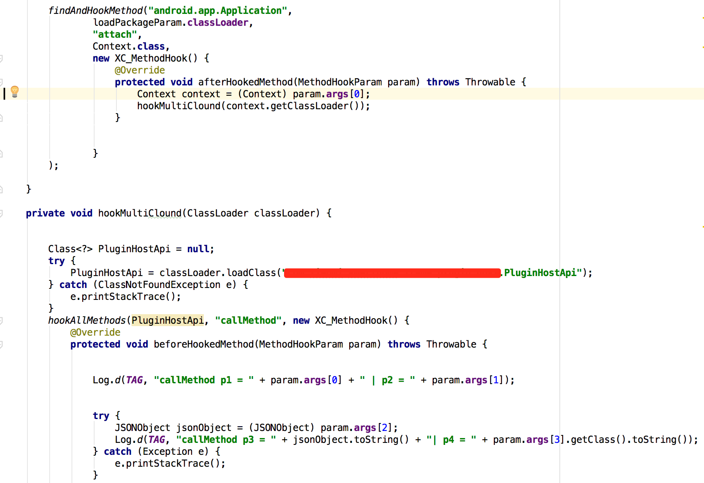
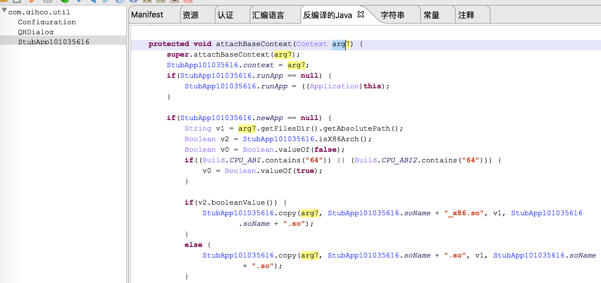

# Android逆向随笔之遇见MultiDex

**Author:瘦蛟舞**

**Create:20161020**

### 0x00 Who is Multidex

很多大厂的Android App因为业务量大，引用库多导致其apk包中的类于方法剧增。这样就有可能出现因为方法数过多导致编译失败的情况。产生这个问题的主因是dex文件格式的限制。一个DEX文件中method个数采用使用原生类型short来索引文件中的方法，也就是4个字节共计最多表达65536个method，field/class的个数也均有此限制。对于DEX文件，则是将工程所需全部class文件合并且压缩到一个DEX文件期间，也就是Android打包的DEX过程中，单个DEX文件可被引用的方法总数被限制为65536。

为解决这个问题，谷歌推出了Multidex技术，简单来说就是将一个apk中的dex文件拆分成多个分主次先后加载，当然在这之前业界已经开始使用插件化来弱化此类问题。现在市面上也有很多Multidex和插件化两种方案都使用的app。

Multidex会给逆向工程师带来如下麻烦：

1.常见工具静态分析的类和方法不全

2.静态分析工具因为交叉引用的问题导致反编译失败或崩溃

3.动态调试中无法下断点

4.hook的时候找不到制定的类和方法

### 0x01 merge multidex

在逆向apk中经常会遇到一些类丢失，反编译崩溃的情况。如果这时候去观察apk压缩包会发现其中有超过一个dex，上图中就有两个dex。那么这个app分析起来就不会很轻松了，因为这个叫dex分包的技术直接意味着你要面对超过65536个java方法。而这篇文章主要就是讲解笔者在遇到这种情况的时候一些应对手法。

如果你的dex2jar版本为v2.1之前的版本，那么dex2jar就会默认转化第一个dex文件而忽略其他dex文件.52f26c6 2.1版本开始支持multidex，直接执行

    d2j-dex2jar.sh the-apk-witch-mutidex.apk

就可以转化所有dex文件到一个jar包中。

在dex2jar更新v2.1之前笔者是用的一个比较"耿直"的方法解决这个问题，因为dex的method数量有限但是jar包对method是没有特别限制的，所以我写了一个脚本将apk中多个dex先转化为jar文件之后解压缩最后合并打包压缩，同样可以得到完全的反编译文件。

Android逆向中出镜率较高的jeb在早期版本v1.x也同样有类似尴尬的问题，只默认反编译第一个dex文件。但是到v2.2也开始支持multidex采用merge的方式解决多个dex的反编译问题。也就是在jeb2.2之后就可以无障碍的在multidex中使用交叉引用功能了。

在很长一段时间使用jeb1.5的时候解决这个问题的办法同样也也merge多个dex的smali代码，因为要回编译至dex所以就无法突然65K方法数的限制，那么就要想办法对multidex进行瘦身。大数据情况下我们只关心其自有代码，对其依赖库往往是带过的(大多数情况是和配置文件中application或者入口Activity同路径的代码)。这里就需要选择一个较小的dex去识别去除一些依赖库和第三方sdk比如android support / google gson，然后抽取另外的dex的主包smali代码合并到较小的dex中。最后回编译至dex拖入jeb1.5中就可以正常分析了。

### 0x02 attach multidex

在multidex的测试过程中还会出现一种情况，就是使用xposed hook其方法的时候，如果方法位于默认dex中是可以的正常hook，但是如果方法位于dex分包中xposed就会报错提示所要hook的方法所在类无法找到。

要分析这个问题的原因以及解决办法，就要先了解multidex的载入过程以及xposed的hook时机。

dex分包加载大致流程如下,可以得出分包是滞后主包不少时间加载的：

1.检测是否有分包需要安装,系统是否支持multidex

2.从apk中解压出分包

3.通过反射将分包注入到当前classloader

而xposed为了能让module及时载入执行所以得尽快调用handleLoadPackage()，所以此时获取的context的classloader中只要默认dex主的包的类。

因此我们得想法得到完整的上下文context,比较明显的获取完整context的hook时机有如下两处：

MultiDex.install()

MultiDexApplication.attachBaseContext()

[MultiDexApplication.java](https://android.googlesource.com/platform/frameworks/multidex/+/master/library/src/android/support/multidex/MultiDexApplication.java)

而xposed的作者建议是选择android.app.Application.attach()，因为attachBaseContext是有概率被重写的不稳定.所以选择方法内调用了attachBaseContext的Application.attach()。

[platform_frameworks_base/core/java/android/app/Application.java](https://github.com/android/platform_frameworks_base/blob/master/core/java/android/app/Application.java#L180)

示例代码如下

分析到这里就可以想到一些加壳后的app无法正常hook也可能是类似原因可以用同样的方法解决(这里前提当然是能脱壳看到代码且壳没对hook做对抗，如果有对抗还是脱了之后回打包比较稳妥.)。下图这个壳同样也佐证了attachBaseContext被重写的可能，直接hook被重写的attachBaseContext也是可行的。

**0x03 refer**

[Configure Apps with Over 64K Methods](https://developer.android.com/studio/build/multidex.html#about)

[Android分包原理](http://souly.cn/%E6%8A%80%E6%9C%AF%E5%8D%9A%E6%96%87/2016/02/25/android%E5%88%86%E5%8C%85%E5%8E%9F%E7%90%86/)

[Multidex support #30](https://github.com/rovo89/XposedBridge/issues/30#issuecomment-68488797)

[美团Android DEX自动拆包及动态加载简介](http://tech.meituan.com/mt-android-auto-split-dex.html)

[Google Git](https://android.googlesource.com/platform/frameworks/multidex/+/master/library/src/android/support/multidex)
