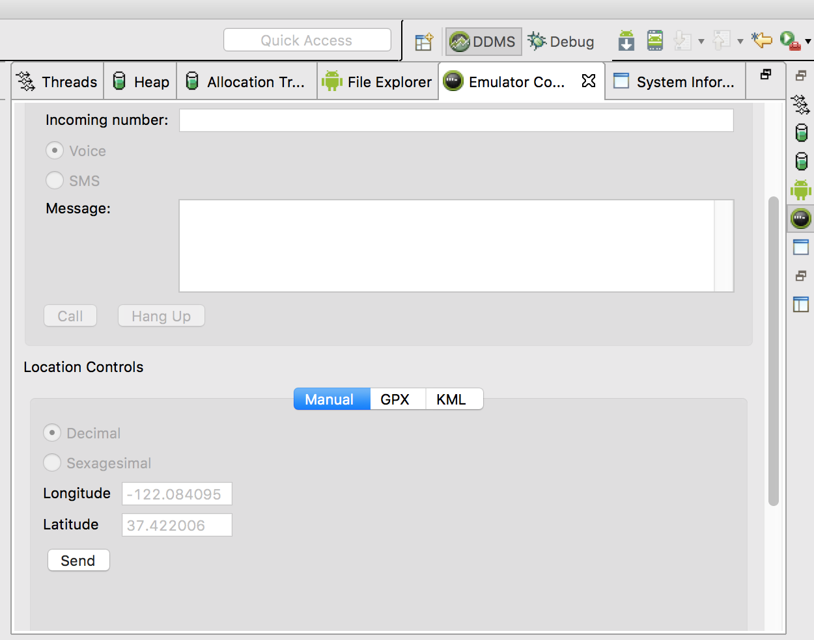
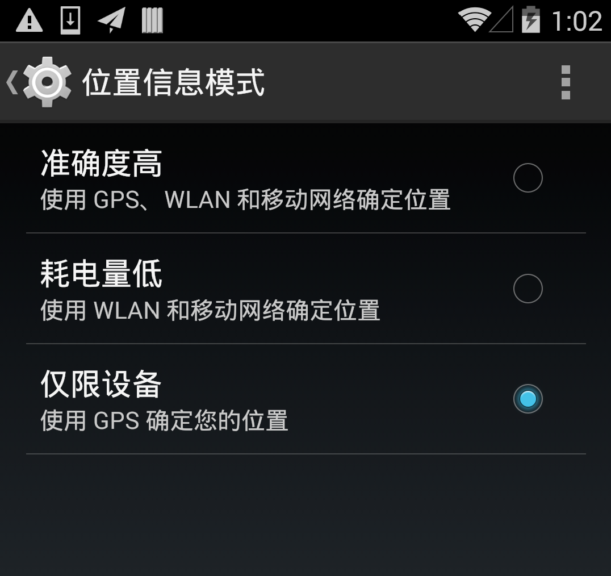
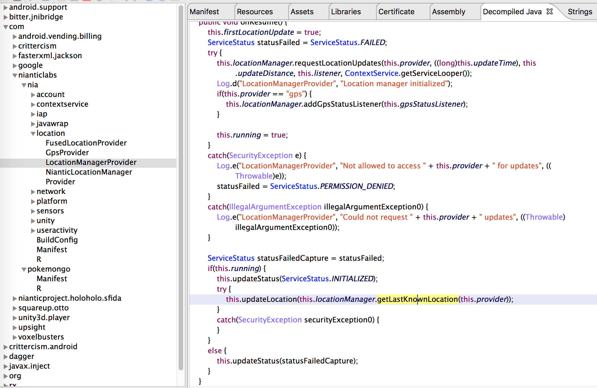
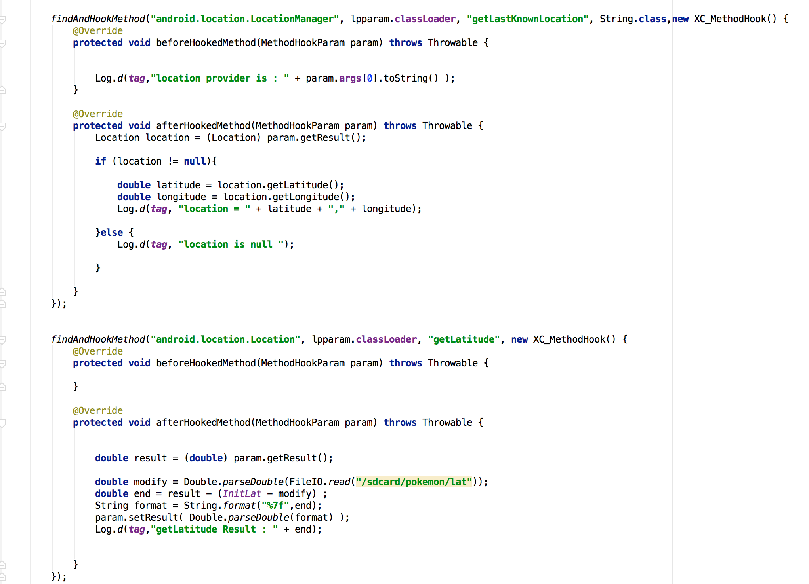
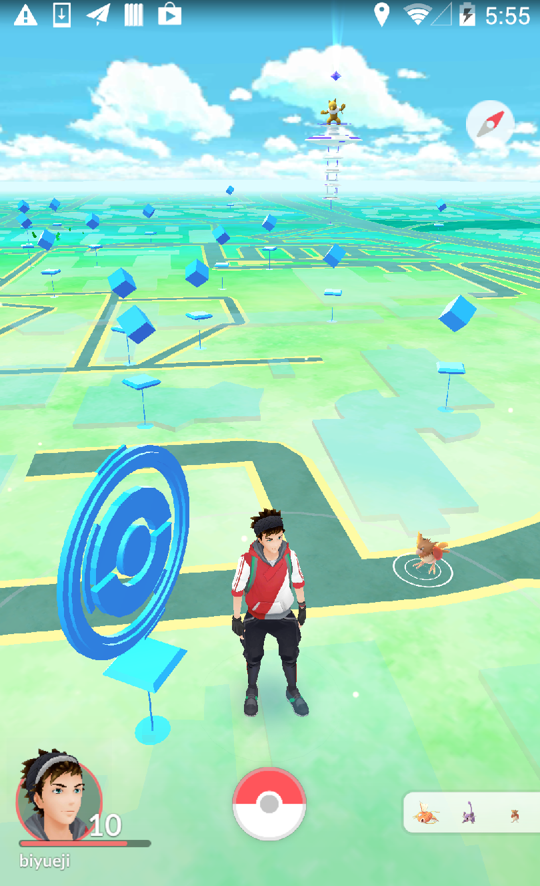
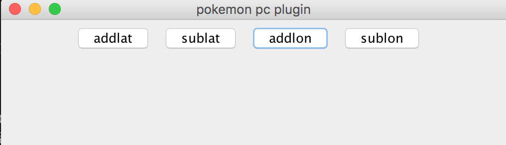

# 小议安卓定位伪造-实战足不出户畅玩pokemon go

**Author:瘦蛟舞**

**Create:20160715**

**本文旨在技术探讨，正常玩家请勿模仿，游戏中虚拟位置有封号风险**

### 0x00 安卓定位方式归类

要伪造定位首先要摸清定位到底是如何实现的，首先从广义上来区分安卓的定位方式实际上就gps和network两种。但是network网络定位过于抽象，到底是移动网络基站定位，还是宽带ip定位还是wifi定位了，于是我又做了如下细分。

细分定位方式如下：

1. GPS定位：通过卫星定位，精度高耗电也高定位速度慢。但是需要搜索到三颗星以上才可以定位，室内的大多无法使用。
2. 网络定位：多指wifi／宽带ip定位，其实也包括移动网络也就是第三点。
3. 基站定位：通过运营商的基站三角定位，定位精度低功耗低。
4. 混合定位：结合上面多种方式，AGPS定位。   <!-- FusedLocation 融合定位 -->
5. 第三方SDK: 百度地图／高德地图／谷歌地图，本质上还是使用上面4种方式。


通常位置信息权重排序 ：gps > wifi > 基站 ，实际上还和信号强度，以及软件算法等多种因素有关。

功耗排序 ： gps > 基站 > wifi 


### 0x01位置欺骗可行方案

针对上述定位方式可以假想如下方案进行欺骗。

1.硬件放射gps信号欺骗。 成本较高，需要诸如hackrf这样的硬件设备。我工位在窗户边真实gps信号十分强，所以我伪造的信号就像对弱了导致整个方案成功率变低(其实是hackRF没有外部时钟模块)。具体操作可以参考下文。

[http://drops.wooyun.org/tips/10580](http://drops.wooyun.org/tips/10580)

2.android位置模拟。这种方式需要打开gps定位并且进入开发者模式开启位置模拟，这个方案较易操作。但是很多app对这种行为作了检测，例如pokemon go在检测到**位置模拟**后便会提示**Failed to detect location**



3.hook系统调用，篡改location返回值，需要root权限。这个是我最终采用到方案。这个方案的优点是比较稳定，被检测到异常的概率比较小。既可以正常人肉跑动玩游戏，也可以偷懒利用pc上的插件点击鼠标满地图抓小精灵。

	07-14 12:30:40.573    2657-3291/? D/pokemongoH﹕ location = -35.19044856,149.0560237
	07-14 12:30:40.573    2657-3291/? D/pokemongoH﹕ getLatitude Result : -35.19044856
	07-14 12:30:40.583    2657-3291/? D/pokemongoH﹕ getLongitude Result : 149.0560237

4.模拟器提供位置模拟功能，ARM模拟器运行缓慢，x86模拟机虽然快但是兼容性差。命令行指定坐标 ： 

	telnet localhost 5554 
	geo fix <longitude value> <latitude value>```

这类操作因为需要在模拟器中进行，所以体验和兼容性要差很多。

5.篡改软件上传的ip／wifi信息，实际操作难度较大。


### 0x02分析pokemon go  APP

1. 在android平台要玩此游戏需要 google play 框架，如果你手机是国行的肯定不会带此框架，必须root后才能安装。我所使用的nexus 5是自带的。
2. 既然要使用google play的服务那在gfw的保护就必须得自备梯子了，我选择的是showsocks，vps在香港。
3. 安装app,[https://apkpure.com/pok%C3%A9mon-go/com.nianticlabs.pokemongo](https://apkpure.com/pok%C3%A9mon-go/com.nianticlabs.pokemongo).
4. 众所周知任天堂是一直不在乎国服的，这次Pokemon go更是对大陆地区进行锁区操作。当你千辛万苦完成上述两个步骤后进行进入游戏会发现地图上没有任何小精灵和补给站以及道馆。所以这个时候就需要使用到本文讲解的技术**定位伪造**了。

先观察下网上公开的Pokemon go锁区图，从下图可以看出东三省和新疆部分地区是不在锁区范围可以正常游戏的。为什么这样，我个人猜测有这样两个原因

1. 这个长方形的锁区范围从开发角度易于实现 
2. 游戏运营初期策略较为宽松宁放过不误杀。


为了测试Pokemon Go的定位方式，我做了如下操作。

1.设置系统使用**wlan和移动网络定位**会提示 **GPS signal not found**，当设置**仅gps定位**和**gps/wlan/移动网络确定位置**的时候可以正常游戏




2.监控 location provider


	07-14 12:30:22.573    2657-2657/? D/pokemongoH﹕ HOOK IT
	07-14 12:30:40.553    2657-3291/? D/pokemongoH﹕ location provider is : gps
	07-14 12:30:40.563    2657-3291/? D/pokemongoH﹕ location provider is : network
	

3.逆向app,在逆向过程中未发现调用getCellLocation／getBSSID方法，但是发现其有调用getLastKnownLocation。下文会描述这些方法的用处。




结论：pokemon go采用混合定位其中gps定位为主，network定位为辅且gps定位可以独立工作network定位无法独立工作。


### 0x03伪造gps插件开发

上文已经简单分析了安卓定位的方式以及pokemon go采用的定位方案，在hook系统api前腰先对这些api简单了解下。

需要关注的api：类以及方法如下

	Class:
	android.location.Location
	Method:
	public double getLatitude ()   //获取纬度，北纬为正数，南纬为负数。
	public double getLongitude ()  //获取经度

	Class:
	android.location.LocationManager
	Method:
	public Location getLastLocation ()
	public Location getLastKnownLocation (String provider)  //通过provider获取location

	Class:
	android.telephony.TelephonyManager
	Method:
	public CellLocation getCellLocation ()  //通过GSM获取location

	android.net.wifi.WifiInfo
	public String getBSSID ()  //获取wifi的bssid


通过分析定位代码和android api可以发现不管采用何种定位方式，归根到底还是要从loaction中取出经纬度，也就是你的位置信息。所以这个类中的getLatitude／getLongitude方法就是hook的关键点。




现在已知开服区域：美国／澳大利亚／英国／日本。我选择将自己的坐标偏移到澳大利亚的堪培拉。




其实网上很多伪造位置的软件，但是网上的软件有三处不足：1.可能有后门或者广告2.可能出现开飞机的现象（游戏中短时间大范围变化坐标）后被封号。3.可diy性差。

如果坐标写死，那么游戏依然是不能正常玩的，所以我是做了个偏移，就相当于另一个地方有个影子同步在动一样。便宜量通过一个文件来计算，文件写入的是需要偏移到的地址，这样也方便与pc上的adb交互。

电脑控制端控制插件四个按钮.

addlon: longitude ＋ 0.0005

sublon: longitude － 0.0005

addlat: latitude ＋ 0.0005

sunlat: latitude － 0.0005





最后效果如下。PS：平时抓精灵多建议关掉AR，这样更流畅抓的成功率高一些。


待开发功能：

1. 多角度移动，如果有多点触控其实没必要。
2. 自动跑步，检测到小精灵的时候停下 （自动加减坐标，监控到震动即停止跑步）
3. pc端地图同步，人物坐标同步。
4. ...


### 0x04 问我ios怎么办

如果是ios用户看到这里已是十分不易，所以附送一个ios pokemon go类似玩法：

[https://github.com/kahopoon/Pokemon-Go-Controller](https://github.com/kahopoon/Pokemon-Go-Controller)

