# SSL Pinning Practice

**Author:瘦蛟舞**

**Create:20180326**

关键词: 

- SSL pinning/Public key pinning/Certificate pinning/Domain pinning
- 证书锁定/证书固定

## 0x01 证书锁定的收益

安全性提升,更加有效覆盖对抗中间人攻击场景.

证书锁定本质是对抗中间人攻击.并非用于对抗破解抓包的.但如果程序逻辑未被注入运行在"可信环境"中倒是有些作用.

ssl对抗的攻击场景:
- 中间人攻击部分场景
	- ARP欺骗
	- DNS劫持
	- 钓鱼WIFI
	- 伪基站

ssl pinning新增对抗场景:
- 客户端安装恶意证书
	- 一些WiFi需要你添加根证书信任才能使用互联网
	- 一些网站需要你添加根证书信任才能不反复红叉提示
- 其他CA恶意签发站点证书
	- WoSign和Symantec都有过一段时期签发的证书不受信任的历史[https://news.mindynode.com/zh/events/50](https://news.mindynode.com/zh/events/50) (还有StartCom和CNNIC)

**因为发现赛门铁克签发了大量有问题的证书,Google官方博客公布了 Chrome 浏览器不信任赛门铁克证书的时间表：**

> 2017 年 10 月发布的 Chrome 62 将在 DevTools 中加入对即将不受信任的赛门铁克证书的警告；
>
> 2017 年 12 月 1 日,DigiCert 将接手赛门铁克的证书签发业务；
>
> 2018 年 4 月 17 日发布的 Chrome 66 将不信任 2016 年 6 月 1 日之前签发的证书；
>
> 2018 年 10 月 23 日发布的 Chrome 70 将停止信任赛门铁克的旧证书.

受影响的赛门铁克 CA 品牌包括 Thawte、VeriSign、Equifax、GeoTrust 和 RapidSSL,几个独立运作密钥不受赛门铁克控制的次级 CA 得到了豁免,其中包括苹果和 Google.Google 建议使用赛门铁克证书的网站及时更新到受信任证书.

## 0x02 业务证书锁定方案选择

PM和开发让我给他讲下SSL Pinning,于是从中间人攻击和证书链开始balabla讲了一堆.

PM:哦,就是证书白名单吧

我:emmmm,是

开发:不想听你Balabala一堆,有没有简单的方法梭哈一把干?

我:emmmm,有


**抽象业务场景分类如下:**

- 单发app,大多数是这种情况.可以直接选择开源库TrustKit.
	- 再细分金融,商场,游戏等.根据自身业务特性以及对安全等级的要求选择0x04中所述方案.
- SDK.可以考虑使用文中提供的SSLPinKit工具类(只有安卓的).
	- 再细分账号,统计等.根据自身业务特性以及对安全等级的要求选择0x04中所述方案.
- 系统组件android 7.0 N 以上,可以直接配置network-security-config.

**单发APP推荐TrustKit的理由:**

* android 7.0 + 使用系统原生锁定方案,而7.0 Nougat之前则TrustKit自己逻辑实现锁定.但是对于使用者来说配置方法都是一致的比较优雅(只需要配置network-security-config).
* 简单易用兼容性好,支持证书更新,证书备份等等.
* 同时有成熟的iOS库

[https://github.com/datatheorem/TrustKit-Android](https://github.com/datatheorem/TrustKit-Android)

[https://github.com/datatheorem/TrustKit](https://github.com/datatheorem/TrustKit)

## 0x03 证书锁定的理论基础

理解文章可能需要如下知识.可以跳过此环节.

**可信CA**:CA(Certificate Authority)是数字证书[认证中心](https://baike.baidu.com/item/%E8%AE%A4%E8%AF%81%E4%B8%AD%E5%BF%83)的简称,是指发放、管理、废除数字证书的机构.CA的作用是检查证书持有者身份的合法性,并签发证书,以防证书被伪造或篡改,以及对证书和密钥进行管理.

**双向锁定**:在客户端锁定服务端证书的基础上,服务端对客户端的证书也进行锁定,需要客户端再做一次证书预埋.多见于金融业务.

**证书链**:证书链就是Root CA签发二级Intermediate CA,二级Intermediate CA可以签发三级Intermediate CA,也可以直接签发用户证书.从Root CA到用户证书之间构成了一个信任链:信任Root CA,就应该信任它所信任的二级Intermediate CA,从而就应该信任三级Intermediate CA直至信任用户证书.

**逐级验证**:客户端对于收到的多级证书,需要从站点证书(leaf certificate)开始逐级验证, 直至出现操作系统或浏览器内置的受信任CA 根证书(root certificate).

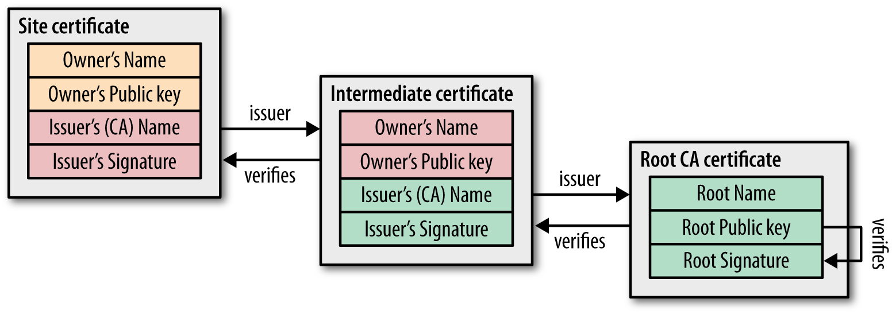

**通常逐级检测点如下:**

- 是否由上级证书签发
- 是否吊销
- 是否过期
- 是否遵循上级证书的策略

## 0x04 证书锁定方案对比

先梳理下对证书处理的几种策略

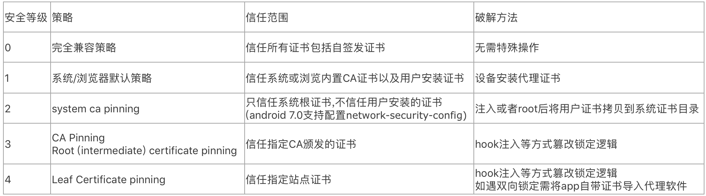


### 站点证书锁定 leaf certificate pinning

首先考虑的锁定站点证书,这种策略安全性是肯定的,但是有个缺陷就是需要维护预埋证书.如果你没考虑过更新预埋证书会怎么样了?拿一个开源项目举例.
https://github.com/menjoo/Android-SSL-Pinning-WebViews  (没错,又是它.之前SSL解锁的文章也是拿他举例.)
例子中的网站 https://www.infosupport.com/ 证书已经更新过一次,代码中的证书key是2015年的

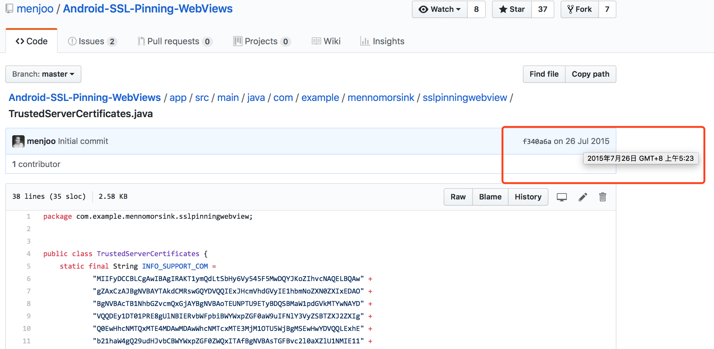

而线上证书已于2017年更换,所以导致pinning失效,直接粗暴pinning可能导致业务无法访问.

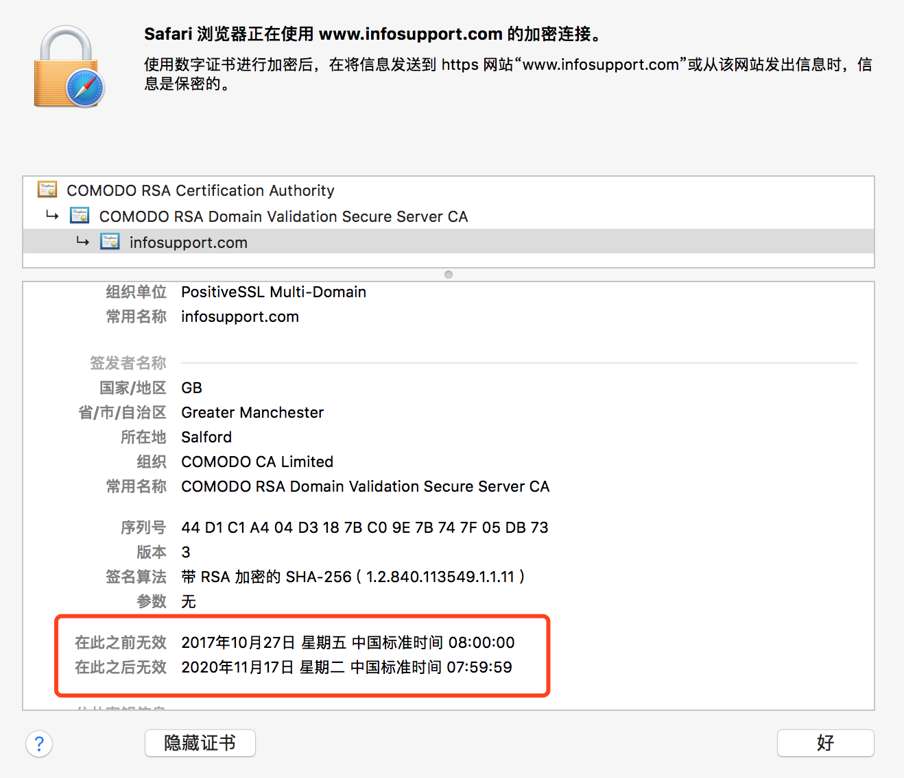

现在的站点证书一般有效期在1到2年,所以做站点证书锁定还要保证服务可用性的话就得必须实现客户端锁定证书指纹的更新.

但是更新证书的网络请求该如何处理,有如下选择:

- 指纹更新请求被劫持到的概率比较低,不锁定更新指纹请求直接使用https完成.缺点是安全性稍弱.
- 自签名证书的有效期非常长,用自签名证书锁定指纹更新请求.缺点是兼容性稍弱.

客户端的工作基本梳理完成,服务端需要实现证书指纹下发接口.还有每到证书即将过期的时候需要有人将的证书指纹配置进入.这里虽然提取指纹配置可以由代码实现,但是签发证书是由第三方CA完成的,所以离不开人对接.

整个锁定逻辑每隔一段时间(站点证书过期节点),需要有认为介入才能维持服务可用性.因为"人"这个X因素的引入会给业务稳定性带来极大风险,在大多数场景下不合理的.

先挂起这个安全性很高但是实现较为复杂且的方案,进入下一锁定策略.

### 中间证书锁定 Intermediate certificate pinning  

锁定中间证书或根证书的优势是安全性接近锁定站点证书,且这两证书的有效期一般很长,很多都是15年到30年,所以暂不考虑热更新证书指纹.没准十几年后区块链去中心化就把CA给去掉了.

除证书有效期时间长的优势,锁定间证书或根证书还可以更好的兼顾业复杂的业务线,因为企业子域名很多情况下都是自己业务的站点证书,但是一个企业通常站点证书都是由一个中间证书(根证书)签下来.所以锁定间证书或根证书不用特别对每个业务线做调整,一套策略或者方案基本可以适用企业整个业务线.

先尝试中间证书的锁定方案,这里Comodo的中间证书超期时间为2029,距到期还有十来年超过了大多数的产品的生命中求.这么久的时间窗口,完全可以让指纹随着应用更新完成迭代.

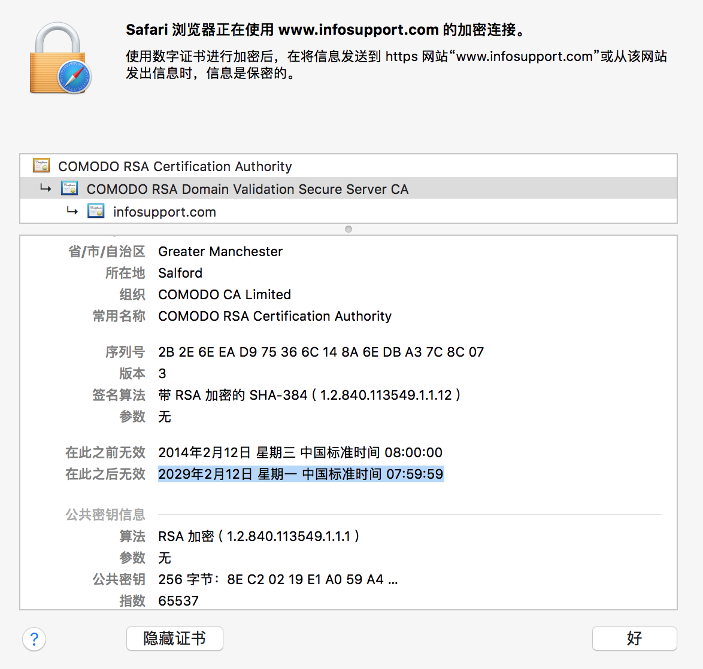

但是锁定中间证书的方案会遇到一个问题,那就是更换证书CA(数字证书颁发机构).这就需要通过备份一些可能会用的到CA指纹.中间证书的量级相对于根证书要高出很多,而且也不好预测将来可能会更换到哪些中间证书.

先挂起这个安全性不错但是,冗余相对难操作的方案,进入下一锁定策略.


### 根证书锁定 Root certificate pinning

参考操作系统更新预埋CA根证书的机制,通过自升级完成锁定CA的指纹更新.Android N系统约内置了150多个系统根证书.而实际作为一个应用是不需要信任这么多CA的根证书的.可靠卖证书的CA就那么十来家,业务的安全需求决定了你需要哪类证书.这样备份证书的范围就收窄了,且根证书的数量级相对小.所以就没中间证书备份难的问题.

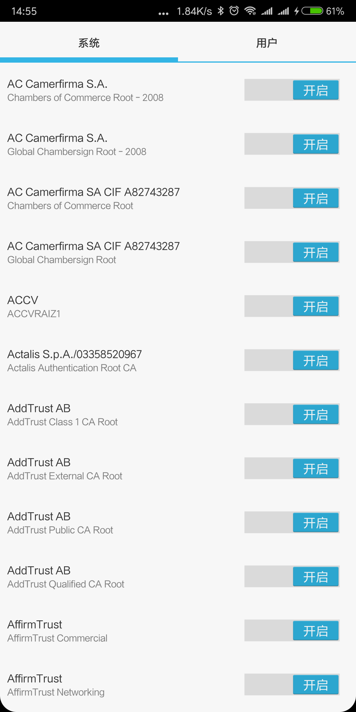

目前主流的SSL证书主要分为 DV < OV  <  EV,安全性和价格一次递增的.

DV和OV型证书最大的差别是：DV型证书不包含企业名称信息；而OV型证书包含企业名称信息,以下是两者差别对比表：

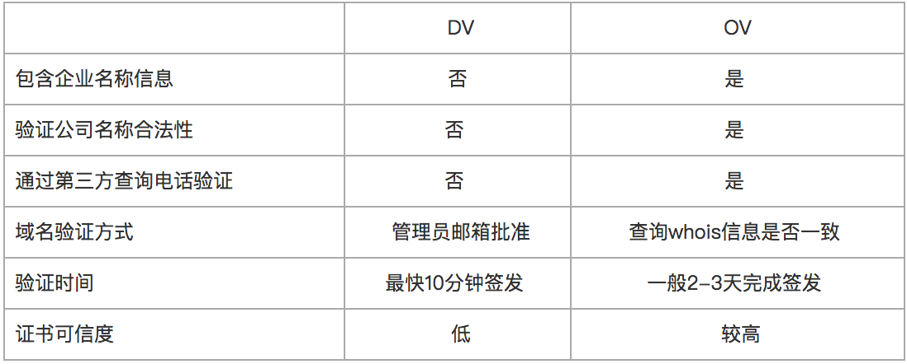

OV型和EV型证书,都包含了企业名称等信息,但EV证书因为其采用了更加严格的认证标准,浏览器会对EV证书"标绿"+"ID显示"(是的,VIP绿钻待遇,凸显尊贵身份).


综合看来根锁定策略的安全性,实施难度现在看来是比较适合账号业务的.接下来就是备份证书的选择.

备份锁定证书的主要的考量因素:

- 有效期
- 安全性
- 兼容性

下图是win7的内置根证书,其中有相对效期较长CA分别有:Godaddy,DigiCert,Thawte.这三家在win7的这四个根证书均在2031年之后才生效.建议选择这类根作为备份,因为这些有效期长且在较早的系统版本中预埋,说明兼容性也过关.如果对安全性有更改追求可以预埋些EV证书比如DigiCert High Assurance EV Root CA.

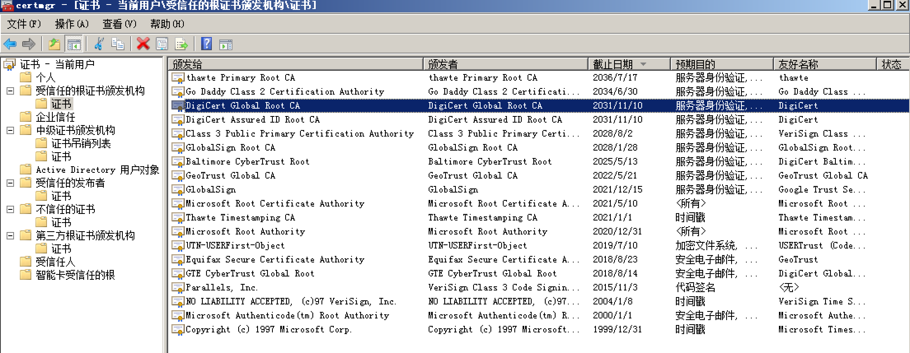

其中GoDaddy Class 2 Certification Authority Root Certificate是交叉证书,根证书交叉链的示意图如下.


Godaddy G1和G2真实的交叉状态如下,也就是G1个G2两个根都能验过交叉中间证书签发的站点证书.这样情况建议将G1和G2的根均做预埋备份.

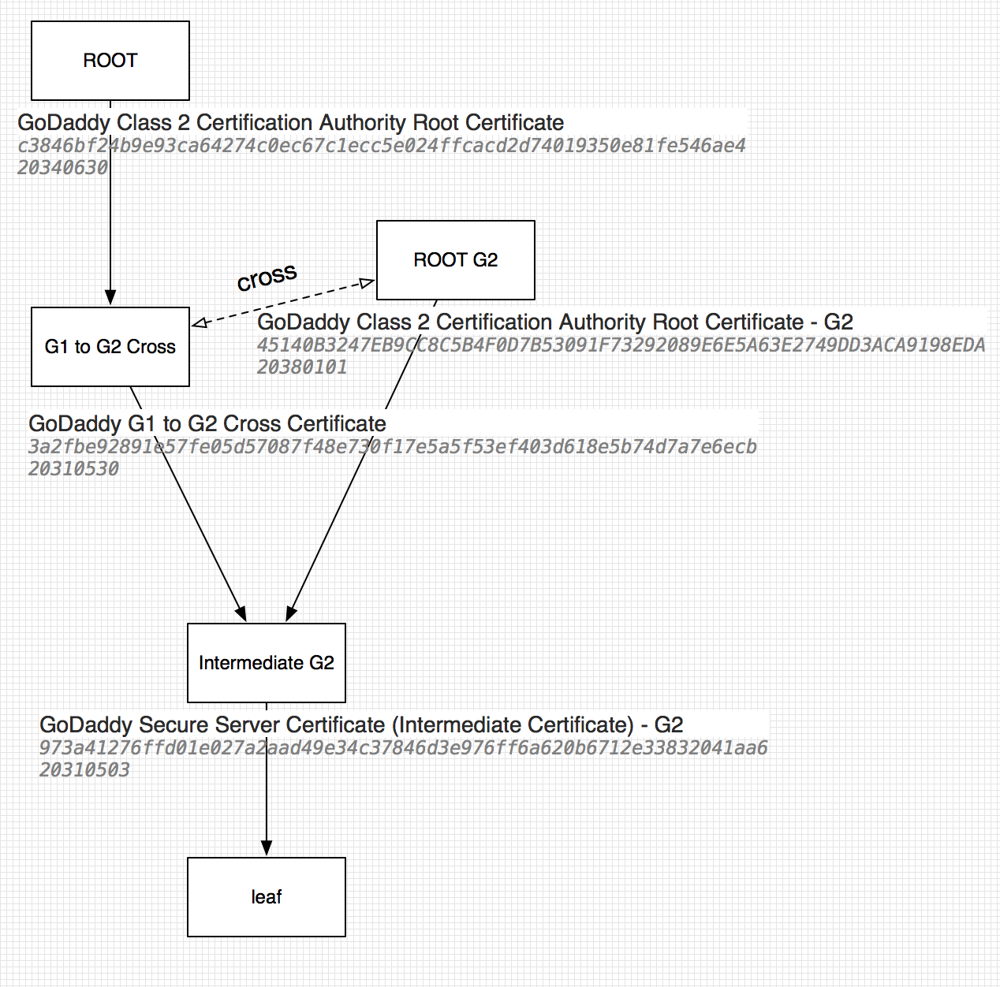

解决证书备份后问题,比如锁的根2031年到期,2031年之后应该如何处理.锁定超期是否应该拒绝连接?根据业务特性做选择: 

- 拒绝连接,安全优先
- 允许连接,可用优先
- 提示风险让用户选择,折中策略

android 8.0.0 下京东的锁定异常选择提示如下图 (android 6.0.1中没有此检测)

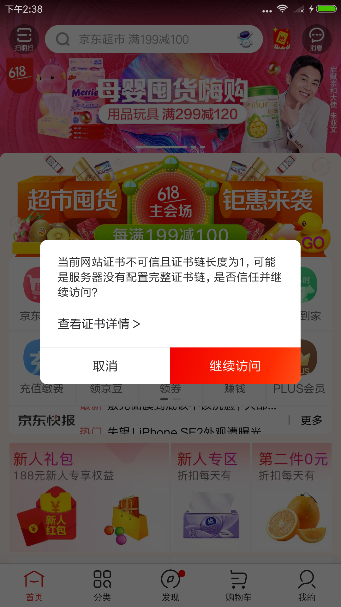

### 客户端系统证书锁定 system ca pinning

这个锁定方案相对前三个要保守许多,安全性提升也相对有限,所以业务代码出问题的概率也变的极小.

你需要做的仅仅是将通用操作系统中用户安装的第三方证书移除APP的证书信任列表.Android7.0后已经开始默认支持此特性,可以通过network-security-config更改配置.


>在 Android 7.0 中,通过使用说明性_“网络安全性配置”_(而不是使用传统的易出错的编程 API,例如>X509TrustManager),应用可以安全地自定义其安全(HTTPS、TLS)连接的行为,无需任何代码修改.
>
>支持的功能：
>
>*   **自定义信任锚**:让应用可以针对安全连接自定义哪些证书颁发机构 (CA) 值得信赖.例如,信任特定的自签>署证书或限制应用信任的公共 CA 集.
>*   **仅调试重写**:让应用开发者可以安全调试其应用的安全连接,而不会增加安装基础的风险.
>*   **明文流量选择退出**:让应用可以防止自身意外使用明文流量.
>*   **证书固定**:这是一项高级功能,让应用可以针对安全连接限制哪些服务器密钥受信任.
>
>默认情况下,面向 Android 7.0 的应用仅信任系统提供的证书,且不再信任用户添加的证书颁发机构 (CA).如果面向 Android N 的应用希望信任用户添加的 CA,则应使用[网络安全性配置](https://developer.android.com/preview/features/security-config.html)以指定信任用户 CA 的方式.

## 0x05 网络安全性配置 network-security-config 使用参考

完整用法请阅读

https://developer.android.com/preview/features/security-config.html

https://developer.android.com/training/articles/security-config

这里列举几个常用的配法.

### 系统证书锁定配置参考

- 信任系统证书 移除了 <certificates src="user"/> 用户安装的证书的信任

```xml
<?xml version="1.0" encoding="utf-8"?>
<network-security-config>
    <base-config>
        <trust-anchors>
            <certificates src="system"/>
        </trust-anchors>
    </base-config>
</network-security-config>
```
- release模式下只信任系统证书
- debug模式下加入对信任用户安装的证书

```xml
<?xml version="1.0" encoding="utf-8"?>
<network-security-config>
    <base-config>
        <trust-anchors>
            <certificates src="system"/>
        </trust-anchors>
    </base-config>

    <debug-overrides>
        <trust-anchors>
            <certificates src="system"/>
			<certificates src="user"/>
        </trust-anchors>
    </debug-overrides>
</network-security-config>
```
### 根证书锁定配置参考

- 强制锁定了两个根证书GoDaddy Class 2 Certification Authority Root Certificate和DigiCert
- debug模式下加入对信任用户安装的证书
- 超过2034-06-30锁定解除.

```xml
<?xml version="1.0" encoding="utf-8"?> <network-security-config>
    <!-- Official Android N 7.0 API -->
  <domain-config>
        <domain includeSubdomains="true">www.mi.com</domain>
        <pin-set expiration="2034-06-30">
            <!--GoDaddy Class 2 Certification Authority Root Certificate-->
  <pin digest="SHA-256">VjLZe/p3W/PJnd6lL8JVNBCGQBZynFLdZSTIqcO0SJ8=</pin>
            <!--backup pin-->
  <pin digest="SHA-256">VjLZe/p3W/PJnd6lL8JVNBCGQBZynFLdZSTIqcO0SJ8=</pin>
        </pin-set>
        <!-- TrustKit Android API -->
  <trustkit-config enforcePinning="true">
            <!-- Add a reporting URL for pin validation reports -->
  <report-uri>http://report.m.com/log_report</report-uri>
        </trustkit-config>
    </domain-config>
    <debug-overrides>
        <trust-anchors>
            <!-- For debugging purposes, add a debug CA and override pins -->
 <!--<certificates overridePins="true" src="@raw/debugca" />-->  <certificates overridePins="true" src="user"/>
        </trust-anchors>
    </debug-overrides>
</network-security-config>
```

## 0x06 IoT设备上的证书锁定

设备ROM发版相对app发版要复杂许多,所以设备的证书锁定场景复杂性更高.这样先将设备抽象成两大类

- 系统自带证书的通用操作系统比如AndroidTV.
- 系统没有预制证书的实时操作系统(RTOS).

如果设备是第一类通用操作系统比较好处理

- 如果证书是CA签发的,只需信任系统证书即可,最好同时开启系统分区保护.
- 如果证书是自签发的,除了信任系统证书以外额外只信任此自签发证书即可,切勿为了跑通业务盲目信任所有证书.一些业务刚开发的时候可能还没买证书,所以初期代码是信任所有证书,后来买正式证书后忘记修复证书信任代码.例如没买证书之前curl使用了-k参数,买完证书后忘记统一除去此参数.

```
 -k, --insecure Allow connections to SSL sites without certs (H)
```

如果设备是第二类RTOS,首先得确认其是否支持SSL,其上运行的业务是否需要SSL.如果需要且支持,则可以通过自行预制根再参考前文完成锁定.


## 0x07 重复造轮子

PinKit是一个android下简化的证书锁定工具类

- PinKit方便SDK集成,不与network-security-config冲突.

- 网上代码大多取public key的hash进行base64 encod sha256当为Pin码,而浏览器上显示的是证书指纹的sha256.为了方便肉眼观察PinKit采用了同浏览器一致的证书指纹hex encode sha256当为Pin码

- PinKit同TrustKit和AndroidPinning类似,都do the system's SSL validation : 先用系统的TrustManagerImpl和内置CA验一遍,再用锁定的CA验. (所以自签发证书这个库来锁需要注意下配置)
这样更为稳妥,至少有系统默认的一套为你兜底. 但是貌似有些臃肿,和其两次做hostNameVerified类似.
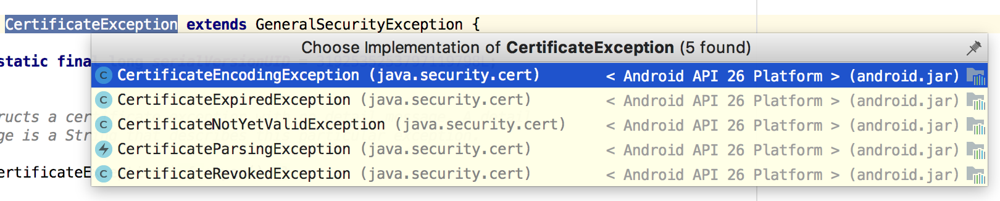

参考TrustKit完成SSLPinKitDemo如下

https://github.com/WooyunDota/SSLPinKitDemo

## 0x08 常见Q&A

测试如何抓包了?

判断下app是debug版本还是release版本,debug版本不锁证书或者在锁定列表里加入一个测试证书.

做了根证书锁定如果换CA怎么办了?

如果只是系统证书锁定则不考虑此场景,如果是根证书锁定则需加入一些更换可能性较高CA的根证书指纹做备份,建议选择安全性较高EV证书,当然也会贵一些了.注意根证书的超期时间,选择时效长一些的.

webview中是的请求是否要做证书锁定?

不建议,不推荐在webview中做证书锁定.

证书吊销,失效等问题是否需要业务自己再实现一次?

不需要,方案复用系统TM检测.在系统TrustManger基础上收缩CA根证书的范围.

会影响正常用户的代理(梯子软件)的使用吗?

一般是没有影响的.


## 0x09 X.509 v3 format

The basic X.509 v3 format described in ASN.1:

```c
---------------------------------------------------------------------
-- X.509 signed certificate 
---------------------------------------------------------------------
SignedContent ::= SEQUENCE 
{
  certificate         CertificateSigned,
  algorithm           Object Identifier,
  signature           BITSTRING
}

---------------------------------------------------------------------
-- X.509 certificate to be signed
---------------------------------------------------------------------
CertificateToBeSigned ::= SEQUENCE 
{
  version                 [0] CertificateVersion DEFAULT v1,
  serialNumber            CertificateSerialNumber,
  signature               AlgorithmIdentifier,
  issuer                  Name
  validity                Validity,
  subject                 Name
  subjectPublicKeyInfo    SubjectPublicKeyInfo,
  issuerUniqueIdentifier  [1] IMPLICIT UniqueIdentifier OPTIONAL,
  subjectUniqueIdentifier [2] IMPLICIT UniqueIdentifier OPTIONAL,
  extensions              [3] Extensions OPTIONAL
}
```
## 0x10 Reference

https://medium.com/@appmattus/android-security-ssl-pinning-1db8acb6621e 

https://developer.android.com/training/articles/security-config

https://msdn.microsoft.com/en-us/library/windows/desktop/bb540800(v=vs.85).aspx

https://www.myssl.cn/home/article-61.html
