# ARM Exploitation Start

---

原文:Learning Pentesting for Android Devices节选

### 0x00 

本文主要带大家了解ARM处理器的基础知识和ARM世界中不同种类的漏洞.我们会进一步分析这些漏洞来搞清楚它的具体利用场景.此外,我们还会研究不同的安卓rooting利用脚本用于挖掘潜在的漏洞.考虑大世面上大多数android智能手机都是基于ARM架构处理器,因此了解ARM以及ARM中存在的安全隐患是非常有价值的.

### 0x01 Introduction to ARM architecture

ARM架构基于精简指令集(Reduced Instruction Set Computing [RISC](http://baike.baidu.com/link?url=Fhz0XXhUitAZ4AlMdT-exSZP29Joqn6fh-HtrTqUcWV9H3iW6rMAx_G1LtZga4nKGE7vauq7fhvXDLrN7hT_MwytacNITJwM4vSUR1WzYqBeWzVecsCBMSXljxpWnwX-)),这意味着它具有比基于复杂指令集（Complex Instruction Set Computing[CISC](http://baike.baidu.com/link?url=T8Kn2EzeE-TjU6ex4i9iVZu4alQrmfmTL4d-Goh3A2LsdX7pYQJC7-Gm7w_A9U1I13DMLDYHp84bCg32R0ls3q)）少得多的指令架构.使用ARM处理器的设备几乎无处不在,比如智能手机,电视,电子书,嵌入式设备等等.

ARM共有16个通用寄存器从R0到R15.(R0-R7,8个通用寄存器)其中5个有特å殊意义:

- R11: Frame Pointer (FP)
- R12: 内部过程调用暂时寄存器 Intra-procedure Register (IP)
- R13: 栈指针 Stack Pointer (SP)
- R14: 链接寄存器 Link Register (LR)
- R15: 程序计数器 Program Counter (PC)

下图显示了ARM架构：

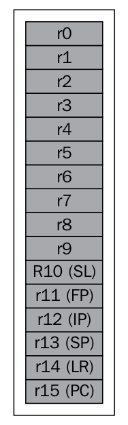

这五个寄存器中我们应重点关注如下三个:

- 栈指针 Stack Pointer (SP-R13):存储栈顶指针

- 链接寄存器 Link Register (LR-R14):存储被调用函数返回地址

- 程序计数器 Program Counter (PC-R15):存储着下一条执行指令的地址.每条执行被执行后，该计数器会进行自增.


### 0x02 Execution modes

ARM有两种执行模式:


- ARM 模式: In the ARM mode, 32位指令集
- Thumb 模式: In the Thumb mode, 16位指令集

执行模式取决于程序状态寄存器(CPSR)的状态.其实存在第三种模式: Thumb-2模式,就是将arm模式和Thumb模式混合.我们不会去分析这两种模式的区别,因为这样就超出本文的范围了.即使是Android SDK中的模拟器也是arm平台的,其他大多数的智能手机也是基于arm.但是我们还是选择从开源硬件模拟器[QEMU](http://wiki.qemu.org/Main_Page)开始进行ARM exploitation的训练.

### 0x03 Setting up the environment

在我们开始基于ARM平台设备的exploiting前建议先安装好对应的环境.尽管Android SDK的模拟器也能基于arm运行,而且大多数的智能手机也是基于arm.我们还是选择用QEMU(开源硬件虚拟机和模拟器)开始ARM exploitation.

为了在android设备上执行接下来的操作,我们需要下载和配置Android NDK环境.如果你正使用Mac,那么安装QEMU是非常简单的,只需要输入:```brew install qemu```

如果系统是Ubuntu需要执行如下操作:

1.第一步下载安装QEMU依赖包

	sudo apt-get build-dep qemu
    wget http://wiki.qemu-project.org/download/qemu-
       1.7.0.tar.bz2

2.下一步配置QEMU,指定目标为ARM最后make.只需要进入解压后的目录输入如下命令.

	./configure --target-list=arm-softmmu
    make && make install

3.一但QEMU安装成功,我们就可以下载ARM平台的Debian镜像运行exploitation习题.下载列表:

[http://people.debian.org/~aurel32/qemu/armel/](http://people.debian.org/~aurel32/qemu/armel/)

4.这里我们下载格式为qcow2的镜像,debian_squeeze_armel_ standard是基于QUME的系统镜像.qcow2 for our OS.内核文件是 vmlinuz-2.6.32- 5-versatile ,RAM磁盘文件是initrd.img-2.6.32-5- versatile.下载完必须文件后就可以通过以下指令启动QEMU实例.

	qemu-system-arm -M versatilepb -kernel vmlinuz-2.6.32-5-versatile -initrd initrd.img-2.6.32-5-versatile -hda debian_squeeze_armel_standard.qcow2 -append "root=/dev/sda1" --redir tcp:2222::22
	
5.上述所有操作成功就可以通过以下命令ssh登录QEMU:

	ssh root@[ip address of Qemu] -p 2222
	
6.默认帐号密码是root:root.

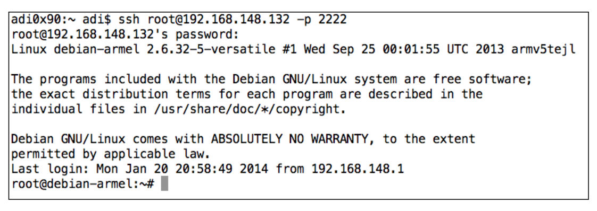

到此我们已经成功配置好环境,是时候开始exploiting存在漏洞的应用

### 0x04 Simple stack-based buffer overflow

简单来讲,缓存(buffer)是用于存储任意数据的地方.当缓存的数据超过了缓存区的大小就会发生溢出(overflow).攻击者可以利用溢出攻击来控制程序执行恶意代码.

下面就用一个简单的程序来演示如何利用溢出攻击.下图中显示程序有三个函数:vulnerable, ShouldNotBeCalled以及 main.

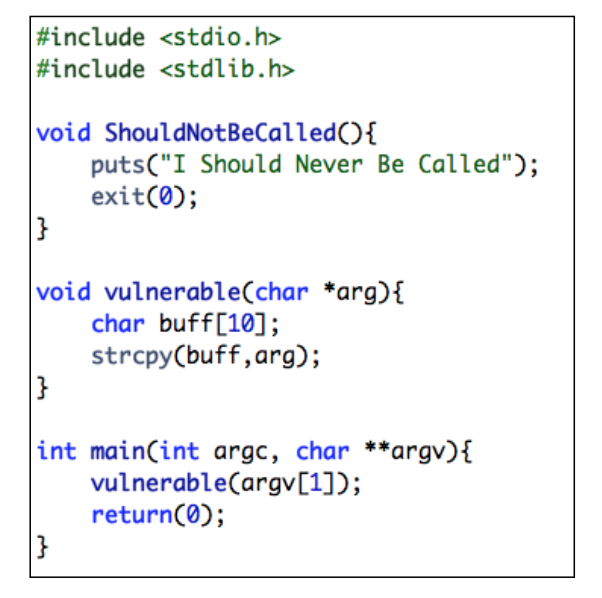

执行程序的时候函数 ```ShouldNotBeCalled``` 一直没有被调用.

函数```vulnerable```只有一个操作就是将成员变量拷贝到只有10bytes大小的缓存buff中.

写完此程序后通过gcc编译(arm虚拟机中编译).此外我们还将禁用空间格局随机化Address Space Layout Randomization (ASLR)让利用场景变得更简单些.ASLR是一种针对缓冲区溢出的安全保护技术，通过对堆、栈、共享库映射等线性区布局的随机化,通过增加攻击者预测目的地址的难度,防止攻击者直接定位攻击代码位置,达到阻止溢出攻击的目的.据研究表明ASLR可以有效的降低缓冲区溢出攻击的成功率,如今Linux、FreeBSD、Windows等主流操作系统都已采用了该技术.Android 4.0之后也实现了该方案.[http://www.duosecurity.com/blog/exploit-mitigations-in-android-jelly-bean-4-1](http://www.duosecurity.com/blog/exploit-mitigations-in-android-jelly-bean-4-1)

	echo 0 > /proc/sys/kernel/randomize_va_space //禁用ASLR
	gcc -g buffer_overflow.c -o buffer_overflow  //编译example

下一步,用gdb调试二进制文件.

	gdb -q buffer_overflow

使用```disass```命令反编译一部分函数,下图为反编译```ShouldNotBeCalled```

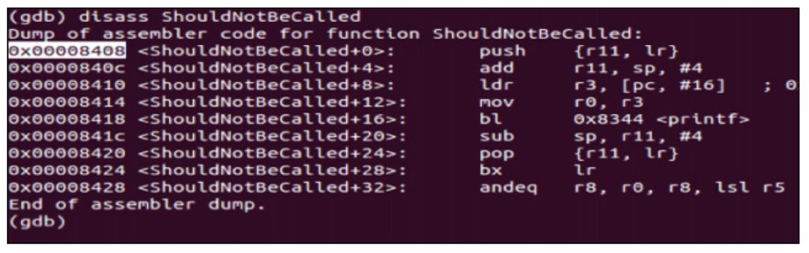

正如截图中说看到的,函数```ShouldNotBeCalled```从内存地址0x00008408开始.如果我们查看反编译的```main```函数,将会发现```vulnerable```函数是从0x000084a4开始调用,在0x000084a8返回.当程序进入存在漏洞的函数,使用有漏洞的指令strcpy,函数并不会检查拷贝字符串的大小.如果程序进入存在漏洞的子程序,我们就能够通过控制LR控制整个程序流程.

这里目标是估算LR何时被重写之后插入```ShouldNotBeCalled```地址来调用函数```ShouldNotBeCalled```.用一个较长的参数运行程序,比如下面的命令,观察发生了啥.在此之前先在调用```strcpy```地址处设置断点.

	b vulnerable
	b *<address of the strcpy call>

通过设置断点,我们可以将参数改成AAAABBBBCCCC运行程序观察他如何被覆盖.观察发现在vulnerable和strcpy函数被调用时触发断点.一但断点触发,我们就可以通过```x```命令指定sp操作堆栈.如下图

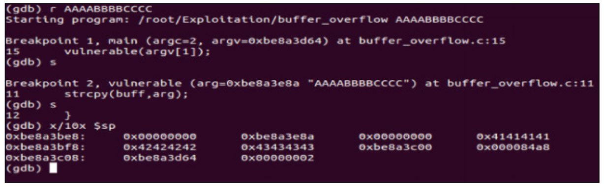

如图所示,堆栈已经被我们输入(ASCII: 41 for A, 42 for B, and so on)的buffer重写.分析截图,发现0x000084a8这种情况我们需要多于4个字节去覆盖返回地址.


最终输入的字符串为16字节的垃圾数据和函数```ShouldNotBeCalled```的地址

	r `printf "AAAABBBBCCCCDDDD\x38\x84"`
	
如图所示,我们将```IShouldNeverBeCalled```起始地址插入参数中

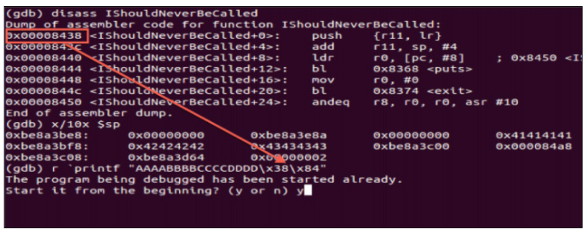

请注意,因为框架原因这里字节顺序是相反的.这样就能看到程序调用函数ShouldNotBeCalled了.如下图


### 0x05 Return-oriented programming


大多数情况下,我们并不需要调用程序自身的其他函数.相反,我们需要在攻击向量中插入shellcode,这样就可以通过shellcode达到任意目的.但是,再大多数基于arm平台的设备中内存区域是不可执行的,这样就阻止了我们插入和执行shellcode.

所以,攻击者必须依赖一项技术**返回导向编程 return-oriented programming [ROP](http://zh.wikipedia.org/wiki/%E8%BF%94%E5%9B%9E%E5%AF%BC%E5%90%91%E7%BC%96%E7%A8%8B)**.所谓ROP,简单的说就是把原来内存已经存在的代码块拼接起来,拼接的方式是通过一个预先准备好的特殊的返回栈,里面包含了各条指令结束后下一条指令的地址.最终执行我的shellcode.在一般程序里面,都包含着大量的返回指令（ret）,他们基本位于函数的尾部,或是函数中部需要返回的地方.而从函数开始的地方到ret指令之间的这一段序列称为二进制指令代码块(gadgets).我们需要在整个内存空间中搜索我们需要的gadgets

举个例子,如果我们在调试程序的时候反编译```seed48()```,得到如下输出:

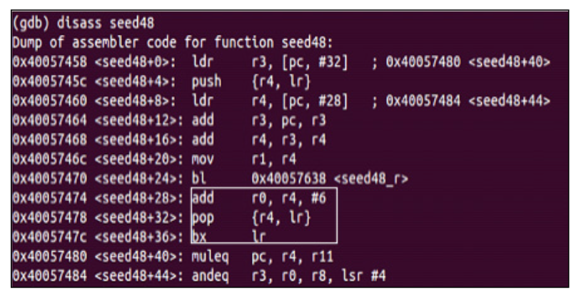

分析反编译代码,代码包含一个ADD指令接着是POP和BX指令,这就是完美的 ROP gadget.这里攻击者可以想到为了利用 ROP gadget 首先跳到POP指令控制R4(which will be six less than the address of /bin/sh)之后在LR中输入ADD指令的值.最后我们得到 /bin/sh 的地址,当我们跳会ADD (R0 = R4 + 6 ),之后我们可以在R4中指定任意垃圾数据以及LR中指定 system() 的地址.

这意味着我们最终讲跳到 system() 并且参数为 /bin/sh , 这样就可以执行shell命令了.用同样的方式,我们可以创建任意ROP gadget 来达到执行任意命令的效果.因为ROP是个非常复杂的话题,强烈建议自己动手尝试分析反编译代码,然后构造exploit.

### 0x06 Android root exploits

在早期android版本中,各种android版本的各种设备都遇到Android root exploits .Android rooting就是获取设备的最高权限而不是手机制造厂商给用户的默认权限.这些root exploits利用了各种Android系统漏洞.下面是一些漏洞列表和漏洞原理简介:

- **Exploid**: CVE-2009-1185 影响android2.1及之前版本,此exploit基于```udev```漏洞CVE-2009-1185,udev是一个android组件负责USB连接,进程应该只处理kernel发送的device的NETLINK的socket消息，但实际上并未检测NETLINK的socket消息的来源,这样可以广播add device的socket信息,触发硬件处理事件,将恶意代码传入kernel,由其写入设备文件.这样,攻击者只需发送一条构造好的udev消息就可以提权了.

- **Gingerbreak**:CVE-2011-1823,此exploit利用vold的漏洞,原理类似上一个.(android并没有实现linux的udev，其功能由vold进程实现，其包含VolumeManager，NetlinkManager，CommandListener等modules).Android 2.3.4之前版本的 volume 守护进程(vold)由于信任从 PF_NETLINK socket 接收到的消息,因此允许以 root 权限执行任意代码,利用方法是通过一个负数索引绕过指针对最大值的有符号整数检查.

- **RageAgainstTheCage**:此exploit基于```RLIMIT_NPROC```,RLIMIT_NPROC用于指定用户调用setuid()函数的时候能创建的最大进程数.adb 后台是root权限,之后会调用 setuid() 自行降权.android 2.2 以及之前版本如果进程数达到RLIMIT_NPROC的阈值,程序就不会调用setuid()降权,这样adb就会以root权限运行了.

- **Zimperlich**:与```RageAgainstTheCage```原理类似,不一样的是此处依赖的zygote进程的降权.所有的android应用是由Zygote进程fork分支后启动的.Zygote是由root权限运行的.在fork之后新的进程将使用setuid调用降权至目标应用的uid.Android2.2以及之前版本的Zygote没有对降权时setuid调用的返回值进行检查.同样,在耗尽目标程序uid的最大进程数之后,Zygote就无法降低它的权限,然后就以root权限启动应用了.

- **KillingInTheNameOf**: CVE-2011-1149 此expolit利用了```ashmem``` (the shared memory manager) 接口漏洞,用于修改```ro.secure```的值,ro.secure决定了设备的root状态.Android 的共享内存(Ashmem)子系统是一个共享内存分配器.共享内存可以通过 mmap 或者文件 I/O 进行访问.在android 2.3之前,ashmem 允许任何用户重新映射属于 init 进程的共享内存,将包括系统属性地地址空间的内存进行共享,KillingInTheNameOf 利用程序将系统属性空间重新映射为可写,并将 ro.secure 属性设置为0.在重启 adbd 后,ro.secure 属性的修改会允许 adb shell 取得 root 权限访问.

这些都是比较出名的用户root安卓设备的exploits.

### 0x00 附录


数据处理指令-指令编码

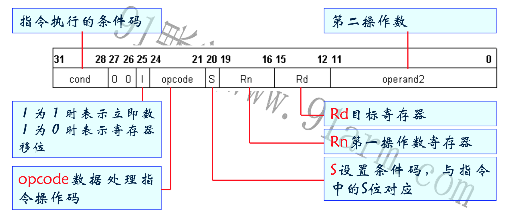

操作码功能表


分支指令B/BL-指令编码

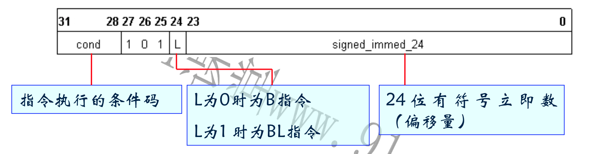

分支指令BX-指令编码

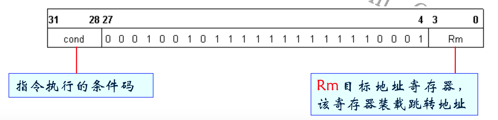

分支指令功能表

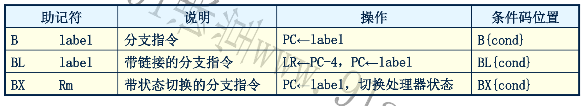

* 跳转指令:
	- B 跳转指令。 
	- BL 带返回的跳转指令。
	- BLX 带返回和状态切换的跳转指令。 
	- BX 带状态切换的跳转指令。
* 数据处理指令
	- MOV 数据传送指令 
	- MVN 数据取反传送指令
	- CMP 比较指令 
	- CMN 反值比较指令
	- TST 位测试指令 
	- TEQ 相等测试指令
	- ADD 加法指令28 
	- ADC 带进位加法指令 
	- SUB 减法指令 
	- SBC 带借位减法指令
	- SUB 减法指令 
	- SBC 带借位减法指令 
	- RSB 逆向减法指令 
	- RSC 带借位的逆向减法指令 
	- AND 逻辑与指令 
	- ORR 逻辑或指令 
	- EOR 逻辑异或指令 
	- BIC 位清除指令
* 乘法指令与乘加指令
	- MUL 32 位乘法指令 
	- MLA 32 位乘加指令 
	- SMULL 64 位有符号数乘法指令 
	- SMLAL 64 位有符号数乘加指令 
	- UMULL 64 位无符号数乘法指令 
	- UMLAL 64 位无符号数乘加指令 
* 程序状态寄存器存取指令 
	- MRS 程序状态寄存器到通用寄存器的数据传送指令。 
	- MSR 通用寄存器到程序状态寄存器的数据传送指令。
* 寄存器加载/存储指令
	- LDR 字数据加载指令 
	- LDRB 字节数据加载指令
	- LDRH 半字数据加载指令 
	- STR 字数据存储指令
	- STRB 字节数据存储指令 
	- STRH 半字数据存储指令
	- LDM 连续数据加载指令 
	- STM 连续数据存储指令
* 数据交换指令 :
	- SWP 字数据交换指令 
	- SWPB 字节数据交换指令
* 移位元指令：
	- LSL 逻辑左移 
	- ASL 算术左移
	- LSR 逻辑右移 
	- ASR 算术右移
	- ROR 循环右移 
	- RRX 带扩充的循环右移
* 协处理器指令
	- CDP 协处理器数据操作指令
	- LDC 协处理器数据加载指令
	- STC 协处理器数据存储指令
	- MCR ARM处理器寄存器到协处理器寄存器的数据传送指令
	- MRC 协处理器寄存器到ARM处理器寄存器的数据传送指令
	
	
arm架构完整版


### 0x00 参考

[http://infocenter.arm.com/help/topic/com.arm.doc.qrc0001mc/QRC0001_UAL.pdf](http://infocenter.arm.com/help/topic/com.arm.doc.qrc0001mc/QRC0001_UAL.pdf)

[http://bbs.pediy.com/showthread.php?t=176283](http://bbs.pediy.com/showthread.php?t=176283)

[http://hack0nair.me/2013-04-05-return-oriented-programming/](http://hack0nair.me/2013-04-05-return-oriented-programming/)

[http://blog.csdn.net/jackaduma/article/details/7286348](http://blog.csdn.net/jackaduma/article/details/7286348)

